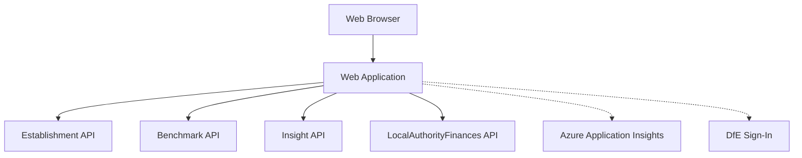

## Logical Viewpoint

| Component | Description |
|:---|:---|
| Web Application | This application is the front end for the service and provides all the functionality |
| Establishment API | Handles searching and details of establishments |
| Benchmark API | Handles benchmark calculations and comparisons |
| Insight API | Handles insights and recommendations |
| LocalAuthorityFinances API | Handles local authority financial data |

## Cross-cutting concerns

| Component | Description |
|:---|:---|
| Logging and Analytics | Azure Application Insights |
| Authentication and Authorisation | DfE Sign-In |
