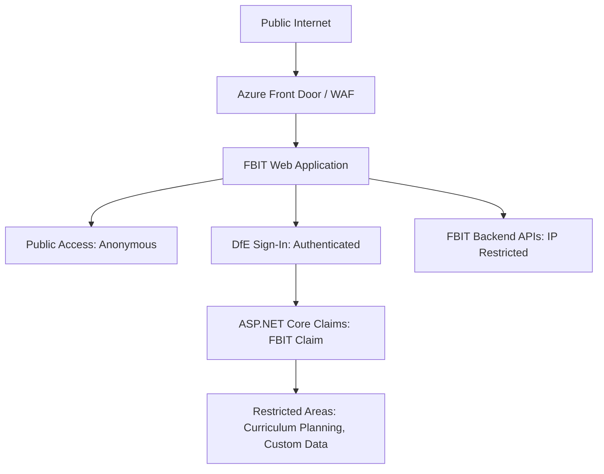

## Physical Architecture

## Authentication & Authorisation

### Anonymous Access

The majority of the Financial Benchmarking and Insights Tool is in the public domain, and anonymous access to these areas of the service is permitted.

### Authentication

For areas requiring authentication, this is delegated to DfE Sign-in and is managed by the standard established process.

### Authorisation

Authorisation is handled by the standard ASP.NET Core claims model. Only those authenticated users with the FBIT claim will be allowed access to the restricted areas of the service. Currently the only functions or areas that are intended to require authorisation are:

- Curriculum planning
- Custom data
