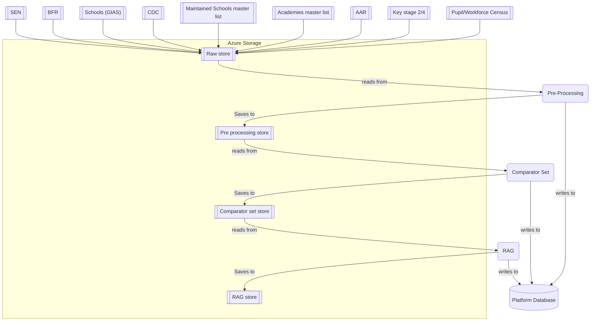
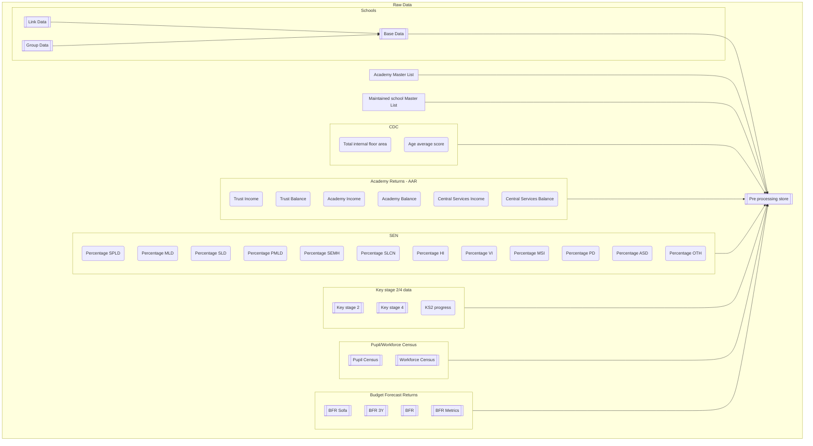
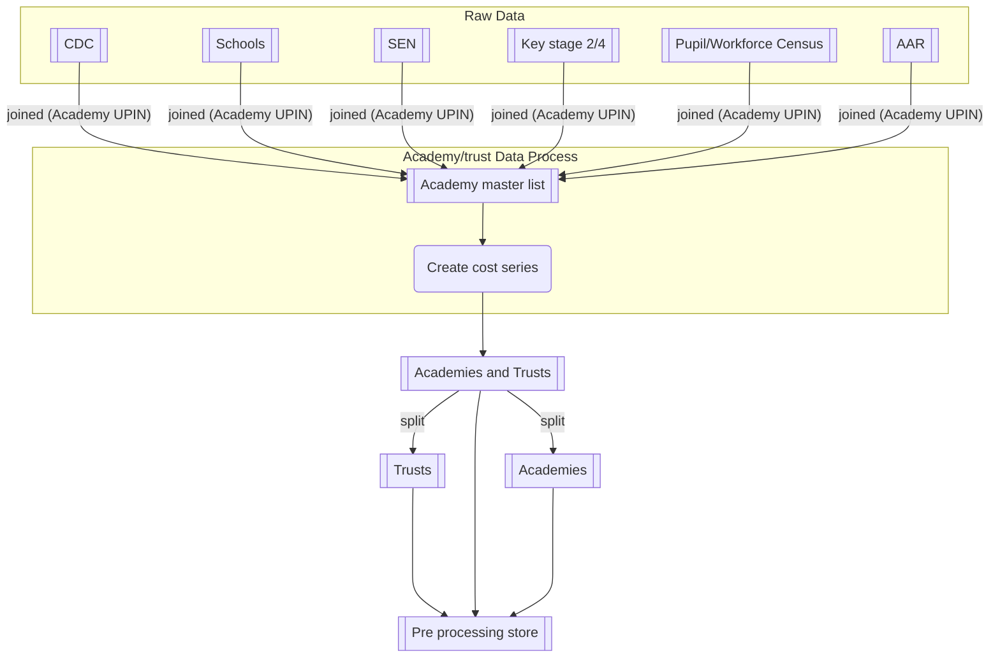
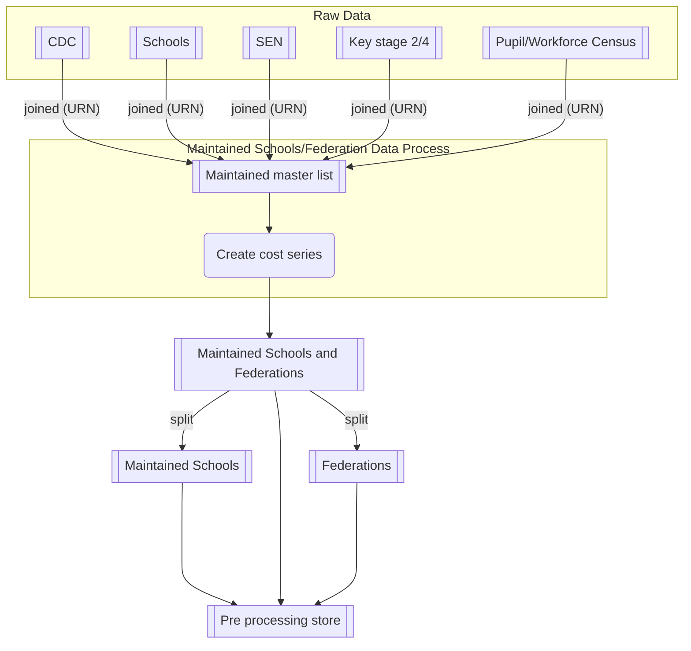
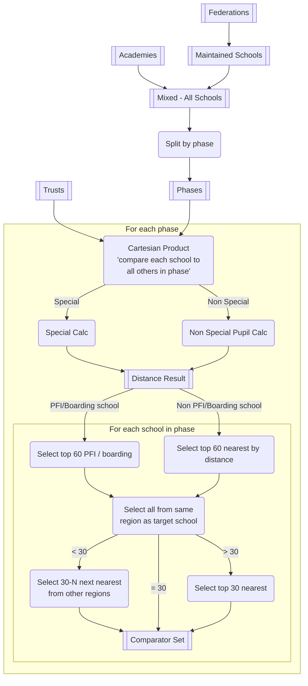
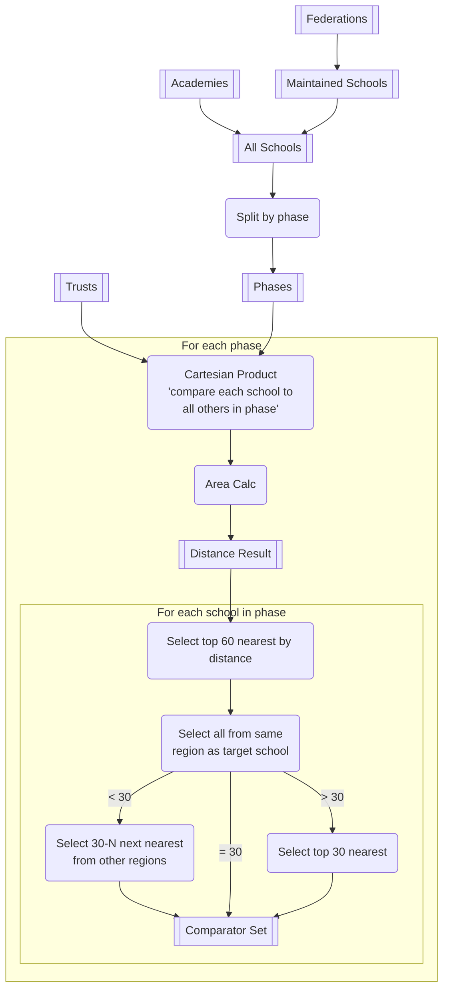
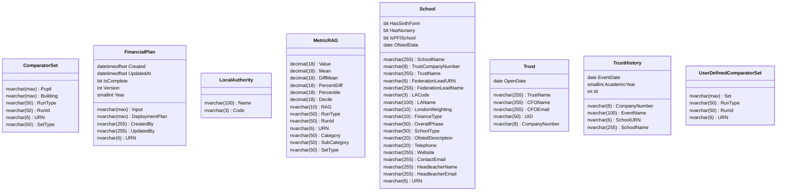

# Data Processing

The data processing pipeline has the following key stages: 

* Pre-processing
* Comparator set computation
* RAG computation

## High-level pipeline flow

## Pre-processing

The pre-processing module takes the raw data and transforms, joins and cleanses it, ready for the comparator set computation. The raw input data files are mixture of Excel workbooks and CSV's: 

| Dataset | Input Filename | Join Key(s) | Description |
|:--------|:----------|:---------|:-----------|
| **GIAS** | gias.csv, gias_all_links.csv, gias_links.csv | UKPRN, URN | General school information this actually consists of 3 files `gias.csv`, `gias_all_links.csv` and `gias_links.csv`. These files are combined to produce a dataset that represents the base school information |
| **CDC** | cdc.csv | URN | This contains building information 
| **SEN** | sen.csv | URN | Contains information about the special educational characteristics of schools, including the number of pupils with a EHC Plan and with various other quantities that define the special education need charateristics of the school  | 
| **Maintained School** | maintained_schools_master_list.csv | URN, UKPRN | This is the master list that represents the full cohort of LA maintained schools in the UK. This file also typically contains the financial data for the schools aswell. | 
| **Academies** | academy_master_list.csv | Trust UPIN, Academy UPIN, URN | This is the master list that represents the full cohort of Academies in the UK. It is worth noting that this also contains entries for trusts |
| **Academy Account Returns** | ARX_CS_BenchmarkReport_YYYY.xlsx, ARX_BenchmarkReport_YYYY.xlsx, ARX_Standing_Data_YYYY.xlsx, ARX_Insights_Extract_YYYY.xlsx | Academy UPIN | This is the consolidated list of all Academy Account Returns financial data for the given financial year obtained from the AnM database, where X is the version number (usually tied to the year) and YYYY is the year, e.g. 2023. Access to the AnM database can be requested via a "service now" ticket. These 4 files require aggregating and processing into the AAR report file supplied in the live service. | 
| **Key stage 2/4** | ks2.xlsx, ks4.xlsx | URN | This set of files contains the attainment figures for Key stage 2/4 across both schools and academies | 
| **Pupil Census** | census_pupils.csv | URN | Contains the pupil census information collected during the census data collection, this data set is key for attributes like Percentage of free school meals and English as a first language | 
| **Worforce Census** | census_workforce.xlsx | URN | Contains schools workforce information, for example the Number of teachers in a school both Headcount and Full-Time equivalent as well as other information such as Number of Vacant posts and Teacher Pupil ratios. |
| **BFR** | BFR_SOFA_raw.csv, BFR_3Y_raw.csv | Trust UPIN | The BFR is a collection that spans the past, current and future financial years. It collects data in a format to allow for academic and financial year analysis by ESFA/DfE for more information see [here](https://www.gov.uk/guidance/academies-budget-forecast-return) | 

The following diagrams are a logical representation of the types of data that are derived from the raw data. Note the word logical, this isn't representative of how the actual processing flows. 

### Raw/Base data processing

### Trust / Academy data processing

### Maintained schools / Federations data processing

## Comparator set computation

Computing comparator sets involves taking the data from the pre-processed academy, maintained schools, trust and federation data and applying two computation flows, one to compute the comparator set using the pupil metric distances and the other using the area metric distances. While similar there are differences, in the workflows which is why they are treated separate below.

### Computing pupil metrics

Computing pupil metrics consumes the following attributes from the input data sets. For the pupil calculation we use 

* Number of pupils (pupils)
* Percentage FSM (FSM%)
* Percentage SEN (SEN%) - Computed by - EHC Plan / NoOfPupils

for the special calculation

* **SPLD** - Specific Learning Difficulty
* **MLD** - Moderate Learning Difficulty
* **SLD** - Sever Learning Difficulty
* **PMLD** - Profound and Multiple Learning Difficulty
* **SEMH** - Social, emotional and mental health difficulties
* **SLCN** - Speech, Language and Communication Needs
* **HI** - Hearing Impairment
* **MSI** - Multi sensory impairment
* **PD** - Physical disability
* **ASD** - Autistic Specturm Disorder
* **Oth** - Other

A full description of these categories can be found [here](https://www.jrs.w-berks.sch.uk/userfiles/files/9%20SEN%20Category%20Descriptors.pdf)

**Pupil Calculation (non-special)**

$$ \sqrt{0.5\left(\dfrac{\Delta Pupils}{range(pupils)}\right)^2 + 0.4\left(\dfrac{\Delta FSM\%}{range(FSM\%)}\right)^2  + 0.1\left(\dfrac{\Delta SEN\%}{range(SEN\%)}\right)^2 } $$

**Special Calculation**
 
$$\begin{aligned}
pupils &= 0.6\left(\dfrac{\Delta Pupils}{range(pupils)}\right)^2 + 0.4\left(\dfrac{\Delta FSM\%}{range(FSM\%)}\right)^2
\\
\\
sen &= \left(\dfrac{\Delta SPLD\%}{range(SPLD\%)}\right)^2 + \left(\dfrac{\Delta MLD\%}{range(MLD\%)}\right)^2 + \left(\dfrac{\Delta SLD\%}{range(SLD\%)}\right)^2
\\
&+ \left(\dfrac{\Delta PMLD\%}{range(PMLD\%)}\right)^2 + \left(\dfrac{\Delta SEMH\%}{range(SEMH\%)}\right)^2 + \left(\dfrac{\Delta SLCN\%}{range(SLCN\%)}\right)^2
\\
&+ \left(\dfrac{\Delta HI\%}{range(HI\%)}\right)^2 + \left(\dfrac{\Delta MSI\%}{range(MSI\%)}\right)^2 + \left(\dfrac{\Delta PD\%}{range(PD\%)}\right)^2 + \left(\dfrac{\Delta ASD\%}{range(ASD\%)}\right)^2
\\
&+ \left(\dfrac{\Delta Oth\%}{range(Oth\%)}\right)^2
\\
\\
result &= \sqrt{pupils} + \sqrt{ sen } 
\end{aligned}$$

### Computing area metrics

Computing area metrics consumes the following attributes from the input data sets. For the area calculation we use 

* **GIFA** - Sum of the internal floor areas of the buildings in the school
* **Age Average** - The age average is computed by taking the indicative age of the school and multiplying by the proportional area of the building. $ ProportionArea * (Year - BuildingAge)  $ this is done as part of the pre-processing phase.

**Area Calculation**

$$ \sqrt{0.8\left(\dfrac{\Delta GIFA}{range(GIFA)}\right)^2 + 0.2\left(\dfrac{\Delta AgeAverage}{range(AgeAverage)}\right)^2 } $$

### Future calculations

There are currently further discussions taking place about Trust to Trust calculations and potentially begin able to create a single pupil calculation for both special and non-special schools, with the special term going to 0 for the latter. This opens up the potential to allow more general comparisions to happen.

We could also look to extend this further to include Region, PFI and Boarding elements so that these no longer have to be special cased.

> Note: **Not to be used at the minute for discussion only**

**Trust Calculation**

$$\begin{aligned}
\sqrt{0.6\left(\dfrac{\Delta Pupils}{range(pupils)}\right)^2 + 0.4\left(\dfrac{\Delta FSM\%}{range(FSM\%)}\right)^2 +\sum_{\substack{n=1}}^N\left(\dfrac{\Delta Phase\%_n}{range(phase\%_n)}\right)^2}
\end{aligned}$$

**Unified pupil calc**

$$\begin{aligned}
sen &= \left(\dfrac{\Delta SPLD\%}{range(SPLD\%)}\right)^2 + \left(\dfrac{\Delta MLD\%}{range(MLD\%)}\right)^2 + \left(\dfrac{\Delta SLD\%}{range(SLD\%)}\right)^2
\\
&+ \left(\dfrac{\Delta PMLD\%}{range(PMLD\%)}\right)^2 + \left(\dfrac{\Delta SEMH\%}{range(SEMH\%)}\right)^2 + \left(\dfrac{\Delta SLCN\%}{range(SLCN\%)}\right)^2
\\
&+ \left(\dfrac{\Delta HI\%}{range(HI\%)}\right)^2 + \left(\dfrac{\Delta MSI\%}{range(MSI\%)}\right)^2 + \left(\dfrac{\Delta PD\%}{range(PD\%)}\right)^2 + \left(\dfrac{\Delta ASD\%}{range(ASD\%)}\right)^2
\\
&+ \left(\dfrac{\Delta Oth\%}{range(Oth\%)}\right)^2
\\
pupils &= \sqrt{0.33\left(\dfrac{\Delta Pupils}{range(pupils)}\right)^2 + 0.33\left(\dfrac{\Delta FSM\%}{range(FSM\%)}\right)+ 0.33sen}
\end{aligned}$$

## RAG Calculation

Once the comparator set has been computed, we can move on to calculate the RAG and metrics for a target school in the comparator set.

A RAG calculation maps the school spend in a given [cost category](https://educationgovuk.sharepoint.com.mcas.ms/:w:/r/sites/DfEFinancialBenchmarking/_layouts/15/Doc.aspx?sourcedoc=%7B622FB0F9-7CB1-445A-8FFA-664F8857F036%7D&file=Benchmarking%20cost%20categories%20and%20sub-categories.docx&action=default&mobileredirect=true&DefaultItemOpen=1) to a Red/Amber/Green status based on which decile that schools spend sits within, for that cost category. A further breakdown of the RAG requirements can be found in the [RAG Rating and methodology document](https://educationgovuk.sharepoint.com.mcas.ms/:w:/r/sites/DfEFinancialBenchmarking/_layouts/15/Doc.aspx?sourcedoc=%7BF41024D4-0C39-4337-BCBC-73E33118CA28%7D&file=RAG%20Rating%20methodology.docx&action=default&mobileredirect=true&DefaultItemOpen=1%3Fweb%3D1)

A RAG record consists of the following attributes: 

| Attribute | Description | 
|:----------|:------------|
| URN | The unique identifier attached to a school/establishment |
| Category | The top level cost category |
| Sub-Category | The child level cost category |
| Value | The `per-unit` value of the total spend for that school. The per-unit spend depends on the type of cost category. If the cost category has a pupil basis then the cost is divided by the `Number of Pupils`. If it is a building basis then it is divided by the `Total Internal Floor Area` |
| Mean | *Note: actually the median* value of the costs within the comparator set |
| Diff Mean | The difference in the current cost for the target school versus the *Mean* |
| Percentage Diff | The percentage differents between the *mean* spend for schools in the comparator set and the current school |
| Percentile | The percentile that the current spend for the cost category sits within in the current comparator set |
| Decile | The decile that the current spend for the cost category sits within in the current comparator set | 
| RAG | The RAG rating given by the school based off the current comparator set. |

### Mapping RAG status

The mapping of the decile to RAG statuses depends on whether the target school has a set of *close comparators* or not. A close comparator is a comparator school that fits with in the following criteria: 

**Pupil Based RAG**

* **Number of Pupils** within 25%
* **Percentage Free School Meals** within 5%
* **Percentage SEN** within 10%

**Building Based RAG**

* **Total Internal Floor Area** within 10%
* **Age Average Score** within 20%

If there are more than 10 close comparators then a distinct RAG mapping is used `{OfstedRating}_10`, otherwise we use the Ofsted rating to choose the RAG mapping that is required. 

The currently configured mappings can be found [here](https://github.com/DFE-Digital/education-benchmarking-and-insights/blob/188b00c31ca9041d78b63152cc0d96af9f287b09/data-pipeline/src/pipeline/config.py#L128)

## Storing the calculations

Once all of the processing is complete the data is stored in the platform database so that it is available to query from reporting engines and the FBIT front end. The schema for this data consists of the following tables

> Note: The RunType, RunID, SetType are metadata fields that allow the front end and other tools to identify which pipeline run that the data has been derived from. 

