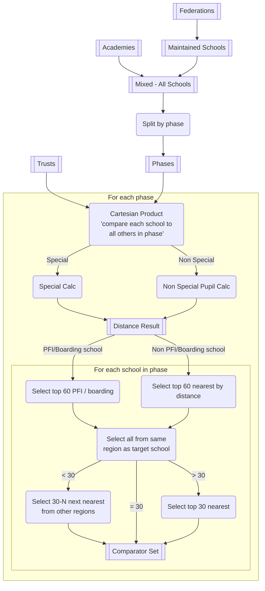
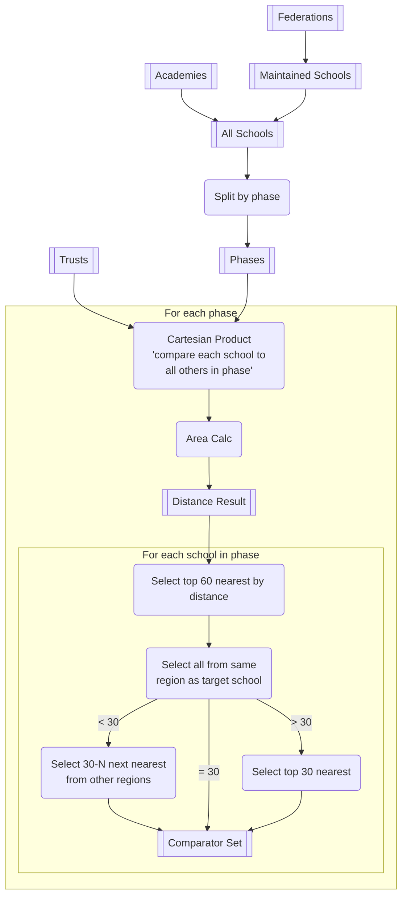

# Data Processing

The data processing pipeline has the following key stages: 

* Pre-processing
* Comparator set computation
* RAG computation

## Pre-processing

//TODO: Add pre-processing logic

## Comparator set computation

Computing comparator sets involves taking the data from the pre-processed academy, maintained schools, trust and federation data and applying two computation flows, one to compute the comparator set using the pupil metric distances and the other using the area metric distances. While similar there are differences, in the workflows which is why they are treated separate below.

### Computing pupil metrics

Computing pupil metrics consumes the following attributes from the input data sets. For the pupil calculation we use 

* Number of pupils (pupils)
* Percentage FSM (FSM%)
* Percentage SEN (SEN%) - Computed by $ EHC Plan / NoOfPupils $

for the special calculation

* **SPLD** - Specific Learning Difficulty
* **MLD** - Moderate Learning Difficulty
* **SLD** - Sever Learning Difficulty
* **PMLD** - Profound and Multiple Learning Difficulty
* **SEMH** - Social, emotional and mental health difficulties
* **SLCN** - Speech, Language and Communication Needs
* **HI** - Hearing Impairment
* **MSI** - Multi sensory impairment
* **PD** - Physical disability
* **ASD** - Autistic Specturm Disorder
* **Oth** - Other

A full description of these categories can be found [here](https://www.jrs.w-berks.sch.uk/userfiles/files/9%20SEN%20Category%20Descriptors.pdf)

**Pupil Calculation (non-special)**

$$ \sqrt{0.5\left(\dfrac{\Delta Pupils}{range(pupils)}\right)^2 + 0.4\left(\dfrac{\Delta FSM\%}{range(FSM\%)}\right)^2  + 0.1\left(\dfrac{\Delta SEN\%}{range(SEN\%)}\right)^2 } $$

**Special Calculation**
 
$$\begin{aligned}
pupils &= 0.6\left(\dfrac{\Delta Pupils}{range(pupils)}\right)^2 + 0.4\left(\dfrac{\Delta FSM\%}{range(FSM\%)}\right)^2
\\
\\
sen &= \left(\dfrac{\Delta SPLD\%}{range(SPLD\%)}\right)^2 + \left(\dfrac{\Delta MLD\%}{range(MLD\%)}\right)^2 + \left(\dfrac{\Delta SLD\%}{range(SLD\%)}\right)^2
\\
&+ \left(\dfrac{\Delta PMLD\%}{range(PMLD\%)}\right)^2 + \left(\dfrac{\Delta SEMH\%}{range(SEMH\%)}\right)^2 + \left(\dfrac{\Delta SLCN\%}{range(SLCN\%)}\right)^2
\\
&+ \left(\dfrac{\Delta HI\%}{range(HI\%)}\right)^2 + \left(\dfrac{\Delta MSI\%}{range(MSI\%)}\right)^2 + \left(\dfrac{\Delta PD\%}{range(PD\%)}\right)^2 + \left(\dfrac{\Delta ASD\%}{range(ASD\%)}\right)^2
\\
&+ \left(\dfrac{\Delta Oth\%}{range(Oth\%)}\right)^2
\\
\\
result &= \sqrt{pupils} + \sqrt{ sen } 
\end{aligned}$$

### Computing area metrics

Computing area metrics consumes the following attributes from the input data sets. For the area calculation we use 

* **GIFA** - Sum of the internal floor areas of the buildings in the school
* **Age Average** - The age average is computed by taking the indicative age of the school and multiplying by the proportional area of the building. $ ProportionArea * (Year - BuildingAge)  $ this is done as part of the pre-processing phase.

**Area Calculation**

$$ \sqrt{0.8\left(\dfrac{\Delta GIFA}{range(GIFA)}\right)^2 + 0.2\left(\dfrac{\Delta AgeAverage}{range(AgeAverage)}\right)^2 } $$

### Future calculations

> Note: **Not to be used at the minute for discussion only**

**Trust Calculation**

$$\begin{aligned}
\sqrt{0.6\left(\dfrac{\Delta Pupils}{range(pupils)}\right)^2 + 0.4\left(\dfrac{\Delta FSM\%}{range(FSM\%)}\right)^2 +\sum_{\substack{n=1}}^N\left(\dfrac{\Delta Phase\%_n}{range(phase\%_n)}\right)^2}
\end{aligned}$$

**Unified pupil calc**

$$  $$

$$\begin{aligned}
sen &= \left(\dfrac{\Delta SPLD\%}{range(SPLD\%)}\right)^2 + \left(\dfrac{\Delta MLD\%}{range(MLD\%)}\right)^2 + \left(\dfrac{\Delta SLD\%}{range(SLD\%)}\right)^2
\\
&+ \left(\dfrac{\Delta PMLD\%}{range(PMLD\%)}\right)^2 + \left(\dfrac{\Delta SEMH\%}{range(SEMH\%)}\right)^2 + \left(\dfrac{\Delta SLCN\%}{range(SLCN\%)}\right)^2
\\
&+ \left(\dfrac{\Delta HI\%}{range(HI\%)}\right)^2 + \left(\dfrac{\Delta MSI\%}{range(MSI\%)}\right)^2 + \left(\dfrac{\Delta PD\%}{range(PD\%)}\right)^2 + \left(\dfrac{\Delta ASD\%}{range(ASD\%)}\right)^2
\\
&+ \left(\dfrac{\Delta Oth\%}{range(Oth\%)}\right)^2
\\
pupils &= \sqrt{0.33\left(\dfrac{\Delta Pupils}{range(pupils)}\right)^2 + 0.33\left(\dfrac{\Delta FSM\%}{range(FSM\%)}\right)+ 0.33sen}
\end{aligned}$$

Storage

| Partition   | RowKey | Data.... |
|-------------|--------|----------|
| Default-2022|{URN 345672} | [123112, 1212331] |
| Default-2022|Mixed-{URN 345671} | [123112, 1212331] |
| Default-2022|{URN 111111} | [123112, 1212331] |
| Default-2022|Mixed-{URN 111111} | [123112, 1212331] |

## RAG Calculation
//TODO: RAG calculation

