# Decision - 0011 - Data pipeline Databricks conversion

## Context and Problem Statement

DfE's SQL server databases are being turned off and migrated to Databricks by the end of 2026. Our data pipelines consume some of this data, so we will have to adapt our pipelines to consume from Databricks. The presence of databricks allows an opportunity for updating of our pipelines - we could offload compute into databricks as an example of a good databricks pipeline for DfE.

## Decision Drivers

* SQL Server databases (including AnM) are being decommissioned by end of 2026
* A lot of our source data including ancillary data is on Databricks already. More is scheduled to be added and we can request missing data.
* The current SQL to extract data will need to be rewritten to Databricks SQL syntax as a Databricks job.
* We will have access to Databricks compute. There are pre-allocated tokens allocated for funding, there are open questions around how this will be managed in the longer term.
* The FBIT service can work from a csv pushed by a job from Databricks, or the Databricks API allows the FBIT application to trigger an export job.
* Data export is currently tracked by Databricks unity catalogue, and is unrestricted.
* Our data size is not large, the pipeline is not run often, and it doesn't take a lot of time to run. So the performance and scalability of the transformations in Databricks, while an improvement, isn't very relevant.

## Considered Options

A basic structure of the data pipeline illustrates the degrees of databricks involvement:

```mermaid
flowchart LR
    %% Data Sources
    DB[(Database Data)]
    STATIC[(Static Data)]
    
    %% Bronze Layer
    subgraph BRONZE ["🥉 BRONZE LAYER"]
        RAW[Raw Data]
    end
    
    %% Silver Layer
    subgraph SILVER ["🥈 SILVER LAYER"]
        MERGE[Merged/Processed Data]
    end
    
    %% Gold Layer
    subgraph GOLD ["🥇 GOLD LAYER"]
        AGGR[Lowest grain user-ready data]
    end
    
    %% Data Mart
    subgraph MART ["📊 DATA MART"]
        COMP[Comparator Sets]
        RAG[RAG System]
    end
    
    %% Flow connections with transformation labels
    DB -->|Ingest & Filter| BRONZE
    STATIC -->|Ingest & Clean| BRONZE
    BRONZE -->|Merge & Transform| SILVER
    SILVER -->|Link| GOLD
    GOLD -->|Serve & Index| MART
    
    %% Styling
    classDef bronzeStyle fill:#CD7F32,stroke:#8B4513,stroke-width:2px,color:#fff
    classDef silverStyle fill:#C0C0C0,stroke:#808080,stroke-width:2px,color:#000
    classDef goldStyle fill:#FFD700,stroke:#DAA520,stroke-width:2px,color:#000
    classDef martStyle fill:#4CAF50,stroke:#2E7D32,stroke-width:2px,color:#fff
    
    class BRONZE bronzeStyle
    class SILVER silverStyle
    class GOLD goldStyle
    class MART martStyle
```

> Note: only the stages up to and including merged/processed are currently under consideration in any of the below options. The latter stages integrate with the operational activities of the service and as such, are not consistent with the intentions of DfE's Databricks platform.

### **Option 1: Change database sources to Databricks**

Change the existing database data sources to Databricks with no changes to the rest of the pipeline. This will need to happen at the very least, as the old databases are getting switched off and migrated to Databricks (as far as we know, this is just AnM). The SQL to extract pipeline data for us will need to be rewritten to t-SQL (this might not be a large task).

#### Pros

* **Simple & Fast to Implement:** This requires minimal code changes.
* **Lowest Risk:** The core processing logic remains untouched.
* **Directly Addresses the Core Problem:** It solves the immediate issue of the SQL Server decommissioning with the least possible effort.

#### Cons

* **Missed Opportunity:** Fails to take advantage of Databricks' processing power and features, ignoring the opportunity for architectural improvement.
* **Data out costs:** Pulling large volumes of raw (Bronze) data out of Databricks  is an anti-pattern. This can lead to high data egress costs and performance bottlenecks.
* **Misaligned with Strategy:** Does not align with the wider organisational strategy of using Databricks as a primary platform for data pipelines. This could lead to the pipeline being considered "legacy" in the future.
* **Scalability Bottleneck:** The existing FBIT service remains the bottleneck for performance and scalability, which Databricks is designed to solve.

### **Option 2: Change all data sources to Databricks**

Change all data sources to Databricks (static files/ancillary data included) with no changes to the rest of the pipeline. We've seen a list of the data sources to be uploaded to databricks and the large majority of our ancillary data will be available. There might still be a few sources which are uploaded through blob storage, or re need to request to be made available in databricks.

#### Pros

* **Consolidates All Data Sources:** Creates a single source of truth for all pipeline data (both database and static files). This simplifies data management, governance, and discovery.
* **Simplified Ingestion Logic:** The FBIT pipeline only needs to know how to connect to one type of source system (Databricks), simplifying its ingestion code.

#### Cons

* **Delta lake datasets updates:** Who updates the ancillary data from gov.uk sources when it gets updated? Do we prompt the ADA team to make the new release available?
* **Still Inefficient:** Suffers from the same major drawback as Option 1: all data is pulled out of Databricks for external processing, which is inefficient and costly.
* **Marginal Improvement:** Offers only a small architectural improvement over Option 1 for a non-trivial amount of work.

### **Option 3: Preprocess data in Databricks**

Source data from and perform up until the gold layer of compute in Databricks. Calculate comparator sets and RAG scores in FBIT.

#### Pros

* **Leverages Databricks' Strengths:** Uses Databricks for what it excels at: large-scale, distributed data transformation (ETL/ELT). This makes the most performance-intensive part of the pipeline highly scalable. We'd also be more trackable via the unity catalogue.
* **Fewer expensive data transfers:** The data pulled into FBIT is smaller and pre-aggregated (gold layer).
* **Phased Modernisation:** Represents a good "best of both worlds" compromise. It modernises the core data processing while retaining specialised or complex logic ("comparator sets") in the existing, stable FBIT service.
* **Aligns with Medallion Architecture:** This approach is a textbook implementation of the Bronze-Silver-Gold medallion architecture within a lakehouse platform which can be an example in the rest of DfE

#### Cons

* **Stray files not in databricks** We might need to still drag and drop new releases into databricks to make it all work, like we do with the current pipeline.
* **Architectural Complexity:** The pipeline logic is now split across two systems (Databricks and FBIT). This can make orchestration, end-to-end monitoring, and debugging more complex.

## Recommendation

**Option 2, lay groundwork for Option 3** - Migrate all available data sources to Databricks. It is low risk, sources can be migrated as they become available in Databricks, and establishes a foundation for Option 3 when DfE's Databricks transformation strategy matures.

### Implementation Strategy

#### Data Source Migration Approach

Each data source will be assessed and migrated using one of four pathways:

1. **Ready for Migration:** Data already exists in Databricks in compatible format - migrate extraction logic immediately
2. **ADA Partnership:** Data not in Databricks but ADA team can ingest and maintain it as a managed dataset
3. **FBIT Ownership:** Data not in Databricks but FBIT takes responsibility for ingestion and maintenance
4. **Status Quo:** Data remains outside Databricks where migration is not feasible

#### Parallel Architecture Preparation

To prepare for future Option 3 adoption, we will refactor the current pipeline architecture:

* Separate preprocessing pipeline from comparator sets and RAG functionality
* Enable independent triggering of each pipeline component
