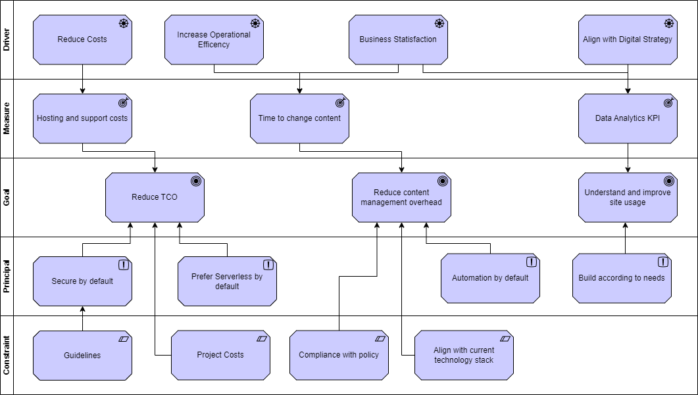

# Introduction and Goals

## Introduction

### Background

Currently the Department for Education (DfE) produces two major sets of financial data:

- School Financial Benchmarking (SFB) - publicly available data that meets the DfE's statutory data transparency requirements
- View My Financial Insights (VMFI) - only accessible to schools, academy trusts, and Local Authorities (LAs) as it includes data nmot in the public domain 
Both of these services allow users to compare a selected school with similar schools. They use largely the same dataset, but are independent of each other. This leads to a duplication of effort and incosistencies as each system analyses the data differently.

## Goals and Drivers

| Type      | Description |
|:---------:|:------------|       
| **Goal** | Reduce total cost of ownership (TCO) |
| **Goal** | Reduce content management overhead |
| **Goal** | Understand and improve site usage |
| **Driver** | Reduce costs |
| **Driver** | Reduce content management overhead |
| **Driver** | Understand and improve site usage |

## Requirements Overview

The requirements for a Minimum Viable Product (MVP) are:

- A single service that replaces both SFB and VMFI, whilst retaining all the features of both systems. Where there is a currentl overlap of feature, a decision will be made and logged as to which functionality will be retained
- A reduction and simplicifcation of the infrastructure hosting the service
- A CI/CD pipeline enabling automated testing and deployment of changes to the system in the most effective manner

## Stakeholders

TBD

**//TODO: Insert or link to the stakeholder map here**
