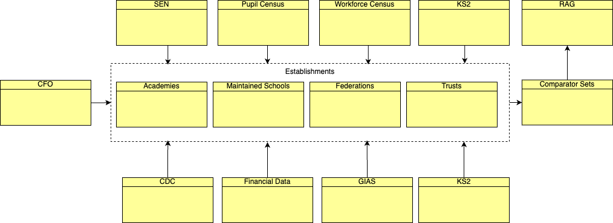

# Information Architecture

## Logical Data Model

### Entities

| Entity                 | Description                                                                                                 |
|:-----------------------|:------------------------------------------------------------------------------------------------------------|
| **Academies**          | Holds information specific to an academies, including staff, pupil and financial                            |
| **Comparator Sets**    | Holds the sets of similar schools/academies that each school is compared to                                 |
| **Financial Plans**    | Holds financial plans for a school or academy designed using the Curriculum & Financial Planning (CFP) tool |
| **CDC**                | Holds building information specific to a school or academy                                                  |
| **GIAS**               | Holds information for a school, academy or trust taken from the Get Information About Schools service       |
| **Maintained Schools** | Holds information specific to an LEA maintained school, including staff, pupils and finances                |
| **MAT Allocs**         | Holds information about multi-academy trust allocations                                                     |
| **MAT Central**        | Holds information about centrally assigned multi-academy trust financials                                   |
| **MAT Overview**       | Holds general information regarding multi-academy trusts                                                    |
| **MAT Totals**         | Holds aggregate information specific to multi-academy trusts                                                |

## Data Repositories

| Name | Technology             |
|:-----|:-----------------------|

