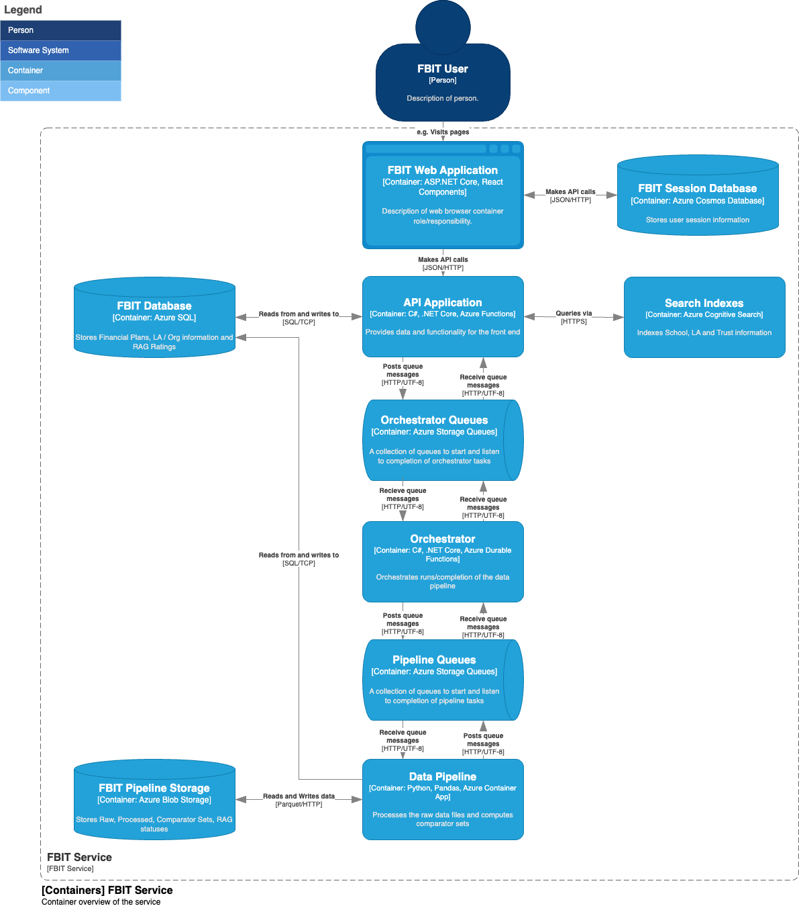

# Application Architecture

| Component | Description |
|:---------:|:------------|
| **Front End** | An Azure App Service that hosts the MVC app that allows users to view default benchmark sets and create custom sets |
| **Benchmarking Renderer** | A ReactJS component that renders benchmarking items |
| **App Service IP Restrictions**| This is an Azure boundary layer that warap the APIs in order to reduce the number of IP addresses that can access the service |
| **Establishments API** | Handles searching of schools and academies |
| **Schools API** | Handles reading of schools data |
| **Academies API** | Handles reading of academies data |
| **Benchmarks API** | Handles creation and reading of benchmark data sets |
| **Events API** | Receiveds HTTPS requests that contain event data |
| **Platform Storage** | This is Azure Storage Accounts, that will hold static assets (such as images) that are not appropriate for satabase storage |
| **Azure SQL Databases** | TBD |
| **Azure Front Door** | A Content Delivery Network (CDN) that serves static assets and caches them nearer the user to improve performance |
| **Azure Maps API** | An Azure service that provides geolocation data |
| **BI Tools** | Commonly used across DfE as a report visualisation platform for management information |

## Interaction Viewpoint 

The calculations below are based on the latest available SLA summary provided by Microsoft available [here (May 2024)](https://wwlpdocumentsearch.blob.core.windows.net/prodv2/OnlineSvcsConsolidatedSLA(WW)(English)(May2024)(CR).docx)

All Downtime calculations are based on a 8-hour working day (Mon - Fri)

### Overall FBIT service

| **Component**            | **Azure Service**   | **Max SLA** | **Min SLA** |
|--------------------------|---------------------|---------|---------|
| Web Application Firewall | Azure Front Door    | 99.99%  | 99.90%  |
| FBIT Web Application     | Azure App Service   | 99.95%  | 95%     |
| FBIT Session Database    | Azure Cosmos DB     | 99.99%  | 99%     |
| FBIT APIs                | Azure Functions     | 99.95%  | 95%     |
| FBIT Database            | Azure SQL Database  | 99.99%  | 95%     |
| FBIT Orchestrator        | Azure Functions     | 99.95%  | 95%     |
| FBIT Data Api            | Azure Container App | 99.95%  | 95%     |
| Data Storage             | Azure Storage       | 99.99%  | 99%     |
| **Total**                |                     | **99.76%**  | **75.76%**  |
| *Downtime mins per year* |                     | *299*     | *30248*   |

### FBIT Data Api

| **Component**            | **Azure Service**   | **Max SLA** | **Min SLA** |
|--------------------------|---------------------|---------|---------|
| FBIT Data Api            | Azure Container App | 99.95%  | 95%     |
| Data Storage             | Azure Storage       | 99.99%  | 99%     |
| **Total**                |                     | **99.94%**  | **94.05%**  |
| *Downtime mins per year* |                     | *75*     | *7426*   |

### FBIT Data Pipeline

| **Component**            | **Azure Service**   | **Max SLA** | **Min SLA** |
|--------------------------|---------------------|---------|---------|
| FBIT Data Pipeline       | Azure Container App | 99.95%  | 95%     |
| Data Storage             | Azure Storage       | 99.99%  | 99%     |
| **Total**                |                     | **99.94%**  | **94.05%**  |
| *Downtime mins per year* |                     | *75*     | *7426*   |

