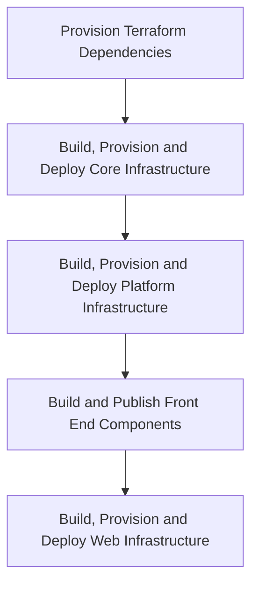
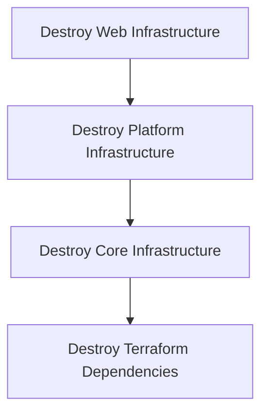

# Deployment Architecture

## Build pipelines

## Release pipelines

### Feature release

To deploy a short-running feature to infrastructure, the [Feature](../../pipelines/feature/release.yaml) release pipeline may be executed.
The intended audience is for features that may contain potentially breaking or in-flight changes that may cause the Development environment to fail should they be merged to `main` prematurely. The feature may be released off a selected source branch and subsequently [destroyed](#destroy-pipeline) once sufficient validations have taken place.

> **NOTE**: Feature deployments should be carefully managed as they will incur additional cost, both in provisioning time as well as financially.

| Input parameter      | Example       | Purpose                                                                                                                                       |
|----------------------|---------------|-----------------------------------------------------------------------------------------------------------------------------------------------|
| `environment`        | `development` | Environment associated with the feature to deploy.                                                                                            |
| `featureEnvironment` | `13`          | Feature environment to create or update. Used with the `environment` choice, this will provision resources with the prefix such as `s198d13`. |

This pipeline is linked to the `feature` environment.

> **NOTE**: Data seeding is currently omitted from a feature release to infrastructure.

### Destroy pipeline

To destroy a short-running feature in infrastructure, the [Destroy](../../pipelines/destroy/release.yaml) release pipeline may be executed.

| Input parameter      | Example       | Purpose                                                                                                                            |
|----------------------|---------------|------------------------------------------------------------------------------------------------------------------------------------|
| `environment`        | `development` | Environment associated with the feature to destroy.                                                                                |
| `featureEnvironment` | `13`          | Feature environment to destroy. Used with the `environment` choice, this will destroy resources with the prefix such as `s198d13`. |
| `areYouSure`         | `No`          | The first gate on this pipeline. Select `Yes` to confirm infrastructure destruction.                                               |

This pipeline is linked to the `destroy` environment, which itself has an approval gate assigned.

