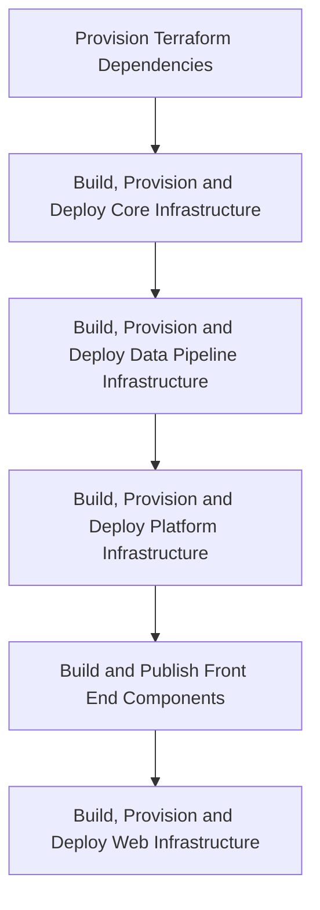
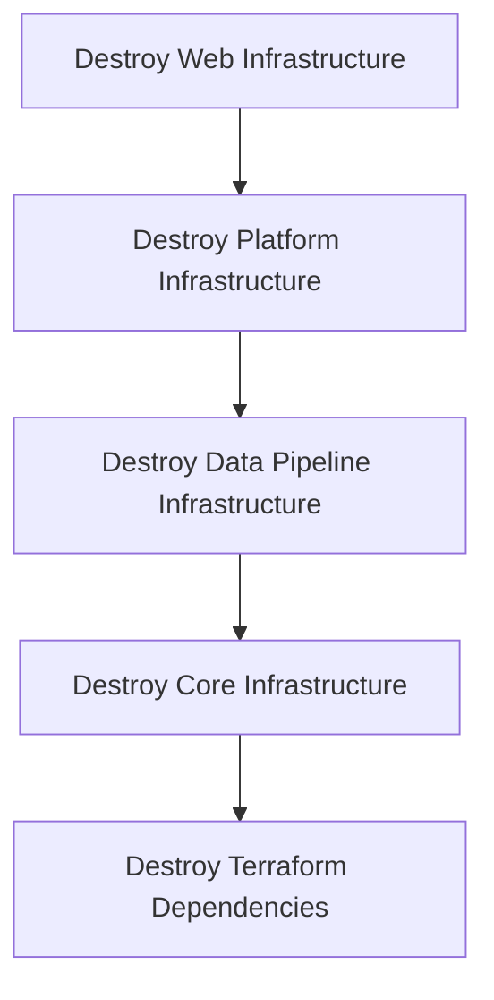

# Deployment Architecture

## Build pipelines

## Release pipelines

### Production release

TODO

### Feature release

To deploy a short-running feature to infrastructure, the [Feature](../../pipelines/feature/release.yaml) release pipeline may be executed.
The intended audience is for features that may contain potentially breaking or in-flight changes that may cause the Development environment to fail should they be merged to `main` prematurely. The feature may be released off a selected source branch and subsequently [destroyed](#destroy-pipeline) once sufficient validations have taken place.

> **NOTE**: Feature deployments should be carefully managed as they will incur additional cost, both in provisioning time as well as financially. This may be achieved by keeping an up-to-date list in, for example, [Slack](https://hippo-digital.slack.com/lists/T12TVEKHQ/F09GXQAJ16F) along with environment ownership.

| Input parameter      | Example       | Purpose                                                                                                                                       |
|----------------------|---------------|-----------------------------------------------------------------------------------------------------------------------------------------------|
| `environment`        | `development` | Environment associated with the feature to deploy.                                                                                            |
| `featureEnvironment` | `13`          | Feature environment to create or update. Used with the `environment` choice, this will provision resources with the prefix such as `s198d13`. |

This pipeline is linked to the `feature` environment.



> **NOTE**: Data seeding is intentionally currently omitted from a feature release to infrastructure. To populate, obtain source files and begin a [data pipeline](../../data-pipeline/README.md) run.

#### Known issues

Deploying to a feature environment that has been used in the past sometimes leads to conflicts on resources that were not properly destroyed previously. This is most commonly seen on Diagnostic Setting and Smart Detector Alert Rule resources. e.g.:

```text
Error: creating/updating Monitor Smart Detector Alert Rule 
(Subscription: "xxx", Resource Group Name: "xxx-ebis-support" Smart Detector Alert Rule Name: "failure-anomalies"): 

unexpected status 409 (409 Conflict) with error: ScopeInUse: A FailureAnomaliesDetector alert rule with id '/subscriptions/xxx/resourcegroups/xxx-ebis-core/providers/microsoft.alertsmanagement/smartdetectoralertrules/failure anomalies - xxx-ebis-ai' is already defined on the resource '/subscriptions/xxx/resourcegroups/xxx-ebis-core/providers/microsoft.insights/components/xxx-ebis-ai'. Only a single FailureAnomaliesDetector alert rule can be define for the same resource.
```

In this case, manually remove the offending resource in Azure Portal and re-run the failed job.

### Destroy pipeline

To destroy a short-running feature in infrastructure, the [Destroy](../../pipelines/destroy/release.yaml) release pipeline may be executed.

| Input parameter      | Example       | Purpose                                                                                                                            |
|----------------------|---------------|------------------------------------------------------------------------------------------------------------------------------------|
| `environment`        | `development` | Environment associated with the feature to destroy.                                                                                |
| `featureEnvironment` | `13`          | Feature environment to destroy. Used with the `environment` choice, this will destroy resources with the prefix such as `s198d13`. |
| `areYouSure`         | `No`          | The first gate on this pipeline. Select `Yes` to confirm infrastructure destruction.                                               |

This pipeline is linked to the `destroy` environment, which itself has an approval gate assigned.



#### Known issues

The destroy pipeline is known to be flaky and may require multiple runs. Some resources containing soft-deleted items (such as Key Vault) may also need to be manually removed upon repeat failures.

<!-- Leave the rest of this page blank -->
\newpage
