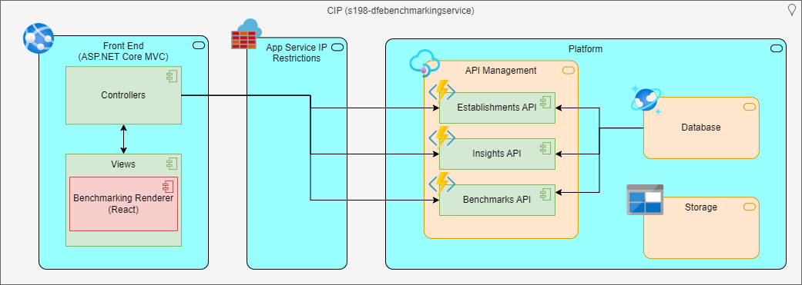
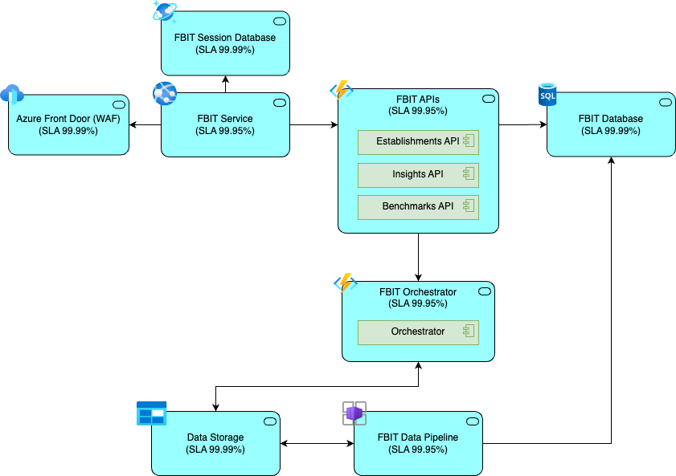

# Application Architecture

## Interaction Viewpoint 

The calculations below are based on the latest available SLA summary provided by Microsoft available [here (Nov 2023)](https://www.microsoft.com/licensing/docs/view/Service-Level-Agreements-SLA-for-Online-Services?lang=1)

| Service | Theoretical Max SLA | Expected min downtime (mins/yr) | Theoretical Min SLA | Expected max downtime (mins/yr) |
|:-------:|:------------:|:-------------------------------:|:------:|:------|
| Benchmarking Service | 99.87% |               163               | 95.96% | 5042 |
| Data Ingestion Pipeline | TBD |               TBD               | TBD | TBD |

Downtime calculations are based on a 8-hour working day (Mon - Fri)

### Component Summary 

| Component | Description |
|:---------:|:------------|
| **Front End** | An Azure App Service that hosts the MVC app that allows users to view default benchmark sets and create custom sets |
| **Benchmarking Renderer** | A ReactJS component that renders benchmarking items |
| **App Service IP Restrictions**| This is an Azure boundary layer that warap the APIs in order to reduce the number of IP addresses that can access the service |
| **Establishments API** | Handles searching of schools and academies |
| **Schools API** | Handles reading of schools data |
| **Academies API** | Handles reading of academies data |
| **Benchmarks API** | Handles creation and reading of benchmark data sets |
| **Events API** | Receiveds HTTPS requests that contain event data |
| **Platform Storage** | This is Azure Storage Accounts, that will hold static assets (such as images) that are not appropriate for satabase storage |
| **Azure SQL Databases** | TBD |
| **Azure Front Door** | A Content Delivery Network (CDN) that serves static assets and caches them nearer the user to improve performance |
| **Azure Maps API** | An Azure service that provides geolocation data |
| **BI Tools** | Commonly used across DfE as a report visualisation platform for management information |