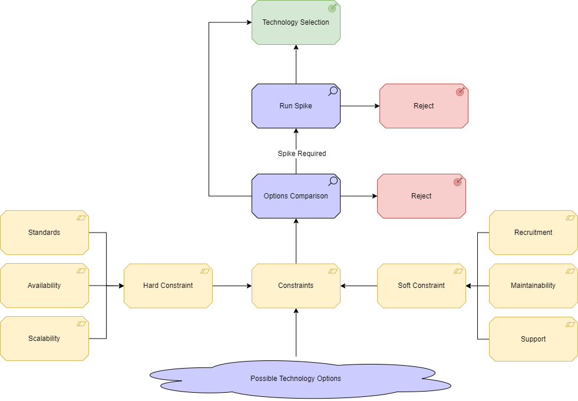

# Decisions

Below are the key decisions that have taken place during the project:

1. [Api Architecture](decisions/api-architecture.md)
2. [Front End Framework](decisions/front-end-framework.md)
3. [Data Storage](decisions/data-storage.md)

## Decision Process

The decision-making process follows the flow shown below:

The "standards" hard constraint includes typical implementations with the wider DfE landscape, as well as GDS compliance, for example, the use of Azure is not a standard, but a hard constraint as the preferred cloud platform for the department. 