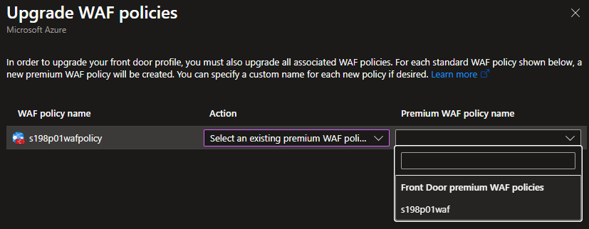

# Azure Front Door Upgrade (0011)

Date: 2025-06-25

## Status

Accepted

Related work items:

- [266317 - FBIT AFD/WAF Upgrade - Provision new WAF policy](https://dfe-ssp.visualstudio.com/s198-DfE-Benchmarking-service/_workitems/edit/266317)
- [266318 - FBIT AFD/WAF Upgrade - Manually upgrade infrastructure](https://dfe-ssp.visualstudio.com/s198-DfE-Benchmarking-service/_workitems/edit/266318)
- [266319 - FBIT AFD/WAF Upgrade - Remove orphaned WAF policy](https://dfe-ssp.visualstudio.com/s198-DfE-Benchmarking-service/_workitems/edit/266319)

## Context

Spike [#264358](https://dfe-ssp.visualstudio.com/s198-DfE-Benchmarking-service/_workitems/edit/264358) was to
research and document the various upgrade paths for the FBIT Application Front Door (AFD) and Web Application
Firewall (WAF) from Standard to the Premium tier. This requirement arose due to the initial private beta release
being more than capable of filtering unwanted traffic based on `geolocation` rules in AFD Standard, but since
then this rule has been observed to be blocking genuine traffic from schools routing from outside the UK.
Managed rules in AFD Premium enable more enhanced traffic management that will allow this rule to be dropped,
or potentially detected/logged rather than block traffic in the Production environment.

## Considerations

1. Availability impact
    - Minimal acceptable downtime
    - If unavoidable then out-of-hours release may be planned instead, but this would be a drain on resources
    - If unavoidable then suitable holding page/pattern should be introduced
2. Custom domain validation via `TXT` records
    - DNS record changes are difficult to sync with IT Helpdesk and may take time to propagate
    - Significant downtime may arise if validation fails, although documentation suggests that
    [`TXT` record validation](https://learn.microsoft.com/en-us/azure/frontdoor/domain#txt-record-validation)
    is a one-off task
3. Terraform state consistency
    - Process entirely handled by Terraform to support future replay-ability
    - If not possible then Terraform state should eventually match infrastructure after any manual intervention
    - Ideally using Terraform import should be avoided due to additional complexity
4. Infrastructure consistency
    - Ideally each environment should end up in a consistent state in comparison to one another, without having
      to conditionally manage resources based on (e.g.) environment-specific configuration values

## Options Considered

### Option 1: Two deployments, with new WAF policies for all environments

1. Provision new Premium/Standard WAF policies as defined in configuration in all environments using Terraform
2. Upgrade AFD to Premium tier within Azure Portal, selecting the above provisioned policy during the process
3. Update Terraform to assign all AFD profiles to their respective new WAF policies and drop orphaned WAF policy

#### Details

##### Provision new WAF policies

Define a new configuration variable in order to configure the new WAF policy SKU in each environment. The
AFD profile variable may also be renamed for consistency:

```tf
variable "configuration" {
  type = map(object({
    # ...
    front_door_profile_sku_name    = string
    front_door_waf_policy_sku_name = string
    # ...
  }))
}
```

For the `production` environment set the new configuration variable to `Premium_AzureFrontDoor` and the rest to
`Standard_AzureFrontDoor` (for the first release the value here for `production` will intentionally not match
the profile SKU).

Define a new WAF policy resource that consumes the SKU from the new variable:

```tf
resource "azurerm_cdn_frontdoor_firewall_policy" "web-app-front-door-waf" {
  name                = "${var.environment-prefix}waf"
  resource_group_name = azurerm_resource_group.resource-group.name
  enabled             = true
  tags                = local.common-tags

  sku_name = var.configuration[var.environment].front_door_waf_policy_sku_name
  mode     = var.configuration[var.environment].waf_mode

  # ... `custom_rule`s and `managed_rule`s as per web-app-front-door-waf-policy ...
}
```

The `web-app-front-door-profile` should be updated with the renamed `front_door_profile_sku_name` configuration
variable:

```tf
resource "azurerm_cdn_frontdoor_profile" "web-app-front-door-profile" {
  name                = "${var.environment-prefix}-education-benchmarking-fd-profile"
  resource_group_name = azurerm_resource_group.resource-group.name
  tags                = local.common-tags

  sku_name = var.configuration[var.environment].front_door_profile_sku_name
}
```

The above changes should then be deployed to all environments before the next step becomes unblocked.

##### Upgrade AFD in the Portal

Submit Privileged Identity Management (PIM) request for Contributor access to Production subscription and await
response.

In Azure Portal, locate the `s198p01-education-benchmarking-fd-profile` resource and select the Upgrade option:


Confirm the upgrade tier:


Choose the newly created Premium WAF policy name:



Confirm the process:


Wait for the update process to complete, usually within a couple of minutes. Then verify FBIT remains accessible.
If something has gone wrong at this stage there is little option that to provision a new AFD as a downgrade from
Premium to Standard [is not supported](https://learn.microsoft.com/en-us/azure/frontdoor/tier-upgrade). See
'rollback' section below for more details.

##### Update Terraform

Update the security policy to associate the new WAF with the AFD profile to ensure for the upgraded AFD that
this now matches infrastructure. For unchanged AFD (i.e. all non-production environments) the new policy is
referenced, but still on the Standard SKU (an infrastructure change, but functionally no difference):

```tf
resource "azurerm_cdn_frontdoor_security_policy" "web-app-front-door-security-policy" {
  name                     = "${var.environment-prefix}-education-benchmarking-fd-security-policy"
  cdn_frontdoor_profile_id = azurerm_cdn_frontdoor_profile.web-app-front-door-profile.id

  security_policies {
    firewall {
      cdn_frontdoor_firewall_policy_id = azurerm_cdn_frontdoor_firewall_policy.web-app-front-door-waf.id

      association {
        # ... no further changes ...
      }
    }
  }
}
```

The old `web-app-front-door-waf-policy` security policy may then also be removed from Terraform.

Modify the variables to set the new SKU for the `production` environment:

```tf
production = {
  # ...
  front_door_profile_sku_name = "Premium_AzureFrontDoor"
  # ... other environment-specific config ...
}
```

The above changes should then match what has been manually upgraded in Azure portal for Production and Terraform
should not detect any changes on its next `plan`, bar the removal of the orphaned WAF policy:


#### Pros

✅ No detectable downtime

✅ No DNS changes required

✅ Consistent AFD-related resources across environments (albeit at different SKUs)

#### Cons

❌ Manual intervention required

❌ Multiple releases to ensure eventual consistency

❌ Multiple WAF policies in each environment between releases may cause confusion, but should not incur charges

### Option 2: Two deployments, with new WAF policy for production environment only

1. Provision new Premium WAF policy in Production only using Terraform
2. Upgrade AFD to Premium tier within Azure Portal, selecting the above provisioned policy during the process
3. Update Terraform to match Production manually upgraded infrastructure
4. Tidy up orphaned Standard WAF policy in Production

#### Details

##### Provision Premium WAF policy

Either define a new variable or else use a conditional check on `lower(var.environment) == "production"` to
determine whether to provision a Premium WAF policy:

```tf
resource "azurerm_cdn_frontdoor_firewall_policy" "web-app-front-door-waf-policy-premium" {
  count               = lower(var.environment) == "production" ? 1 : 0
  name                = "${var.environment-prefix}wafpolicypremium"
  resource_group_name = azurerm_resource_group.resource-group.name
  enabled             = true
  tags                = local.common-tags

  sku_name = "Premium_AzureFrontDoor"
  mode     = var.configuration[var.environment].waf_mode

  # ... `custom_rule`s and `managed_rule`s ...
}
```

Along with the above, the dynamic `managed_rule` blocks on the pre-existing `azurerm_cdn_frontdoor_firewall_policy`
may be dropped and the `sku_name` set to `Standard_AzureFrontDoor`:

```tf
resource "azurerm_cdn_frontdoor_firewall_policy" "web-app-front-door-waf-policy" {
  name                = "${var.environment-prefix}wafpolicy"
  resource_group_name = azurerm_resource_group.resource-group.name
  enabled             = true
  tags                = local.common-tags

  sku_name = "Standard_AzureFrontDoor"
  mode     = var.configuration[var.environment].waf_mode

  # ... `custom_rule`s ...
}
```

The above changes should then be deployed to Production before the next step becomes unblocked.

##### Upgrade AFD in the Portal

As documented above.

##### Update Terraform

Add a conditional to the security policy to ensure the new Premium WAF policy is linked by `id` when the Premium
SKU has been set.

```tf
resource "azurerm_cdn_frontdoor_security_policy" "web-app-front-door-security-policy" {
  name                     = "${var.environment-prefix}-education-benchmarking-fd-security-policy"
  cdn_frontdoor_profile_id = azurerm_cdn_frontdoor_profile.web-app-front-door-profile.id

  security_policies {
    firewall {
      cdn_frontdoor_firewall_policy_id = (
        azurerm_cdn_frontdoor_profile.web-app-front-door-profile.sku_name == "Premium_AzureFrontDoor" 
          ? azurerm_cdn_frontdoor_firewall_policy.web-app-front-door-waf-policy-premium[0].id 
          : azurerm_cdn_frontdoor_firewall_policy.web-app-front-door-waf-policy.id
        )

      association {
        # ... no further changes ...
      }
    }
  }
}
```

Modify the variables to set the new SKU for the `production` environment:

```tf
production = {
  # ...
  front_door_sku_name = "Premium_AzureFrontDoor"
  # ... other environment-specific config ...
}
```

The above changes should then match what has been manually upgraded in Azure portal and Terraform
should not detect any changes on its next `plan`:


#### Pros

✅ No detectable downtime

✅ No DNS changes required

#### Cons

❌ Manual intervention required

❌ Multiple releases to ensure eventual consistency

❌ Inconsistent AFD-related resources across environments

❌ Orphaned 'Standard' WAF policy requires manual removal, or future Terraform update to remove

### Option 3: Manage upgrade via Terraform in single release

1. Bump AFD tier in Terraform alone to destroy existing Standard resources in Production and recreate as Premium
2. Issue change request to add new `TXT` record for custom domain validation

#### Pros

✅ Terraform-only change

✅ Single release

✅ Non-production environments unaffected

#### Cons

❌ 5-10 minutes downtime while resources destroyed, recreated, and application deployed

❌ DNS changes required

## Recommendation

Preferred Approach is Option 1 (two deployments, with new WAF policies for all environments) because it ensures
all environments remain consistent with one another, while allowing the manual upgrade in Azure Portal to reduce
platform downtime.

## Failure considerations

### Shutter site

It is not possible to downgrade Azure Front Door back to Standard from Premium. If something goes drastically wrong
during the upgrade it is recommended that the site be shuttered while investigation proceeds and a resolution is
implemented. As such, any above implementations should not take place until
[#227179](https://dfe-ssp.visualstudio.com/s198-DfE-Benchmarking-service/_workitems/edit/227179) has been completed.

### Manually provision temporary infrastructure

Another option would be to manually create a new AFD profile in the same resource group as the failed AFD (along
with the provisioned Premium WAF policy) while investigation into what went wrong takes place:


Verify that everything is working as expected using the `azurefd.net` domain. Then manually add the custom domain,
after first disassociating from the failed upgraded AFD:


If the disassociation is not done first then the following error will be returned:


A DNS change request with the newly generated `TXT` record may then be submitted as an urgent request to avoid
lengthy downtime.

The manually added domain may then be associated with the route:


Once access has been restored to FBIT using the manually created AFD fixes to the original one may be made, or
investigation begun. This could include:

1. Manually destroying the failing Front Door profile and re-running a Terraform deployment to recreate everything
in the Premium tier
2. Manually destroying the failing Front Door profile and recreating manually everything in the Premium tier to
match what Terraform would next provision according to the chosen approach from above

In both of the above cases custom domain disassociation/reassociation will be required, and DNS change request(s)
made which may lead to additional downtime.

<!-- Leave the rest of this page blank -->
\newpage
