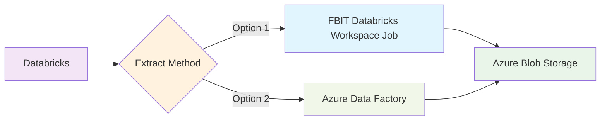

# Decision - 0014 - DfE Databricks data out

## Context and Problem Statement

There is not currently an established method of exporting data from DfE's Databricks instance. As FBIT migrate their data pipelines to Databricks, we need to set a pattern for how we take extracts.

As Databricks is hosted on Azure, compute in Databricks can be configured to write to our Azure subscription area. There are however a few options for how to create and trigger these jobs.

## Considered Options

* We create and administer jobs within our Databricks account. FBIT will own and have permission to run jobs, so we can take our own extracts as we like.
* We help define an extract job for Azure Data Factory (ADF) with the ADA data engineers which runs on a Databricks service account, and extracts data to our Azure blobs. ADA's data engineers will own the job, but we will still be able to change it through them.

The data extracts are not large and not run often. The cost is likely to be low and not largely different between the two options but perhaps slightly more for ADF due to orchestration costs. At higher volumes it might be lower cost to run our own jobs, but ADA have more visibility over data extracts through ADFs which they control, so there are organisational benefits.

### Evaluation

| Trade-off Area | Option 1: FBIT-owned Databricks Jobs | Option 2: ADF with ADA Data Engineers |
|---|---|---|
| **Control vs. Dependency** | Full autonomy over job creation, scheduling, and execution | Dependency on ADA team for changes and troubleshooting |
| **Speed vs. Expertise** | Faster iteration and troubleshooting capability | Leverages centralized monitoring and ADA expertise |
| **Operational Burden** | Requires FBIT to develop Databricks expertise and operational capabilities | Reduced operational burden on FBIT |
| **Standards vs. Flexibility** | Potential for configuration drift from organizational standards | Better integration with existing data infrastructure but less flexibility in scheduling and execution parameters |
| **Efficiency vs. Consistency** | May duplicate effort if similar patterns emerge across teams | Centralized approach reduces duplication but may cause delays in implementing extract modifications |
| **Cost Ownership** | Cost billed to FBIT Databricks workspace | Cost billed to ADA |

## Decision Outcome

If we can agree on a extract frequency leading up to our data releases, having an ADF job which writes us extracts is cleaner. Our extract logic is quite static and not likely to be altered, so having control over it is less of an advantage. We can always request custom runs of the job. A good frequency could be weekly for a month before and after the official release date of each of our financial publications, for example.

There are a few unknowns in how to schedule databricks jobs - we would have to get the code under our version control, and ensure that writing to each environment of ours in Azure was suitably controlled (writes to prod). Having a predictable ADF job to do it for us would remove the need for us to create devops processes on Databricks.

<!-- Leave the rest of this page blank -->
\newpage
