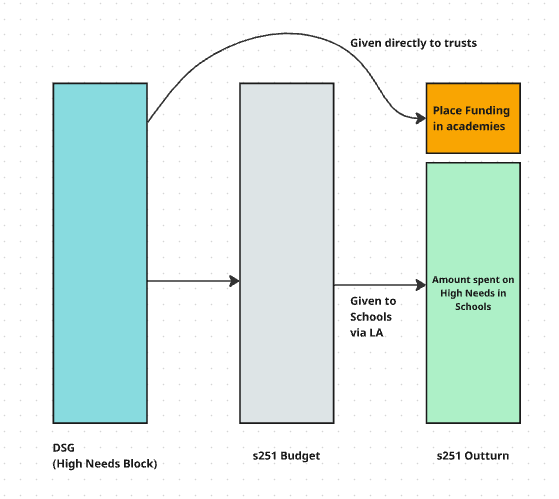

# Recommendation for academy place funding values to enable DSG/s251 outturn alignment (0021)

Date: 2026-01-08

Author: Data Analysts, Data Engineer

Stakeholders: Product Owners, Data Analysts, Developers, Client Stakeholders

## Status

Draft

## Executive Summary

The category comparison charts for s251 budget and outturn data, shown in the High Needs functionality of the Financial Benchmarking and Insights Tool (FBIT), do not currently include the recoupment amount (place funding for academies) in the outturn.  The affect of this is that the budget and outturn figures do not have equivalent coverage, as the budget values will include the place funding for all schools.  To correct this an additional data source will be added to the FBIT data model which will enable the granular academy place funding amount for each category (i.e. Primary, Secondary, Special, Alternative_Provision) to be worked out and added into each category value accordingly.

**Recommendation:** Use the Place funding data source to add the number of places in each cost category into the LA_Financial table to be used when determining the cost per pupil for each category.

## Context and Problem Statement

The current values for the Place Funding charts are taken directly from the s251 outturn publication, as this only covers sending made directly by the LA this does not include the amount given to academies.  

**The Problem:**
The reason the outturn does not include the place funding in academies is that the money is given directly to these schools by DfE as there funding is not managed by LA's.  The funding amount is however included in the Dedicated Schools Grant (DSG) and is therefore in the s251 at the budgeting stage to enable it to be reconciled to the grant.  To enable the outturn to be reconcile to the grant and s251 budget the place funding amount for academies will be added into the outturn value within FBIT.  The solutions will be assessed against the following criteria;

1. **Completeness:** Does it provide the required additional data
2. **Relatability & Explainability:** Can the figure be easily explained and traced back to published datasets
3. **Strategic Focus:** Does the source solve a verified user problem, rather than adding complexity based on assumptions?

## Options Considered

The following sources were evaluated:

1. Do nothing
2. Include values for each category of place funding on the LocalAuthorityFinancial table, these values will be calculate using the school level [High Needs Places](https://www.gov.uk/government/publications/high-needs-allocated-place-numbers) publication and the Schools table to determine whether the school is a Primary or secondary school  
3. Additionally to changes described in option 2 the LocalAuthority table will be amended to include the number of places funded in each category at the £6000 and £10000 level, to enable this number to be added to the service to add transparency of the values used in the calculation.  The 'Provider Category' of each school as per the 'High Needs Places' publication will also be added to the Schools table to enable this to be used elsewhere in the service when alignment to the s251 publication is required.

## Recommendation: Option

The recommendation is to proceed with **Option 2**.

Adding the place funding values from the [High Needs Places](https://www.gov.uk/government/publications/high-needs-allocated-place-numbers) publication to the LocalAuthorityFinancial table gives a balance between performance and traceability.

### Rationale

* **Correlation & Accuracy:** It will be possible to find the place funding values for each authority at the category level in the LocalAuthorityFinancial table which can be cross referenced with the s251 publication, the additional academy place funding ('recoupment') fields will provide the granularity needed to relate the value back to the 'High Needs Places' publication.
* **Explainability:** Storing the separate Acadmey Places Funding values will aid clarity and traceability if required.
* **Problem-First Approach:** The additional fields are being added as they are not present in the 's251' publication but are needed to provide the comparable spending amount for each LA.

## Analysis of Alternatives

| Option                             | Reason for Rejection                                                                                                                                                                                                                                                |
|:-----------------------------------|:--------------------------------------------------------------------------------------------------------------------------------------------------------------------------------------------------------------------------------------------------------------------|
| **Do nothing (Opt 1)**            | This was discounted as it does not meet the user requirements for granular recoupment values to be added to the place funding charts|
| **Replace file (Opt 3)**            | This option has been discounted as the additional fields are not need at this time to meet the stated requirements.|

## Risks and Required Actions

### Risks

* **Perceived Completeness:** The High Needs Places publication is published at the same point as the s251 Budget i.e. it is  .

### Required Actions

1. **Documentation:**
Provide specific documentation which describes how to parse the 'High Needs Places' file and calculate the category level Place Funding fields to be added to the LocalAuthority table.

2. **Data pipeline changes:**
Change the data pipeline to process the new data source and update the database with the new fields.

<!-- Leave the rest of this page blank -->
\newpage
