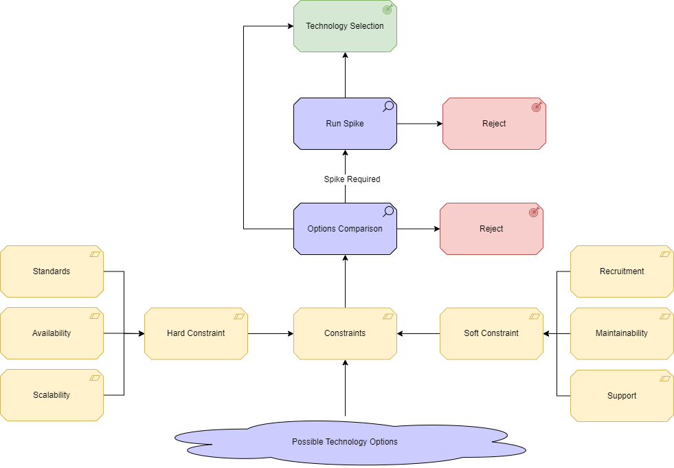

# Front-end framework

## Introduction

For the new financial benchmarking system, there are several differnet frameworks and architectures that can be used to build the user-facing front end site. In order to make the graphs and charts interactive, a JavcaScript framework 
### Option 1
An .NET Core MVC site written in C#. 

### Option 2
A ReactJS site running on NodeJS. 

## Evaluation

| Criteria | Comment | Tech choice 1 | Tech choice 2 | Tech Choice 3 |
|:--------:|:--------|:---------------:|:-----------:|:-----------:|
| Team Knowledge | There were developers in the team that had knowledge of both technologies.  | 3 | 3 |
|Total||4|5|

## Conclusion

//TODO: Add a conclusion, summarising which technology will be selected and why

## Considerations on selected technology 

//TODO: Add considerations specific to the domain and the selected technology. This might include things like how it will scale or be secured in the environment specfic to this project.
