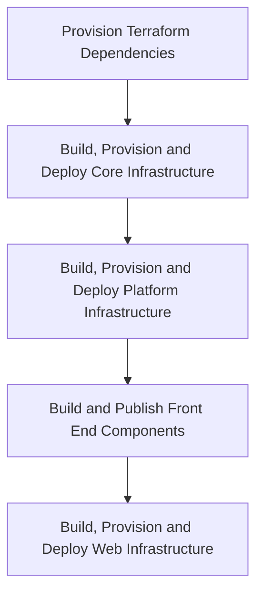
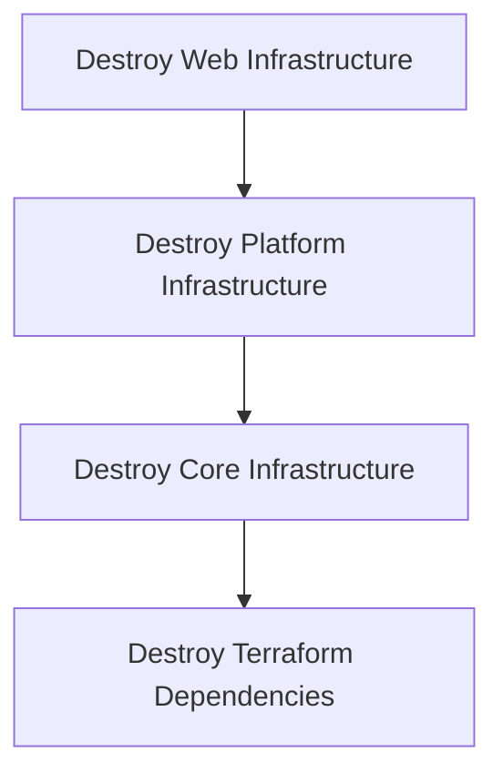

# Deployment Architecture

## Build pipelines

## Release pipelines

### Feature release

To deploy a short-running feature to infrastructure, the [Feature](/pipelines/feature/release.yaml) release pipeline may be executed.
The intended audience is for features that may contain potentially breaking or in-flight changes that may cause the Development environment to fail should they be merged to `main` prematurely. The feature may be released off a selected source branch and subsequently [destroyed](#destroy-pipeline) once sufficient validations have taken place.

> **NOTE**: Feature deployments should be carefully managed as they will incur additional cost, both in provisioning time as well as financially.

| Input parameter | Example | Purpose |
| --- | --- | --- |
| `environment` | `development` | Environment associated with the feature to deploy. |
| `featureName` | `feature-name` | Feature name to create or update. Based on the `environment` choice, this will provision resources with the prefix `s198d01-feature-name`. This value should consist of letters, numbers or hyphens only. |

This pipeline is linked to the `feature` environment.

> **NOTE**: Data seeding is currently ommitted from a feature release to infrastructure.

### Destroy pipeline

To destroy a short-running feature in infrastructure, the [Destroy](/pipelines/destroy/release.yaml) release pipeline may be executed.

| Input parameter | Example | Purpose |
| --- | --- | --- |
| `environment` | `development` | Environment associated with the feature to destroy. |
| `environmentPrefix` | `s198d01-feature-name` | Environment prefix to destroy. This may be found within Azure Portal. |
| `areYouSure` | `No` | The first gate on this pipeline. Select `Yes` to confirm infrastructure destruction. |

This pipeline is linked to the `destroy` environment, which itself has an approval gate assigned.

