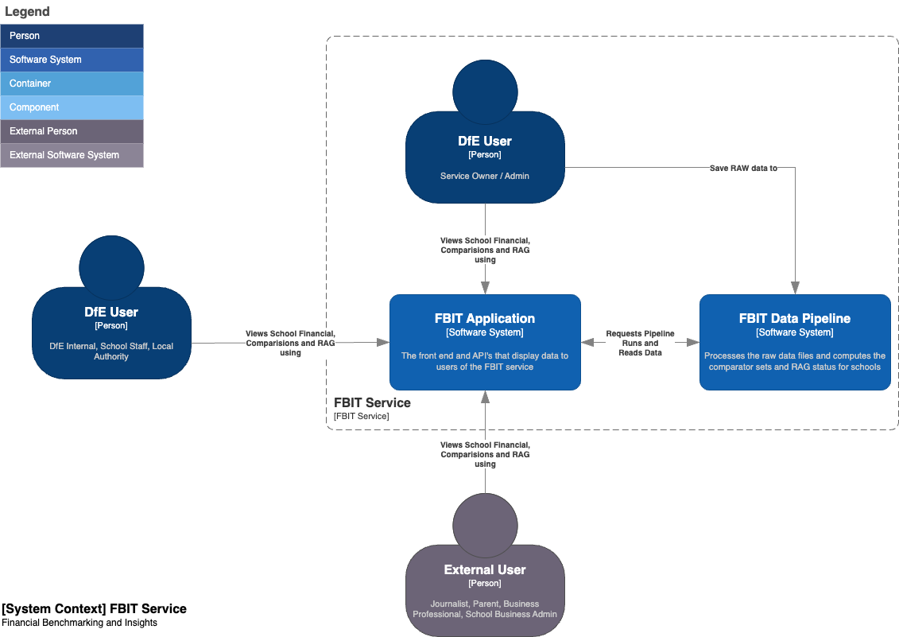

# Introduction

The Financial Benchmarking and insights (FBIT) service is to provide a single service for the management of schools financial data. At a high-level the management of schools financial data includes but is not limited to: 

* A way to compare their use of resources against other schools
* A way to interrogate their own financial data 
* A way to identify areas of improvement to support better * financial planning and consequently improved outcomes for pupils 
* A way to support Governors & Trustees in their role in holding organisations to account 

For more information see the [business context](./business-context.md)

The service allows access in both an authenticated and unauthenticated mode. Authenticated users require a DfE Signin Account to access the secured areas of the service. 

## Key components

The FBIT service consists of two high level components

* **FBIT Application** - The web application through which users interact. It consumes the data from the data pipeline output and displays it through various different projections in various different views. 

* **FBIT Data Pipeline** - A backend service that processes the raw data collected around from data sources around the DfE. The pipeline cleans and transforms the raw data, then computes the comparator set (top 30 most similar schools for the same type of school) for each school.

