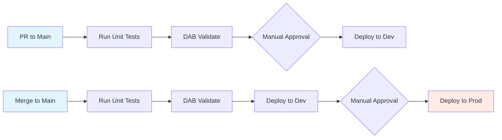

# Databricks Development

## Overview

This document outlines the development workflow for FBIT data preprocessing pipelines in Databricks, using Databricks Asset Bundles (DABs) and Delta Live Tables (DLT) to enable source-controlled, testable, and reproducible data engineering.

## Technology Stack

### Databricks Asset Bundles (DABs)

[DABs](https://docs.databricks.com/aws/en/dev-tools/bundles/) let you define PySpark logic, pipeline variables, target catalogs, and deployment configurations as code. Everything gets deployed through the Databricks CLI.

Why we use them:

- Version all pipeline definitions in Git
- Manage Python dependencies explicitly
- Deploy to multiple environments (dev, staging, prod) with different configs
- Integrate with CI/CD pipelines
- Define pipelines, jobs, and clusters as code with parameters

### Delta Live Tables (DLT)

[Delta Live Tables](https://docs.databricks.com/aws/en/dlt/concepts) (also called Lakeflow Declarative Pipelines) is an ETL framework built for Databricks. You define pipelines as a series of DataFrame transformations, and Databricks gives you a DAG visualization.

Why we use it:

- Built-in [data quality expectations](https://docs.databricks.com/aws/en/dlt/expectations) for validation and quarantine
- [SCD Type 1 and Type 2](https://docs.databricks.com/aws/en/dlt/cdc#example-scd-type-1-and-scd-type-2-processing-with-cdf-source-data) updates work out of the box
- Visual lineage tracking through the DAG
- Handles incremental processing automatically
- Works directly with Unity Catalog

## Development Environment Setup

### Prerequisites

- Python 3.11+ installed locally
- Git access to the FBIT data engineering repository
- Databricks workspace access with appropriate permissions
- Databricks CLI installed (`pip install databricks-cli`)

### VSCode Integration

The [Databricks extension for VSCode](https://marketplace.visualstudio.com/items?itemName=databricks.databricks) significantly streamlines DAB development by providing:

- Bundle validation and deployment commands
- Databricks Connect for local execution against remote clusters
- Integrated debugging for non-DLT PySpark code

**Installation notes:**

- Requires Python 3.11 executable for databricks-connect
- Configure the extension to point to your Databricks workspace URL and personal access token
- Use the extension's built-in commands to validate and deploy bundles without switching to terminal

## Development Workflow

Since DLT cannot be debugged locally, our strategy is to maximize testable non-DLT PySpark code and compose it into DLT tables. This ensures most business logic can be unit tested before deployment.

### Step-by-Step Process

1. **Create a feature branch**  
   Branch from `main` following the naming convention `feature/<ticket-id>-<description>` or `bugfix/<ticket-id>-<description>`

2. **Write PySpark transformation functions**  
   Develop pure PySpark functions that accept and return DataFrames. Keep these functions free of DLT decorators to enable local testing.

3. **Write unit tests**  
   Create pytest unit tests for your transformation functions using local Spark sessions or mocked DataFrames. Tests should live in `tests/unit/` and mirror the source structure.

4. **Compose DLT tables**  
   Wrap your tested transformation functions with DLT decorators (`@dlt.table`, `@dlt.view`) to define pipeline tables and their dependencies.

5. **Validate the bundle locally**  
   Run `databricks bundle validate` to check for configuration errors before deploying to Databricks.

6. **Deploy to development environment**  
   Deploy the bundle to your development workspace:

   ```bash
   databricks bundle deploy --target dev
   ```

   This creates or updates pipeline definitions, jobs, and associated resources in the `dev` catalog/schema.

7. **Run integration tests on Databricks**  
   Trigger the deployed pipeline manually via the Databricks UI or CLI to run integration and end-to-end tests against the cluster. Monitor the DLT DAG for errors and data quality failures.

8. **Iterate as needed**  
   If issues arise, fix them locally in your PySpark functions, update tests, revalidate, and redeploy. Repeat steps 6-7 until the pipeline executes successfully.

9. **Open a pull request**  
   Once the pipeline is validated on Databricks, open a PR against `main` with:
   - Description of changes and ticket reference
   - Evidence that unit tests pass
   - Summary of integration test results from Databricks

### Testing Strategy

- **Unit tests**: Pure PySpark transformation logic tested locally with pytest
- **Integration tests**: Full pipeline execution on Databricks development environment
- **End-to-end tests**: Validation of output data quality and schema in development catalog

Test data for local unit tests should use small, representative samples. Integration tests use full or near-full datasets in the development catalog.

## Deployment and Execution

### CICD Pipeline flow



As elsewhere in the service, failures in the pipeline are fixed forward and there is not a rollback functionality. Builds are tagged with a version as part of CICD.

### Service Account for CI/CD

Currently, bundle deployments are performed manually by developers using their personal credentials. We plan to implement a service account for CI/CD once:

- A majority of source data has been migrated to Databricks Unity Catalog
- Data access policies are finalized and can be applied to the service account
- Appropriate catalog and schema permissions are defined for automated deployments

**Responsible party**: Data engineering lead to track migration progress and initiate service account setup when ready.

### Pipeline Execution

Pipeline runs are currently **manual** via the Databricks workspace UI under Workflows > Delta Live Tables. Navigate to the appropriate pipeline and click "Start" to trigger a run.

**Scheduling**: While DABs support job scheduling, FBIT pipeline runs are ad-hoc and tied to financial release cycles (AAR, BFR, S251, CFR), not predictable time intervals. We will continue the current pattern of manual triggering per release.

If business requirements change and regular scheduling becomes necessary, job schedules can be defined in the DAB configuration under the `jobs` section.
