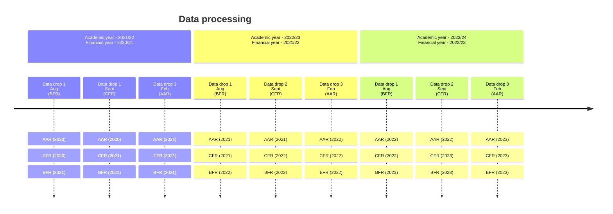

# Releases

The process of releasing data on the service is the responsibility of the developers / maintainers of the service at that given time. This document aims to guide those team members in how to release the financial return data on the service.

## Sourcing the data

There are three financial data releases produced each year on the service. Non-financial and auxiliary data releases are not covered in this section, but should be updated as described in `1_Data-Sources.md`. The three financial datasets, and their respective dates at which they become available to the FBIT team are are:

* BFR - August
* CFR - September
* AAR - January

The exact dates of the releases may vary due to the financial returns being processed by their respective data owners, and so these dates should act as a rough guide to prepare the developers for when a data release is typically expected. You will need to consult with the product owner closer to the release date to determine a more exact time when the data will be available to you for that specific release. The product owner will also inform you When the data is ready for retrieval.

Note that during the time in which the FBIT tool is in service, it is possible that the source of the raw data may change over time. For example, data from `GIAS` was previously sourced through a service called `edubase`. A change to the data source may result in our pipeline failing to retrieve the necessary data in order to carry out a data release. To mitigate this, it is important to check your source data with the relevant database or product owner, and update the existing documentation to reflect any changes made to the data sources.

Once the data has been sourced, it should be stored in the following [sharepoint location](https://educationgovuk.sharepoint.com/:f:/r/sites/DfEFinancialBenchmarking/Shared%20Documents/General/Beta/Data%20Releases?csf=1&web=1&e=55sGTz).

## Cleaning the Data

Once the respective datasets have been retrieved, they will need to be cleaned. Some checkpoints for cleaning the data should be to:

* Ensure the column names and data types for each column are what is expected in the pipeline. This can be validated using the ERD in `2_Data-models.md`. If the data types are not in the expected format, they may not be interpreted by the pipeline and cause a failure.
* If the business requirements of FBIT changes, it must be ensured that new columns are available in the new datasets, for example currently the total number of sixth form students is computed as the number of boys and girls in year groups 12 and 13, however this may be expanded to capture a broaded range of genders in the future which will need to be accounted for.
* Similarly, previously used columns in the service which are being discontinued for a period of time, such as the KS2 and KS4 data between 2020 - 2022, should be sufficiently accounted for.

## Loading the data for processing

Once the data has been sourced and cleaned, it should be loaded into its respective blob store. As a possible route to achieve this, we would recommend connecting to the respective storage containers using the Microsoft Azure Storage Explorer tool.

Once you have connected to the `dev` storage container, naigate to the `raw/default` virtual directory. Within this virtual directory, create a new virtual folder for the submission year you are uploading. The naming convention is such that for the submission period `2022- 2023` the virtual folder would be called `2023`. You may then upload the files for this data release into this container.

Note, if you are releasing BFR or CFR data, then you will also need to copy the missing data from the previous year into the virtual folder with the new data. e.g. if you are uploading 2023 BFR data, you should copy all data associated with the CFR and AAR from 2022 into the 2023 virtual folder. This can be illustrated in the figure below:

## Running the pipelines

Once the respective data has been loaded to the Azure Storage Container, the pipeline run can be initiated. To do this, open the Microsoft Azure Storage Explorer tool, connect to the respective storage container, and navigate to the `data-pipeline-job-pending` queue item. Click `Add` and enter the message `{"type":"default","year":<YYYY>}` where `<YYYY>` is to be replaced by the respective submission year, for example, for `2022-2023`, `<YYYY>` would take the value of `2023`. Ensure that `Store As` is assigned as `Plain UTF-8`, and set the `Time to live` value to `Expire in` with some period, e.g. 1 Day. Click `OK` to queue the message. This should then be picked up and the pipeline executed. You can monitor the pipeline in the respective Application Insights logs through the Azure portal.

<!-- Leave the rest of this page blank -->
\newpage
