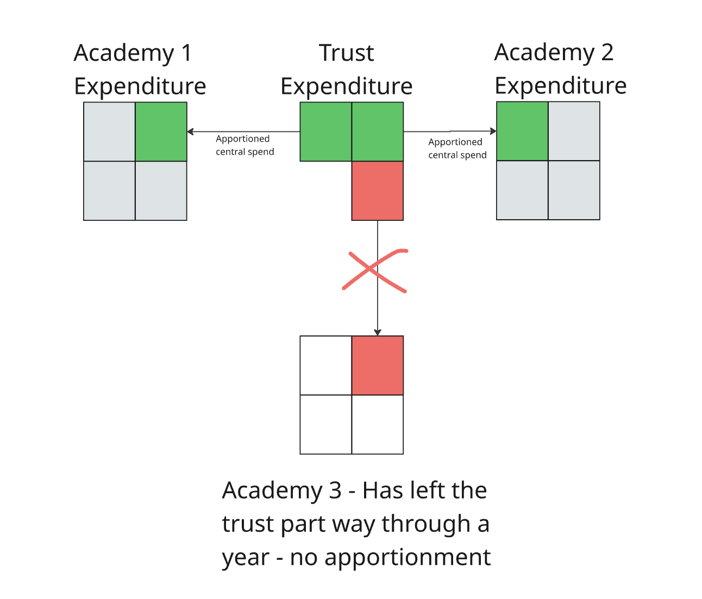

# Academy Apportionments

## What are Academy Trusts?

Academy trusts are groups of academies that oversee finances, curriculum, and performance for their member schools. Because trusts exist to serve their academies, individual academies want to understand how much of their trust's expenditure is attributable to them.

Trusts submit consolidated accounts for the trust and its academies to the Department for Education (DfE). In practice, some academies also submit their own accounts, which can create duplicates that we resolve during processing.

## How Apportionment Works

Trust expenditure is distributed (apportioned) to its member academies using two methods:

- **Pupil numbers**: Most expenditure is apportioned based on each academy's pupil count as a proportion of total trust pupils
- **Floor area**: Utility and premises costs are distributed based on the physical space each academy occupies

## FBIT Implementation

In FBIT (Financial Benchmarking Insight Tool), we combine central trust figures with individual academy data so academies can see how much of the trust's central expenditure is attributable to them.

Each academy's share of the trust's central costs is calculated using the apportionment method above and then scaled by the fraction of the financial year the academy belonged to the trust. For example, if an academy joins a trust for just one day in a financial year, its share of central expenditure would be close to zero.

## Trust Membership Changes

### Joiners

Joiners are apportioned on a part-year, pro-rata basis for the period they belonged to the trust (as described above).

### Leavers

Under normal circumstances, adding up all the apportioned central service expenditure for the academies in a trust equals the trust's total central expenditure. However, this total can be less than the trust's actual spend when membership changes during the financial year.

**Why this happens**: When an academy leaves a trust partway through a year, the trust's central expenditure includes money spent while that academy was still a member. Since the end-of-year members are different, summing their apportioned central service shares may be less than the total central spend.

**The result**: The trust's central expenditure may appear higher than the sum of its current members' apportioned shares, because it includes historical spending on academies that are no longer part of the trust.
