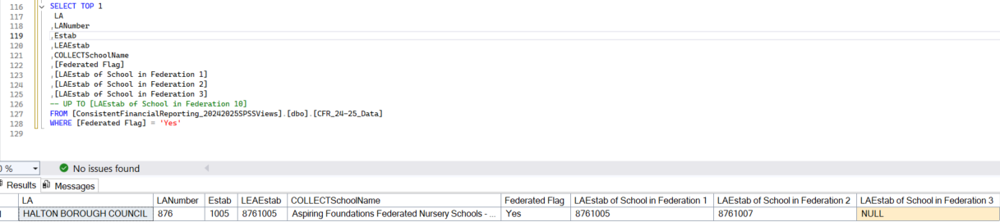

# Data Sourcing and Validation for Consistent Financial Reporting (CFR) Data

This procedure details the necessary steps to process the Consistent Financial Reporting (CFR) data extract to produce the definitive `maintained_schools_master_list.csv` dataset. The core of this process involves rigorous data validation and cleansing to ensure the accuracy and integrity of the final output.

## CFR Quality Assurance Check

The main checks on CFR data relate to the fields for federated schools. A federation of schools is a structure where two or more maintained schools join under a single governing body, while retaining their individual identities. Section 24 of the Education Act 2002 allows for a local authority (LA) to allocate a single budget share to a governing body where there are two or more schools federated.

Federated schools receiving a single budget share should report collectively in their CFR return. There should therefore be only one CFR return made for federated schools. The “lead school” in the federation should make the return while including the LA Establishment (`LAEstab`) numbers of other schools within the federation. There should be no individual return from schools within a federation other than the lead school. In practice however some schools submit returns both through a federation and on their own, resulting in duplicate submissions which need to be resolved as part of preprocessing.



The image above shows an example of a federated school with the lead school alone actioning the financial return. There is validation in the data collection to identify federation reporting issues but it is possible that some errors remain. The mis-recording of federated schools can cause issues such as duplication and incorrect totals.

### CFR Data Source

Server Name = `T1PRISTOAOL01`

Database = `ConsistentFinancialReporting_YYYYYYYYSPSSViews` where YYYYYYYY represent financial year, for instance `ConsistentFinancialReporting_20242025SPSSViews`

View = `CFR_YY-YY_Data` where YY-YY represent financial year, for instance `CFR_24-25_Data`

### Local Database

Created local database = `CFRYY` where YY represents the financial year end, for instance `CFR25` for financial year ending 2025.
Table = `CFR_YYYY` where YYYY represent financial year, for instance `CFR_2425` for financial year ending 2025.

#### The following instructions describe CFR QA checks

1. Connect the CFR data source as listed above
2. Run the below SQL query to validate non-federated schools financial return. The absence of record / no result suggest that there is no incorrect non-federated school entry in CFR data collection.

    ```sql
    SELECT *
    FROM  [ConsistentFinancialReporting_20242025SPSSViews].[dbo].[CFR_24-25_Data]
    WHERE ([Federated Flag] IS NULL OR [Federated Flag] = 'No')
    AND   ([LAEstab of School in Federation 1] IS NOT NULL
        OR [LAEstab of School in Federation 2] IS NOT NULL
        OR [LAEstab of School in Federation 3] IS NOT NULL
        OR [LAEstab of School in Federation 4] IS NOT NULL
        OR [LAEstab of School in Federation 5] IS NOT NULL
        OR [LAEstab of School in Federation 6] IS NOT NULL
        OR [LAEstab of School in Federation 7] IS NOT NULL
        OR [LAEstab of School in Federation 8] IS NOT NULL
        OR [LAEstab of School in Federation 9] IS NOT NULL
        OR [LAEstab of School in Federation 10] IS NOT NULL)
    ```

3. Run the below SQL query to validate that only the “lead school” within a federation have CFR return. The absence of record / no result suggest that there is no incorrect federated school entry in CFR data collection.

    ```sql
    SELECT b.*
    FROM (
        SELECT [LAEstab of School in Federation 1] AS LAEstab1_to_10 FROM [ConsistentFinancialReporting_20242025SPSSViews].[dbo].[CFR_24-25_Data]
        UNION
        SELECT [LAEstab of School in Federation 2] FROM [ConsistentFinancialReporting_20242025SPSSViews].[dbo].[CFR_24-25_Data]
        UNION
        SELECT [LAEstab of School in Federation 3] FROM [ConsistentFinancialReporting_20242025SPSSViews].[dbo].[CFR_24-25_Data]
        UNION
        SELECT [LAEstab of School in Federation 4] FROM [ConsistentFinancialReporting_20242025SPSSViews].[dbo].[CFR_24-25_Data]
        UNION
        SELECT [LAEstab of School in Federation 5] FROM [ConsistentFinancialReporting_20242025SPSSViews].[dbo].[CFR_24-25_Data]
        UNION
        SELECT [LAEstab of School in Federation 6] FROM [ConsistentFinancialReporting_20242025SPSSViews].[dbo].[CFR_24-25_Data]
        UNION
        SELECT [LAEstab of School in Federation 7] FROM [ConsistentFinancialReporting_20242025SPSSViews].[dbo].[CFR_24-25_Data]
        UNION
        SELECT [LAEstab of School in Federation 8] FROM [ConsistentFinancialReporting_20242025SPSSViews].[dbo].[CFR_24-25_Data]
        UNION
        SELECT [LAEstab of School in Federation 9] FROM [ConsistentFinancialReporting_20242025SPSSViews].[dbo].[CFR_24-25_Data]
        UNION
        SELECT [LAEstab of School in Federation 10] FROM [ConsistentFinancialReporting_20242025SPSSViews].[dbo].[CFR_24-25_Data]) a
    LEFT JOIN (
        SELECT * FROM [ConsistentFinancialReporting_20242025SPSSViews].[dbo].[CFR_24-25_Data])b
    ON a.LAEstab1_to_10 = b.LEAEstab
    WHERE b.LEAEstab IS NOT NULL
    ```

4. Run the below SQL query to validate that all schools where the Federated Flag is “yes” (lead school) have at least one school listed in “LAEstab of School in Federation 1” to 10 (non-lead schools). The absence of record / no result suggest that there is no incorrect federated school entry in CFR data collection.

    ```sql
    SELECT TOP 10 *
    FROM  [ConsistentFinancialReporting_20242025SPSSViews].[dbo].[CFR_24-25_Data]
    WHERE [Federated Flag] = 'Yes'
    AND   [LAEstab of School in Federation 1] IS NULL
    AND   [LAEstab of School in Federation 2] IS NULL
    AND   [LAEstab of School in Federation 3] IS NULL
    AND   [LAEstab of School in Federation 4] IS NULL
    AND   [LAEstab of School in Federation 5] IS NULL
    AND   [LAEstab of School in Federation 6] IS NULL
    AND   [LAEstab of School in Federation 7] IS NULL
    AND   [LAEstab of School in Federation 8] IS NULL
    AND   [LAEstab of School in Federation 9] IS NULL
    AND   [LAEstab of School in Federation 10] IS NULL
    ```

5. Run the below SQL query to confirm NULLs in the data. `NULL` values can throw out the total calculations, all NULL return should be converted to zero in the creation of the final dataset.

    ```sql
    SELECT * FROM [ConsistentFinancialReporting_20242025SPSSViews].[dbo].[CFR_24-25_Data]
    WHERE [OB01] IS NULL OR [OB02] IS NULL OR [OB03] IS NULL OR [I01] IS NULL OR [I02] IS NULL
    OR [I03] IS NULL OR [I04] IS NULL OR [I05] IS NULL OR [I06] IS NULL OR [I07] IS NULL
    OR [I08a] IS NULL OR [I08b] IS NULL OR [I09] IS NULL OR [I10] IS NULL OR [I11] IS NULL
    OR [I12] IS NULL OR [I13] IS NULL OR [I15] IS NULL OR [I16] IS NULL OR [I17] IS NULL
    OR [I18c] IS NULL OR [I18d] IS NULL OR [E01] IS NULL OR [E02] IS NULL OR [E03] IS NULL
    OR [E04] IS NULL OR [E05] IS NULL OR [E06] IS NULL OR [E07] IS NULL OR [E08] IS NULL
    OR [E09] IS NULL OR [E10] IS NULL OR [E11] IS NULL OR [E12] IS NULL OR [E13] IS NULL
    OR [E14] IS NULL OR [E15] IS NULL OR [E16] IS NULL OR [E17] IS NULL OR [E18] IS NULL
    OR [E19] IS NULL OR [E20A] IS NULL OR [E20B] IS NULL OR [E20C] IS NULL OR [E20D] IS NULL
    OR [E20E] IS NULL OR [E20F] IS NULL OR [E20G] IS NULL OR [E21] IS NULL OR [E22] IS NULL
    OR [E23] IS NULL OR [E24] IS NULL OR [E25] IS NULL OR [E26] IS NULL OR [E27] IS NULL
    OR [E28a] IS NULL OR [E28b] IS NULL OR [E29] IS NULL OR [E30] IS NULL OR [E31] IS NULL
    OR [E32] IS NULL OR [CI01] IS NULL OR [CI03] IS NULL OR [CI04] IS NULL OR [DeMinimis] IS NULL
    OR [CE01] IS NULL OR [CE02] IS NULL OR [CE03] IS NULL OR [CE04A] IS NULL OR [CE04B] IS NULL
    OR [CE04C]IS NULL OR [CE04D] IS NULL OR [CE04E] IS NULL OR [B01] IS NULL OR [B02] IS NULL
    OR [B03] IS NULL OR [B05] IS NULL OR [B06] IS NULL OR [B07] IS NULL
    ```

#### Handling CFR data errors

Once any issue(s) has been identified from QA checks, a report of the affected schools (`LEAEstab`, `Federated Flag` and `LAEstab of School in Federation 1 to 10` fields and respective values) should be documented and communicated / shared with related stakeholder (Dan Tovey, Jeff Kirkman & Lee McCusker).

> **Note**
> Our established process has been to manually correct school data submission errors, as this is more efficient than reopening the portal for resubmission. Following these corrections, product owner would make arrangements to notify the affected schools' Local Authorities with instructions on how to report their financial records correctly in the future.

#### Export CFR Data from CFR Source Data into `CFRYY` Local Database

1. Connect to the CFR data source as listed above
2. Either by using A database GUI Tool or CSV export, ingest all `CFR_YY-YY_Data` record into `CFR_YYYY`
