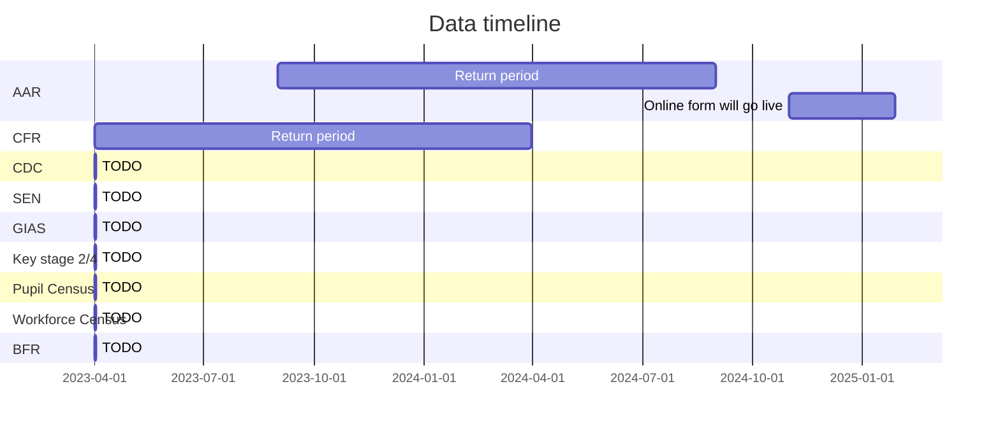
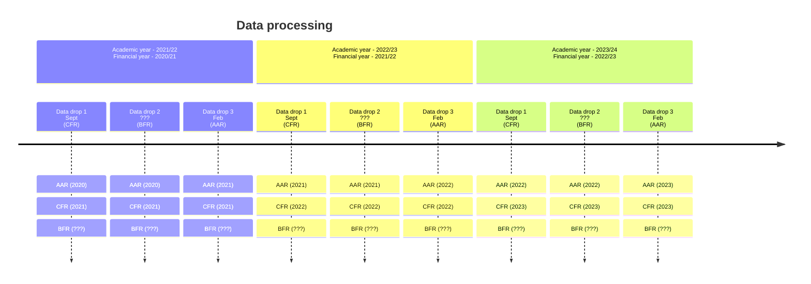

# Data Timeline

The data processing pipeline takes the raw data from various source that cover differing time periods

## Dataset period

| Dataset              | Period                      | 
|:---------------------|:----------------------------|
| **GIAS**             |                             | 
| **CDC**              |                             |  
| **SEN**              |                             | 
| **AAR**              | 1st September - 31th August | 
| **CFR**              | 1st April - 31th March      |
| **Key stage 2/4**    |                             | 
| **Pupil Census**     |                             |  
| **Workforce Census** |                             | 
| **BFR**              |                             |  

## Data processing timeline
