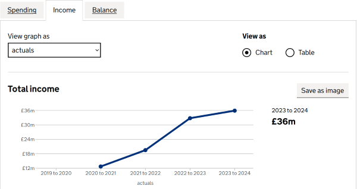
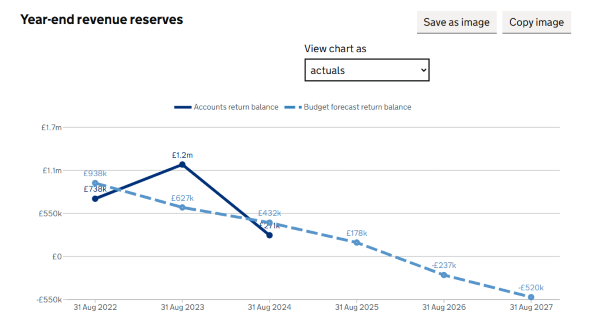
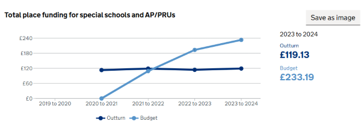
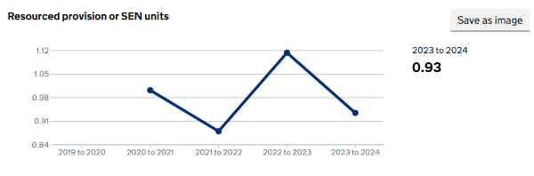
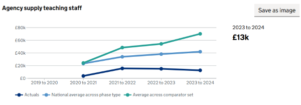
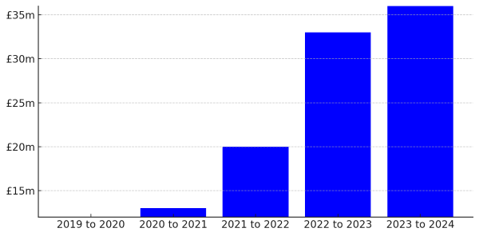
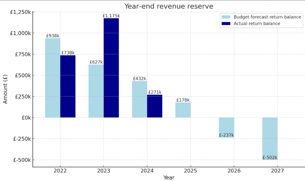

# Line Chart

Across the Financial Benchmarking and Insight Tool (FBIT) platform, line charts have become the standard method for displaying time-series financial data. Line charts plot quantitative values on a continuous axis, connecting data points in sequence. This document explores in depth how line charts:

- Meet user needs by delivering clear continuous views of revenue, spend, and budget trends over time, helping stakeholders spot inflection points, patterns and deviations at a glance.
- Ingest and surface data accurately through a straightforward mapping of year values to the X-axis and monetary values to the Y-axis, ensuring each point reflects the exact underlying figure.
- Embody the core principles of effective time-series visualisation which are continuity, comparability and interpretability.

By adhering to these guidelines, our implementation of line charts across targeted features within the FBIT platform not only provides consistency but also empowers users to make data-driven decisions based on precise, easy digestible financial insights.

## Principles

1. **Emphasis Continuity and Trend**: A line chart's primary strength is displaying continuous data over an ordered interval (most commonly time). By connecting individual data points, the line powerfully illustrates trends, acceleration, deceleration, and volatility, showing how a value evolves from one point to the next.
2. **Maintain Axis Integrity for Accurate Perception**: The integrity of the axes is fundamental to a line chart's honesty. The Horizontal Axis (X-axis): Must represent continuous, ordered data (e.g., time, stages) with consistent, evenly spaced intervals.
The Vertical Axis (Y-axis): Must represent a quantitative measure with a consistent, proportional scale. For honest representation of magnitude, the axis should ideally start at zero. This structure ensures that the visual slope of the line accurately represents the rate of change.
3. **Ensure Clear Comparability Across Series**: When plotting multiple data series, the goal is to facilitate easy comparison.
Visual Distinction: Use a distinct and accessible colour palette and/or varied line styles (e.g., solid, dashed) to help users differentiate series.
Shared Scale: All series must share the same y-axis to provide a common frame of reference. Plotting series with vastly different scales on the same axis should be avoided; consider faceting (small multiples) instead.
4. **Minimal Visual Clutter**: A chart's effectiveness is improved by removing any visual element that does not convey data. Avoid heavy gridlines, background images, 3D effects, or excessive decoration. The focus should be on the data lines themselves, allowing their patterns and intersections to tell the story without distraction. Use subtle, light gridlines only if they are necessary to help the user look up specific values.
5. **Provide Context with Clear Labels and Legends**: Labels and legends are crucial for interpretation.
Axis: Clearly state the units of quantitative measures (e.g., "£200k") and intervals, (e.g., "2022 to 2023").
Strategic Annotations: Do not label every data point, as this creates clutter. Instead, annotate only the most significant points: peaks, troughs, inflection points, or key external events and use tooltip to provide further information such as labels if need be.
Effective Legends: Position the legend where it does not obstruct the data and the position of legends should be consistent across the platform.
6. **Promote Consistency in Design**: For any set of related charts (e.g., within a feature), maintain consistency in design choices. This includes the position of legends, colour schemes, font sizes, and annotation styles. This consistency reduces the cognitive load on the viewer, allowing them to focus on understanding the data rather than re-learning the chart's structure each time.

## Features

**1. Trust Historical Data:**

The Trust Historical Data is located within the `Resources` section of the FBIT platform Trust view. It allows for trust stakeholders to view `Spending`, `Income` and `Balance` financial data of various categories. The line chart visualisation used here illustrates the year-end account return balance for the last five consecutive financial periods.

**Why a line charts is the best choice for the Trust Historical Data use case:**

- **Trend visibility and Emphasis**: Connecting sequential periods with a continuous line makes the £13m growth between `2022 to 2023` and `2023 to 2024` instantly visible. Stakeholders can see at a glance where increase accelerate or plateau.
- **Accurate Rate of Change**: The slope of each segment directly encodes the year-on-year change. Steeper rises between `2021 to 2022` and `2022 to 2023` compared to the year before visually reinforce that the jump from £20m to £33m is larger than the initial £7m increase between `2020 to 2021` and `2021 to 2022`.
- **Clarity**: With only four data points, a line chart avoids the clutter of bars or columns and focuses attention on the progression rather than individual bar heights.
- **Scalability**: If more periods or multiple series (e.g. combining spending, income and balance) are later added, the line format scales naturally giving Cross-series Comparison.
- **Minimalist & Readable**: A clean line chart with markers, horizontal gridlines, and implemented tooltip appears on hover giving a good way to present temporal data because it focuses the user's attention on the trend while providing detailed information about specific data points. This approach minimizes visual clutter and maximizes clarity.
- **Axis Scaling**: The y-axis scaling is appropriate and doesn't distort the representation of the data's fluctuations.

**2. Trust Forecast and Risk:**

The Trust Forecast and Risk is located within the `Forecast and risks` feature of the FBIT platform Trust view. It holds financial data, metrics information and recommendations for the future financial position of trusts. The line chart visualisation illustrates the year-end Account return balance vs Budget forecast return of a Trust.

**Why a line charts is the best choice for the Trust Forecast & Risk use case:**

- **Trend Visibility and Emphasis**: The line chart clearly shows the downward trend in budgeted return from 2022 to 2027 and the actual returns spike in 2023 before dropping in 2024.
- **Future Projections**: Even when actual values are missing for later years, the budget line continues naturally indicating forecast trajectory.
- **Cross-series Comparison**: Readers can instantly spot the year where actual exceeds budget (2023) and where budget flips negative (2026-2027).
- **Negative Values**: Plotting below the zero baseline is straightforward, preserving context of deficits.
- **Data Labels in Context**: Labels attached to each point reinforce exact values without clustering.
- **Axis Scaling**: The y-axis scaling is appropriate and doesn't distort the representation of the data's fluctuations.

**Opportunity:**

Adding tooltips to a line chart enhances user interaction by providing detailed information upon hover, while keeping the main view uncluttered. Replacing tooltips with data labels would make the information permanently visible, potentially obscuring the temporal pattern. Tooltips offer a balance, showing specific values only when needed

**3. High Needs Historical Data:**

The High Needs Historical Data is located within the `High needs benchmarking` feature of the FBIT platform Local Authority (LA) view. It allows LA stakeholders to view both `Section 251` and `Special Educational Needs (SEN)` data for various categories. The line chart visualisation used here illustrates both year-end Budget vs Outturn spend per head, using aggregated s251 categories and SEN statement or EHC plan data for the five consecutive financial years.

> **Note**
> The `Section 251` view utilises a line chart to display two data series while `Special Educational Needs (SEN)` view employ a line chart to represent a single data series.

**Why a line charts is the best choice for the High Needs Historical Data use case:**

- **Trend visibility and Emphasis**: By connecting each period's point, a line chart makes it immediately obvious how the ratio moves over time. The peaks and valleys stand out far more than if the data was represented with isolated bars.
- **Accurate Rate of Change**: The slope between adjacent points encodes the exact increase (jump from 0.88 in `2021 to 2022` to 1.11 in `2022 to 2023` of the `Resourced provision or SEN units` view) or decrease (the fall from 1.11 in `2022 to 2023` to 0.93 in `2023 to 2024` of the `Resourced provision or SEN units` view), which is much harder to gauge from bar-height difference.
- **Clarity**: With only five data points, a line chart avoids the clutter of bars or columns and focuses attention on the progression rather than individual bar heights.
- **Cross-series Comparison**: In the `Section 251` view, readers can instantly spot the year where budget began to exceed outturn (2022 to 2023) and the year were budget was not established (recorded value of 0 in 2020 to 2021).
- **Continuity**: Even with non availability of data for `2019 to 2020`, the line shows a continuous progression into the subsequent non-zero values, reinforcing the temporal sequence.
- **Minimalist & Readable**: A clean line chart with markers, horizontal gridlines, and implemented tooltip appears on hover giving a good way to present temporal data because it focuses the user's attention on the trend while providing detailed information about specific data points. This approach minimizes visual clutter and maximizes clarity.
- **Axis Scaling**: The y-axis scaling is appropriate and doesn't distort the representation of the data's fluctuations.

**4. School Historical Data:**

The School Historical Data is located within the `Resources` section of the FBIT platform School view. It allows for school stakeholders to view `Spending`, `Income`, `Balance` and `Pupil and workforce` financial data of various categories for financial periods. The line chart visualisation used here illustrates financial data from previous financial years for intended school.

> **Note**
> The `Spending` and `Pupil and workforce` views utilises a line chart to display three data series while `Income` and `Balance` views each employ a line chart to represent a single data series.

**Why a line charts is the best choice for the High Needs Historical Data use case:**

- **Trend Visibility and Emphasis**: The line chart clearly shows the progressive trend of all three series.
- **Cross-series Comparison**: FBIT platform users can instantly see how the three series relate with each other. For instance,in `2020 to 2021` both the `National average across phase type` and `Average across comparator set` are similarly higher in comparison to the `Actuals` value. It is clearly effective at highlighting differences among series, especially when there are subtle variations that might be missed in other chart types.
- **Clarity**: With sixteen data points, a line chart avoids the clutter of bars or columns and focuses attention on the progression rather than individual bar heights.
- **Minimalist & Readable**: A clean line chart with markers, horizontal gridlines, and implemented tooltip appears on hover giving a good way to present temporal data because it focuses the user's attention on the trend while providing detailed information about specific data points. This approach minimizes visual clutter and maximizes clarity.
- **Axis Scaling**: The y-axis scaling is appropriate and doesn't distort the representation of the data's fluctuations.

**Opportunity:**

I recommend we standardise the casing of our data labels and tooltip text in the chat interface. Inconsistent capitalisation and the use of different terminologies to mean the same thing may create a distracting user experience. Aligning on a single style will improve clarity and reinforce the charting principles ultimately leading to a more user-friendly experience.

## Alternatives 

**Trust Historic Data:**

**Trust Forecast and Risk:**

**Strengths:**

- Side-by-side comparison of budget vs actual within each year.
- Strong visual cue to magnitude differences.

**Drawbacks:**

- Discontinuous bars would stand alone offering less intuitive sense of trend.
- Negative bars may destruct visual flow.
- Harder to see crossovers and rates of change over multiple periods.
- Stakeholders can't visually compare slopes, only bar heights can be compared and so an intuitive sense of acceleration or deceleration could be missed.

**Conclusion:**

While both line and clustered bar charts can represent the same data,

- The line chart is the clear choice when the primary goal is to illustrate how values evolve over time. By connecting each point in sequence, it makes the upward trajectory immediately apparent and highlights where growth peaks, slows or decline.
- The line chart better serves our goals of illustrating temporal trends and forecast trajectories. Its continuity, ease of cross platform comparison, and natural handling of missing or negative values make it the preferred visual for summarising return balances over time.

<!-- Leave the rest of this page blank -->
\newpage
