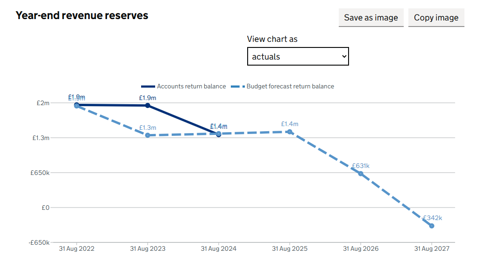
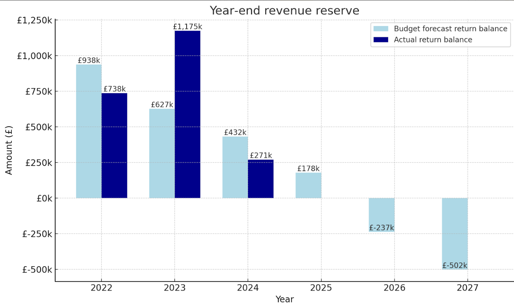

# Line Chart

Across the Financial Benchmarking and Insight Tool (FBIT) platform, line charts have become the standard method for displaying time-series financial data. Line charts plot quantitative values on a continuous axis, connecting data points in sequence. This document explores in depth how line charts:

- Meet user needs by delivering clear continuous views of revenue, spend, and budget trends over time, helping stakeholders spot inflection points, patterns and deviations at a glance.
- Ingest and surface data accurately through a straightforward mapping of year values to the X-axis and monetary values to the Y-axis, ensuring each point reflects the exact underlying figure.
- Embody the core principles of effective time-series visualisation which are continuity, comparability and interpretability.

By adhering to these guidelines, our implementation of line charts across targeted features within the FBIT service not only provides consistency but also empowers users to make data-driven decisions based on precise, easy digestible financial insights.

## Principles to follow for effective Line Charting across the FBIT service

1. Emphasis Continuity and Trend: A line chart's primary strength is displaying continuous data over an ordered interval (most commonly time). By connecting individual data points, the line powerfully illustrates trends, acceleration, deceleration, and volatility, showing how a value evolves from one point to the next.
2. Maintain Axis Integrity for Accurate Perception: The integrity of the axes is fundamental to a line chart's honesty. The Horizontal Axis (X-axis): Must represent continuous, ordered data (e.g., time, stages) with consistent, evenly spaced intervals.
The Vertical Axis (Y-axis): Must represent a quantitative measure with a consistent, proportional scale. For honest representation of magnitude, the axis should ideally start at zero. This structure ensures that the visual slope of the line accurately represents the rate of change.
3. Ensure Clear Comparability Across Series: When plotting multiple data series, the goal is to facilitate easy comparison.
Visual Distinction: Use a distinct and accessible colour palette and/or varied line styles (e.g., solid, dashed) to help users differentiate series.
Shared Scale: All series must share the same y-axis to provide a common frame of reference. Plotting series with vastly different scales on the same axis should be avoided; consider faceting (small multiples) instead.
4. Minimal Visual Clutter: A chart's effectiveness is improved by removing any visual element that does not convey data. Avoid heavy gridlines, background images, 3D effects, or excessive decoration. The focus should be on the data lines themselves, allowing their patterns and intersections to tell the story without distraction. Use subtle, light gridlines only if they are necessary to help the user look up specific values.
5. Provide Context with Clear Labels and Legends: Labels and legends are crucial for interpretation.
Axis: Clearly state the units of quantitative measures (e.g., "£200k") and intervals, (e.g., "2022 to 2023").
Strategic Annotations: Do not label every data point, as this creates clutter. Instead, annotate only the most significant points: peaks, troughs, inflection points, or key external events and use tooltip to provide further information such as labels if need be.
Effective Legends: Position the legend where it does not obstruct the data and the position of legends should be consistent across the service.
6. Promote Consistency in Design
For any set of related charts (e.g., within a feature), maintain consistency in design choices. This includes the position of legends, colour schemes, font sizes, and annotation styles. This consistency reduces the cognitive load on the viewer, allowing them to focus on understanding the data rather than re-learning the chart's structure each time.

## Features within Financial Benchmarking and Insight Tool (FBIT) platform that contains Line Charting

### 1. Trust Forecast and Risk: Year-end Revenue Reserves

The Trust Forecast and Risk: Year-end Revenue Reserves is located within the Forecast and risks feature of the FBIT service/ It holds financial data, metrics information and recommendations for the future financial position of trusts. The line chart visualisation illustrates the year-end Account return balance vs Budget forecast return of a Trust.

#### Why a line charts is the best choice for the Trust Forecast & Risk use case

- Trend visibility: The line chart clearly shows the downward trend in budgeted return from 2022 to 2027 and the actual returns spike in 2023 before dropping in 2024.
- Future projections: Even when actual values are missing for later years, the budget line continues naturally indicating forecast trajectory.
- Cross-series comparison: Readers can instantly spot the year where actual exceeds budget (2023) and where budget flips negative (2026-2027).
- Negative values: Plotting below the zero baseline is straightforward, preserving context of deficits.
- Data labels in context: Labels attached to each point reinforce exact values without clustering.
- The y-axis scaling is appropriate and doesn't distort the representation of the data's fluctuations.

#### Opportunity

The current line chart view could be enhanced by adding tooltip such that when a user hovers on the data points with a mouse, the value summary pops-up with contextual information. 

#### Alternative Chart Type Consideration for Trust Forecast and Risk: Year-end Revenue Reserves

A clustered bar (column) charts groups bars for each return balance by year

##### Strength

- Side-by-side comparison of budget vs actual within each year.
- Strong visual cue to magnitude differences

##### Drawbacks

- Discontinuous bars would stand alone offering less intuitive sense of trend.

- Negative bars (for 2026 to 2027) may destruct visual flow.

- Harder to see crossovers and rates of change over multiple periods.

#### Conclusion

While both line and clustered bar charts can represent the same data, the line chart better serves are goals of illustrating temporal trends and forecast trajectories. Its continuity, ease of cross service comparison, and natural handling of missing or negative values make it the preferred visual for summarising return balances over time.

### 2. Trust Historical Data

The Trust Historical Data is located within the Resources section of the trust view and it allows for trust stakeholders to view financial data from previous financial years. The line chart visualisation used here illustrates the year-end account return balance for the last five consecutive years.
