# FBIT Data Architecture

## Introduction

The purpose of this document is to provide an overview of the data architecture principles that will be followed when migrating and updating the FBIT data model.  Documenting these principles will enable a shared understanding so that, as the service evolves, and changes to the data model are required, enhancements will be done in a controlled way that adheres to the guidelines in spite of inevitable changes to the development team.  

The overarching architectural data model that has been implemented in the service is a medallion architecture which has been popularized by the Databricks platform.  The following section will cover this.

## Medallion Data Model

A [medallion architecture](https://www.databricks.com/glossary/medallion-architecture) is a data design pattern used to logically organize data in a lakehouse, with the goal of incrementally and progressively improving the structure and quality of data as it flows through each layer of the architecture (from Bronze ⇒ Silver ⇒ Gold layer tables).

### Bronze layer (raw data)

The Bronze layer is where data lands from external source systems. The table structures in this layer correspond to the source system table structures "as-is," The focus in this layer is quick Change Data Capture and the ability to provide an historical archive of source, data lineage, auditability, reprocessing if needed without rereading the data from the source system.

### Silver layer (cleansed and conformed data)

In the Silver layer, the data from the Bronze layer is cleansed and transformed ("just-enough") so that the Silver layer can provide a "readable" view of all its key business entities.

The Silver layer brings the data from different sources into an Enterprise view. It can serve as a source for Departmental Analysts, Data Engineers and Data Scientists to further create projects and analysis to answer business problems via enterprise and departmental data projects in the Gold Layer.

In the lakehouse data engineering paradigm, typically the ELT methodology is followed vs. ETL - which means only minimal or "just-enough" transformations and data cleansing rules are applied while loading the Silver layer. Speed and agility to ingest and deliver the data in the data lake is prioritized, project-specific, complex transformations and business rules are applied while loading the data from the Silver to Gold layer. From a data modeling perspective, the Silver Layer has more 3rd-Normal Form like data models.

### Gold layer (curated business-level tables)

Data in the Gold layer of the lakehouse is typically organized in consumption-ready databases and/or "project-specific" data marts. The Gold layer uses more de-normalized and read-optimized data models with fewer joins. The final layer of data transformations and data quality rules are applied here. Final presentation layer of projects such as Departmental Analytics, benchmarking etc. fit in this layer.

**Data Mart**
Is a focused, subset of data for a particular business unit, department, or subject area. It provides faster, more efficient access to relevant data for a defined group of users, enabling them to conduct analytics and reporting to gain specific insights.

### Presentation Layer

Data queried from the data-lake will be mirrored into the FBIT application, this data will be used to serve the service API and subsequently the web application.  

## Data Architecture Diagram

The following diagram illustrates how data flows through the layers of the data architecture:

```mermaid
flowchart LR
    %% Data Sources
    DB[(Measured Data)]
    STATIC[(Reference Data)]
    
    %% Bronze Layer
    subgraph BRONZE ["🥉 BRONZE LAYER"]
        RAW[Raw Data]
    end
    
    %% Silver Layer
    subgraph SILVER ["🥈 SILVER LAYER"]
        MERGE[Merged/Processed Data]
    end
    
    %% Gold Layer
    subgraph GOLD ["🥇 GOLD LAYER"]
        AGGReg[User-ready data held at lowest grain plus reuseable aggregations]
        COMP[Data Marts]
    end
    
    %% Presentation
    subgraph PRESENTATION ["PRESENTATION"]
        api[api]
        new[Web App]  
    end

    %% Flow connections with transformation labels
    DB -->|Ingest| BRONZE
    STATIC -->|Ingest| BRONZE
    BRONZE -->|Rename, Clean and Validate, light transformation| SILVER
    SILVER -->|Transform to represent Business Entities and provide universal aggregations for performance| GOLD
    GOLD -->|Filter as required| PRESENTATION
    
    %% Styling
    classDef bronzeStyle fill:#CD7F32,stroke:#8B4513,stroke-width:2px,color:#fff
    classDef silverStyle fill:#C0C0C0,stroke:#808080,stroke-width:2px,color:#000
    classDef goldStyle fill:#FFD700,stroke:#DAA520,stroke-width:2px,color:#000
    classDef martStyle fill:#4CAF50,stroke:#2E7D32,stroke-width:2px,color:#fff
    classDef presStyle fill:#4CAAEF,stroke:#2E7D32,stroke-width:2px,color:#ffa
    
    class BRONZE bronzeStyle
    class SILVER silverStyle
    class GOLD goldStyle
    class MART martStyle
    class PRESENTATION presStyle
```

>>Note: The scope of the proposed migration to Databricks is up to and including the Gold layer.  Data will be extracted from this layer to be used in the web applications the main reason for this is the custom comparator set calculations functionality in the FBIT service.  These are dynamically generated in response to users needs and it would be logistically difficult to run those calculations remotely in Databricks, also these are for individual user requests and will not be pushed back to the data model.
