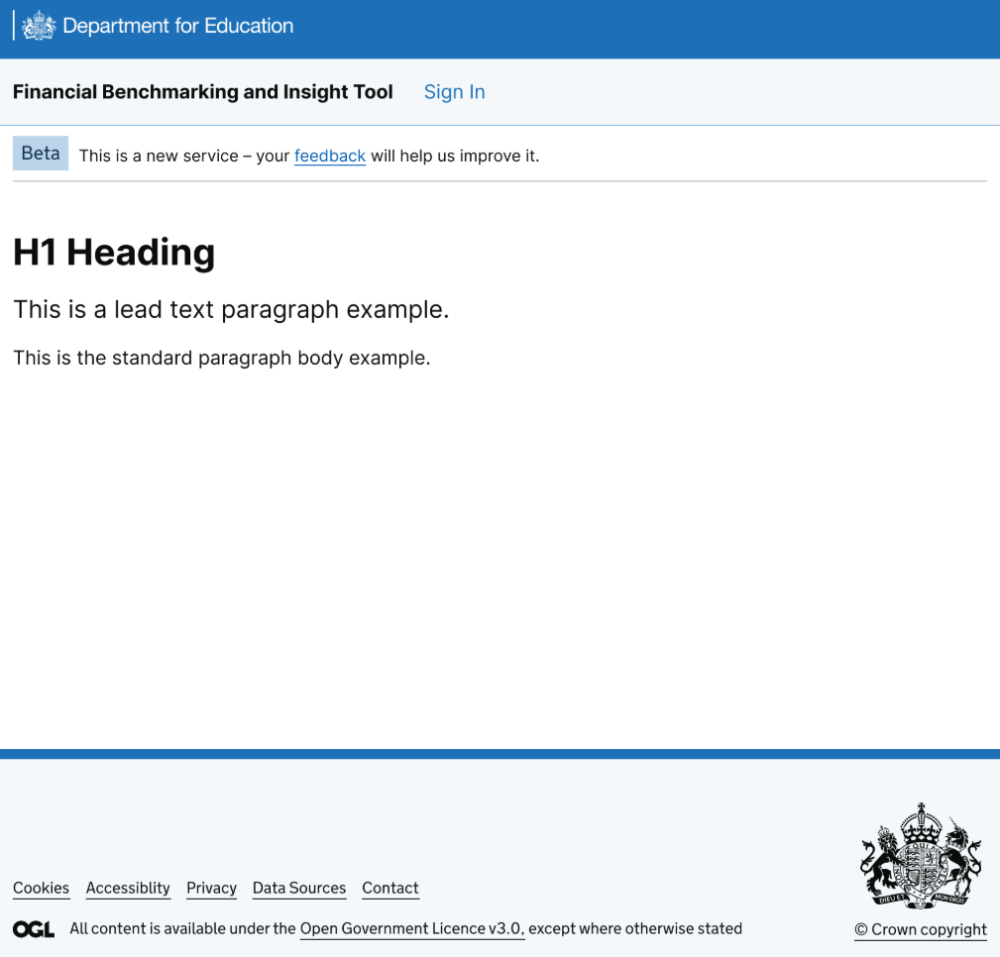
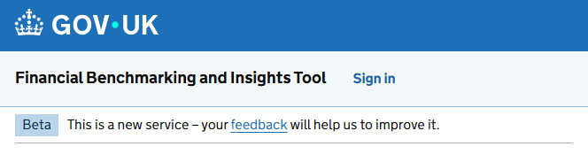
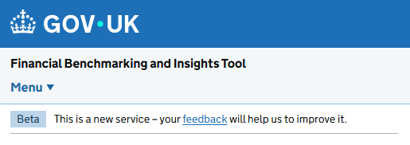

# Branding and Design System

## Introduction

This document outlines the branding strategy, visual identity alignment, and integration of the GOV.UK Design System (GDS) and DfE Branding across the Financial Benchmarking and Insights Tool (FBIT).

As a service hosted on the `education.gov.uk` domain, FBIT is required to adhere strictly to department-wide visual standards. This includes the implementation of the June 2025 brand refresh across both the primary website and the 'Shutter' application.

## Goals

### Primary Goal

The service is fully branded according to the [DfE design system](https://design.education.gov.uk/design-system).



### Secondary Goals

Maintain interim branding compliance using the [GDS June 2025 visual identity](https://design-system.service.gov.uk/get-started/), while supporting progressively enhanced components and passing all automated accessibility and visual regression tests.



## Brand Refresh Details

### GDS Refresh

The [GDS guidelines](https://frontend.design-system.service.gov.uk/brand-refresh-changes/#updating-your-service-to-use-the-new-brand) dictate the core layout and component structure. Updates applied include:

- **Page template:** Updated to the `v5.10.0` CSS class.
- **Header:** Integrated the refreshed [Header](https://design-system.service.gov.uk/components/header/) component. This involved migrating the 'Sign in' and 'Sign out' elements from the global header to the [Service Navigation](https://design-system.service.gov.uk/components/service-navigation/) component.
- **Footer:** Implemented the refreshed [Footer](https://design-system.service.gov.uk/components/footer/).
- **Assets:** Synchronized [fonts and images](https://frontend.design-system.service.gov.uk/import-font-and-images-assets).

> 📅 The deadline for the GDS rebrand effort was [31 December 2025](https://design.education.gov.uk/design-system/govuk-rebrand#what-you-need-to-do)

### DfE Refresh

The [DfE guidelines](https://design.education.gov.uk/design-system/govuk-rebrand) build upon the GDS foundation, applying department-specific visual themes:

- **Header:** Customized according to the [DfE header rebrand](https://design.education.gov.uk/design-system/govuk-rebrand/dfe-header-rebrand) specifications.
- **Footer:** Removed the small left-hand crown logo to meet DfE standards.
- **Typeface:** Aligned typography with the [DfE styles](https://design.education.gov.uk/design-system/styles/typography).

> 📅 The deadline for the DfE rebrand effort was [31 March 2026](https://design.education.gov.uk/design-system/govuk-rebrand#what-you-need-to-do)

## Development Guidelines & Anti-Patterns

To ensure consistent application of the GOV.UK and DfE Design Systems, developers and designers must adhere to the following standards:

### Component Priority (Anti-Pattern)

- **Do not use custom CSS** for styling that is already provided by the `govuk-frontend` library.
- **Avoid building custom components** (e.g., dropdowns, inputs, or tabs) if native HTML elements or existing GDS components can fulfill the requirement.
- **Semantic HTML** must never be compromised for visual flair; accessibility is a fundamental priority.

### Dynamic Content Rendering

For content managed via the database (such as [Service Banners](../features/10_Service-Banners.md)), Markdown is converted to HTML at runtime.

- Use the `GdsMarkdownExtension` (via the `markdig` library) to ensure that GDS classes (e.g., `govuk-link`, `govuk-list`) are applied to the generated HTML nodes.
- This ensures that even user-generated or content-managed text maintains visual consistency with the rest of the service.

### Design Standards Compliance

- **Service Standard**: Every technical implementation must align with the [GDS Service Standard](https://www.gov.uk/service-manual/service-standard), which is a hard architectural constraint for this project.
- **Sortable Tables Exception**: While standard GDS patterns are preferred, sortable table headers in this service use `<button>` elements styled as links. This is a deliberate design choice based on MOJ (Ministry of Justice) patterns and user research into table interactivity.

### Accessibility

All UI changes must be verified against **WCAG 2.2 AA** standards. Automated accessibility testing is mandatory for every pull request.

## Technical Implementation Details

### Prerequisites & Dependencies

The service requires `govuk-frontend` version [5.10.0](https://github.com/alphagov/govuk-frontend/releases/tag/v5.10.0) or higher to support the June 2025 branding.

**Important Note on DfE Frontend:**
The [DfE Frontend](https://design.education.gov.uk/design-system/dfe-frontend) npm package (`dfe-frontend`) **must not** be used. This constraint is in place because:

- The service does not consume specific DfE components like [Card](https://design.education.gov.uk/design-system/components/card) or [Filter](https://design.education.gov.uk/design-system/components/filter).
- The package conflicts with the latest GDS features (e.g., incompatible type scales).
- The [repository](https://github.com/DFE-Digital/dfe-frontend) and package have not been updated since May 2024.

Instead, assets and CSS modifications should be applied manually by following the [DfE header rebrand guidelines](https://design.education.gov.uk/design-system/govuk-rebrand/dfe-header-rebrand).

### Component Initialization (Vue.js and GDS Conflicts)

The move of the Sign in/out button to the [Service Navigation](https://design-system.service.gov.uk/components/service-navigation/) component introduces a responsive view that collapses into a drop-down menu when JavaScript is enabled.



This requires every server-rendered view to register GDS components using `initAll()` in `_Layout.cshtml`. This global initialization can conflict with the mounting of `front-end` (Vue.js) client-side components, resulting in console errors such as:

```text
InitError: govuk-accordion: Root element (`$root`) already initialised
    at _Accordion.checkInitialised (govuk-frontend.js:150:13)
```

To resolve this issue, the progressive enhancement pipeline must implement one of the following strategies:

1. **Scope the initialization:** Add a specific scope to the `initAll()` function within the front-end components.

    ```ts
    initAll({ scope: rootElement });
    ```

2. **Load Order:** Ensure the custom `front-end` module is loaded sequentially *after* `govuk-frontend`.

Alternatively, developers can scope the Service Navigation component directly in the `_Layout.cshtml` call to `initAll()` and target specific elements (e.g., `<main>`) on individual pages that require additional GDS components.

### Known Issues

- **Vite Dev Server Lifecycle:** The `already initialised` error mentioned above may still occur when running the [Vite](https://vite.dev/) dev server locally. This is [by design](https://react.dev/reference/react/useEffect#my-effect-runs-twice-when-the-component-mounts) due to React/Vue lifecycle events running multiple times in strict mode during development. This does not occur in production builds.
- **Test Fragility:** Moving the location of the Sign in/out buttons to the Service Navigation component may break existing End-to-End (E2E) and integration tests.

<!-- Leave the rest of this page blank -->
\newpage
