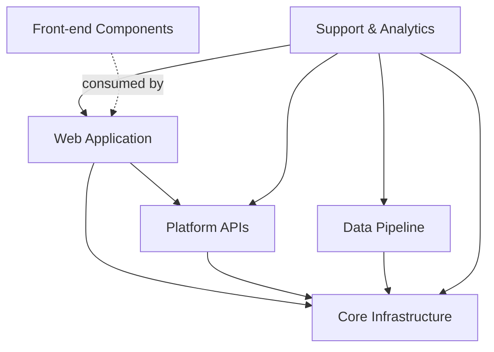

# Getting Started

The repository is a monorepo which contains multiple components, structured to streamline collaboration while providing autonomy and tailored workflows without the overhead of multiple repositories.

- [Core infrastructure](../../core-infrastructure/README.md)
- [Front-end components](../../front-end-components/README.md)
- [Data pipeline](../../data-pipeline/README.md)
- [Platform](../../platform/README.md)
- [Web](../../web/README.md)
- [Prototype](../../prototype/README.md)
- [Support & analytics](../../support-analytics/README.md)

Each component contains its own README with specific, detailed getting started instructions.

## Prerequisites

Before starting, ensure the following tools are installed on your machine:

- **Git:** For version control.
- **.NET 10.0 SDK:** Required for Core infrastructure and Web components.
- **.NET 8.0 SDK:** Required for Platform components.
- **Node.js 22 (LTS):** Required for Front-end and Web components.
- **Terraform:** Required for infrastructure management.
- **terraform-docs:** Required for generating infrastructure documentation (used by `make tf-check`).
- **Make:** Required to run the root `Makefile` and component scripts.
- **Git Bash (Windows):** Required for Windows users to execute `make` commands correctly in a Bash environment.
- **Python 3.x:** Required for certain build scripts and pre-commit hooks.
- **pre-commit:** For running local quality checks before committing.
- **Docker & Docker Compose:** Required for running local dependencies (SQL Server, Redis, etc.) and the data pipeline. See the [Local Environment with Docker guide](06_Local-Environment-with-Docker.md) for setup instructions.

### Recommended IDEs

- **Visual Studio 2022** or **JetBrains Rider** (for .NET development)
- **Visual Studio Code** or **WebStorm** (for Front-end and Terraform)

## Project Architecture

The following diagram illustrates the high-level dependencies between the components:



## First-time Setup

Follow these steps to set up the repository for local development:

1. **Clone the repository:**

   ```sh
   git clone https://github.com/DFE-Digital/education-benchmarking-and-insights.git
   ```

2. **Set up pre-commit hooks:**
   Run the following from the root directory:

   ```sh
   pipx install pre-commit
   pre-commit install
   ```

3. **Configure custom scripts:**
   Some repository tools require local `settings.json` files. Copy the examples provided:

   ```sh
   cp scripts/env-tool/settings.example.json scripts/env-tool/settings.json
   cp scripts/terraform-tool/settings.example.json scripts/terraform-tool/settings.json
   ```

   *Note: Populate these files with your specific local or environment-specific values as needed.*

4. **Navigate to a component:**
   Choose the component you wish to work on and follow its specific README instructions:
   - For the main website: [web/README.md](../../web/README.md)
   - For APIs: [platform/README.md](../../platform/README.md)
   - For React components: [front-end-components/README.md](../../front-end-components/README.md)

## Local Development

A root `Makefile` is provided to consolidate common infrastructure and tooling commands.

### Common Commands

Run `make help` to see all available commands.

- `make up`: Start local Docker dependencies (Azurite, SQL Server, Redis).
- `make down`: Stop local Docker dependencies.
- `make build-pipeline`: Force a rebuild of the data-pipeline Docker image.
- `make lint-md`: Lint and fix all markdown files in the repository.
- `make kill-dotnet`: Kill any hanging dotnet processes.
- `make tf-check`: Run the custom Terraform validation helper (format, validate, lint, docs).
- `make set-env ARGS="all local"`: Run the environment switcher tool.

### Using Make on Windows

To ensure a seamless experience on Windows, execute all `make` commands from **Git Bash**. This provides the necessary environment for the Makefile's shell commands to run correctly.

## Build & deployment

Continuous integration, delivery and testing is automated via [Azure Pipelines](https://dfe-ssp.visualstudio.com/s198-DfE-Benchmarking-service/_build?view=folders). Terraform is used for Infrastructure as Code (IaC) to allow for the build, change, and versioning of the infrastructure safely and efficiently.

### Quality checks

The following quality checks are automated in the pipelines (PR and merge) and should be run locally where possible:

| Component                | Automated Checks                                                                            |
|:-------------------------|:--------------------------------------------------------------------------------------------|
| **Core infrastructure**  | Linting, Validate, Static analysis                                                          |
| **Front-end components** | Unit tests, Linting (`npm run lint`)                                                        |
| **Platform**             | .NET Solution Linting, Terraform Linting/Validate/Static analysis, Unit tests               |
| **Web**                  | .NET Solution Linting, Terraform Linting/Validate/Static analysis, Unit & Integration tests |
| **Prototype**            | Linting, Validate, Static analysis                                                          |
| **Support & analytics**  | Linting, Validate, Static analysis                                                          |

### Tools & commands

#### Terraform

- `terraform fmt`: Rewrites Terraform configuration files to a canonical format.
- `terraform validate`: Validates configuration files in a directory.

#### .NET

- `dotnet format`: Formats code to match `.editorconfig` settings.

#### JavaScript / React

- `npm run lint`: Checks code against ESLint/Prettier settings.
- `npm run lint:fix`: Automatically fixes linting issues.

#### Static Analysis (Checkov)

[Checkov](https://www.checkov.io/) is used for scanning IaC files for misconfigurations and security issues.

<!-- Leave the rest of this page blank -->
\newpage
