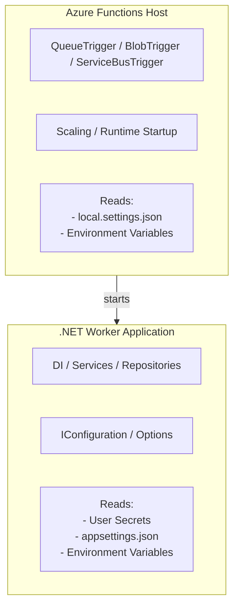

# Platform APIs

This guide details the architectural patterns and development standards for APIs.

## Architectural Philosophy: Vertical Slice

The APIs are implemented using a Vertical Slice Architecture. Instead of traditional horizontal layers (Data, Logic, Presentation) that group code by technical concern, this approach groups code by functional requirement.

* Self-Contained Features: All code required to fulfill a specific request—including the Azure Function trigger, DTOs, and business logic—resides within a single feature folder.
* Isolation: Changes to one slice (e.g., "Accounts") are isolated from others (e.g., "Search"), reducing technical debt and the risk of side effects.
* Scalability: New features can be added as new folders without modifying existing complex service layers.

## Project Structure

Each project follows a consistent high-level directory layout:

* `Features/`: The primary development area containing functional slices.
* `Configuration/`: Dependency injection registration for the worker process and feature-specific services.
* `OpenApi/`: Global OpenAPI/Swagger configuration options (e.g., security schemes, host settings).
* `Program.cs`: Entry point for the Azure Functions isolated worker.

## Anatomy of a Feature Slice

Within the `Features/` directory, each slice (e.g., `Features/Accounts/`) typically contains:

1. Functions (Entry Point): Azure Function HTTP triggers act as the "Controller." They handle the incoming `HttpRequestData` and returns `HttpResponseData`. They are responsible for extracting version information and delegating to the correct handler.
2. Handlers (Orchestrator): Handlers bridge the Function entry point with the internal logic. They implement the versioning logic by mapping specific request versions to the appropriate business logic.
3. Models & Parameters:
   1. Models: Feature-specific Data Transfer Objects (DTOs) for API responses.
   2. Parameters: Objects representing query strings or route parameters, often with associated FluentValidation validators.
4. Services: Feature-specific services contain the business logic and direct database interactions, often leveraging centralised query builders from shared libraries.
5. OpenAPI Examples: Following the vertical slice pattern, OpenAPI examples are located within the feature folder (e.g., `OpenApiExamples.cs`) to keep documentation close to the relevant functional code.

## Versioning Strategy

The platform utilises a Header-Based Versioning strategy to ensure backward compatibility as features evolve.

**The `x-api-version` header:**

* Header: Clients specify the version via the api-version HTTP header.
* Default: If the header is omitted, the API defaults to latest version.
* Selection: The `VersionedFunctionBase` uses this header value to resolve and execute the correct versioned handler.

**Versioned implementation pattern:**

* Define Handlers: Create separate classes for each version (e.g., `GetExpenditureV1Handler.cs` and `GetExpenditureV2Handler.cs`).
* Inherit Abstractions: Use `VersionedFunctionBase` to access `ReadVersion()` methods within the Function entry point.
* Registration: Register the versioned handlers in the service collection.

## External Shared Abstractions

These projects do not contain local `Shared` folders. To maintain consistency across the benchmarking platform, common logic is referenced from centralised projects in the `abstractions` directory:

* `Platform.Functions`: Provides base classes for functions (VersionedFunctionBase), versioned handler interfaces, and shared middleware (e.g., exception handling).
* `Platform.Sql`: Centralises Dapper-based query builders (e.g., `SchoolQueries`, `LocalAuthorityQueries`) used by all APIs for database access.
* `Platform.Domain`: Defines core domain types and constants (e.g., `OverallPhase`, `FinanceType`).
* `Platform.Cache`: Managed Redis caching logic shared across the ecosystem.

## Feature Development Workflow

When adding a new functional slice:

1. Select Project: Identify which API project (Trust, School, or Local Authority) the feature belongs to.
2. Create Feature Folder: Add a new directory under Features/.
3. Implement Slice: Build the Function, versioned Handler(s), and Service.
4. Define Documentation: Add OpenApiExamples.cs within the feature folder.
5. Register Dependencies: Add services and handlers to the project's DI container via the Configuration/ classes.
6. Leverage Abstractions: Use existing query builders in Platform.Sql for data access.

## Configuration Management

This project intentionally separates the configuration model to keep it predictable and avoid mixing application configuration, secrets, and Azure Functions host variables.

**Important**: All secret management must strictly adhere to the [Secret Management Guide](./12_Secret-Management-Guide.md).

Azure Functions has two separate configuration systems. The important distinction:

> Azure Functions bindings are resolved BEFORE the .NET application configuration pipeline exists.

This means `QueueTrigger`, `BlobTrigger`, `ServiceBusTrigger`, and `EventHubTrigger` cannot use User Secrets or custom `IConfiguration` providers directly. Bindings require environment variables.



### Configuration Responsibilities

* `launchSettings.json` is used for local developer profiles, non-secret environment configuration, environment switching, and IDE/debug configuration, including environment selection, feature flags, non-sensitive local overrides, and debug/runtime settings. It should not be used for secrets.
* **User Secrets** are used for per-developer application secrets and `IConfiguration`-backed application configuration, such as SQL connection strings, API keys, external service credentials, and Redis credentials. They are intended for ASP.NET Core configuration, application services, repositories, and options binding, but are not used by Azure Functions bindings.
* `local.settings.json` is used for Azure Functions host/bootstrap configuration and binding-required environment variables that should be encrypted at rest, because Azure Functions bindings are resolved before the .NET worker starts and read environment variables directly. Therefore, this file should remain minimal and only contain values required by the Functions host, required by bindings, needed before the worker starts, or requiring encryption at rest. Non-secret host/runtime values should instead be placed in `launchSettings.json`, and normal application configuration should not be duplicated here.

### Environment Profiles

This solution supports multiple local environments using `launchSettings` profiles and environment-specific User Secrets. This avoids duplicating multiple `local.settings.json` files.

```text
platform-local
platform-development
platform-test 
```

### Adding User Secrets

Add the required secrets to your local environment (using the `platform-local` ID). Please refer to the [Platform README](../../platform/README.md#required-local-secrets) for the full list of required keys.

Example command to add a secret:

```bash
dotnet user-secrets set "Sql:ConnectionString" "Server=..." --id "platform-local"
```

### Encrypted local.settings.json

Azure Functions Core Tools supports encrypting `local.settings.json`.

1. **Add/Update Secret**:

    ```bash
    func settings add MySecret "MyValue"
    ```

2. **Encrypt the file**:

    ```bash
    func settings encrypt
    ```

3. **Decrypt for editing (if necessary)**:

    ```bash
    func settings decrypt
    ```

These values are consumed by the Azure Functions host as environment variables.

### Important Rules

Bindings use environment variables. Bindings do **NOT** read:

* User Secrets
* `appsettings.json`
* custom `IConfiguration` providers

Bindings **only** read:

* Environment variables
* `local.settings.json`

**Application code should use `IConfiguration`**

<!-- Leave the rest of this page blank -->
\newpage
