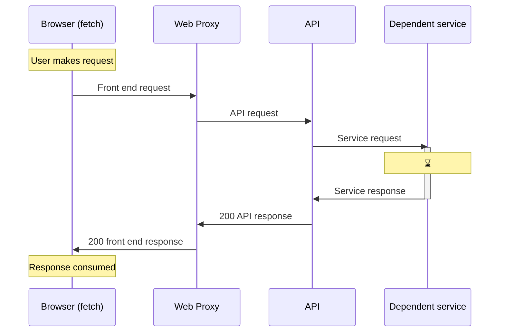
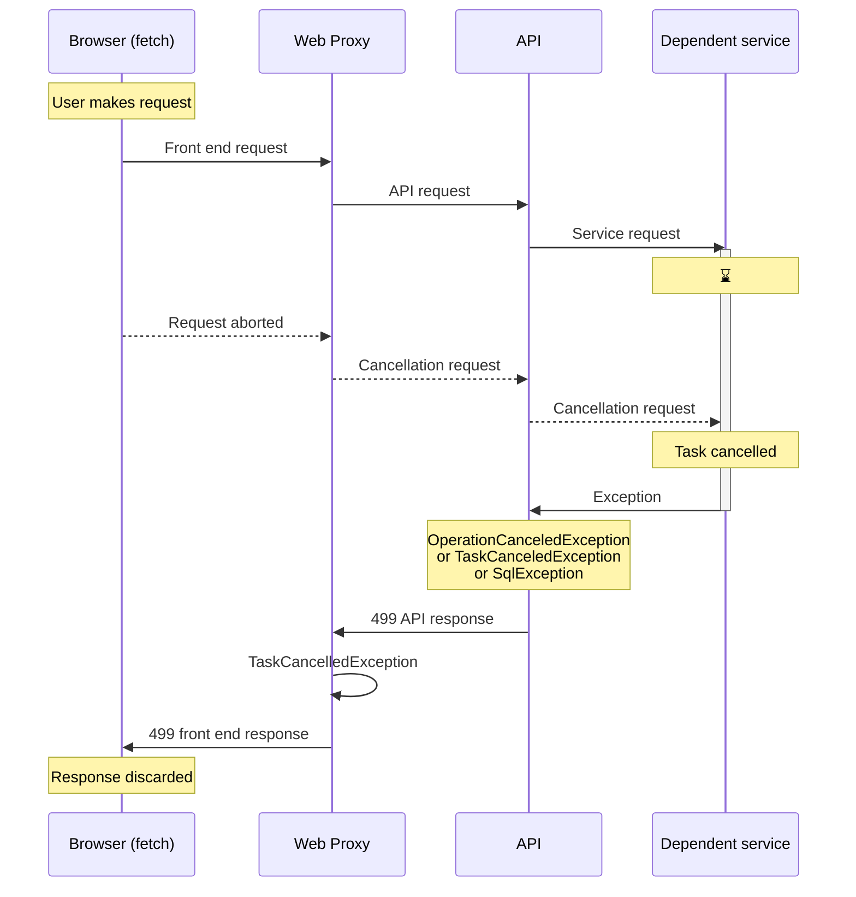
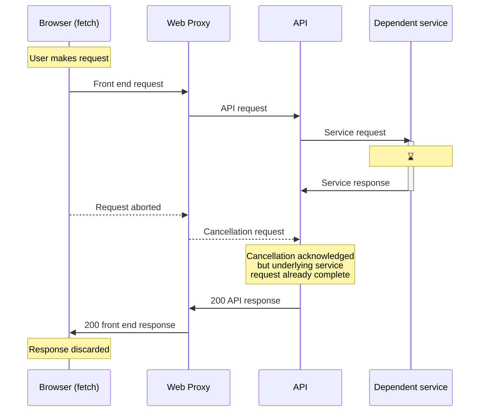

# Task Cancellation within FBIT

.NET supports the cancellation of asynchronous tasks via [`CancellationToken`](https://learn.microsoft.com/en-us/dotnet/api/system.threading.cancellationtoken)s. This has been implemented across FBIT for client side requests from the [`fetch` API](https://developer.mozilla.org/en-US/docs/Web/API/Fetch_API) (with [`signal`](https://developer.mozilla.org/en-US/docs/Web/API/Request/signal)), through Web and down to the underlying dependent services accessed via the API, such as [`DbDataReader.ReadAsync()`](https://learn.microsoft.com/en-us/dotnet/api/system.data.common.dbdatareader.readasync) (via [Dapper](https://github.com/DapperLib/Dapper)).

## Implementation

### Client

To support the cancellation logic, the client component making the `fetch` must supply an abort signal with the command options. This is usually achieved using a/multiple `AbortController`s, e.g.:

```ts
// single signal
const abortController = new AbortController();

const params = new URLSearchParams({
    someParameter: "something",
});
await fetch("/api/path" + params, {
    // ...other options...
    signal: abortController.signal,
});

// ...
abortController.abort();
```

```ts
// multiple signals
const abortController1 = new AbortController();
const abortController2 = new AbortController();
const signals = [abortController1.signal, abortController2.signal];

const params = new URLSearchParams({
    someParameter: "something",
});
await fetch("/api/path" + params, {
    // ...other options...
    signal: signals?.length ? AbortSignal.any(signals) : undefined,
});

// ...
abortController2.abort();
```

> **💡 Note:** `AbortController`s may only be `abort()`ed once. To re-use the variable, create a new instance as required. The `useAbort()` hook in `front-end-components` helps to manage this.

Examples of the above in use are in the search suggester autocomplete (once [`debounce`](https://lodash.com/docs#debounce) gate has been fulfilled) or the dimension drop downs on organisation benchmarking pages. When replicating the `abort()` functionality in a web browser, network monitoring will likely show the request as `(canceled)` and the server response is discarded.

### Web proxy

All Web proxy actions should have a `CancellationToken` as their final method parameter. This token should be passed down to services that call the underlying APIs. e.g.:

```cs
[ApiController]
[Route("api/path")]
public class SomeProxyController(ISomeService someService) : Controller
{
    [HttpGet]
    public async Task<IActionResult> SomeAction(string someParameter, CancellationToken cancellationToken = default)
    {
        try 
        {
            var response = await someService.GetSomethingAsync(someParameter, cancellationToken);
            if (response == null)
            {
                return new NotFoundResult();
            }

            return new JsonResult(response);
        } 
        catch (TaskCanceledException)
        {
            return StatusCode(499);
        }
        catch (Exception)
        {
            // additional context usually logged here
            return StatusCode(500);
        }
    }
}
```

`GetResultOrThrow()` will raise a `TaskCanceledException` if the API response has the status code `499`.

`GetAsync()` also calls `ToApiResult()` with the cancellation token to handle the case when the underlying API has returned, but then the cancellation request is handled by the originating endpoint.

```cs
public interface ISomeService
{
    Task<Something?> GetSomethingAsync(string someParameter, CancellationToken cancellationToken = default);
}

public class SomeService(ISomeApi api) : ISomeService
{
    public async Task<Something?> GetSomethingAsync(string someParameter, CancellationToken cancellationToken = default)
    {
        var query = new ApiQuery()
            .AddIfNotNull("someParameter", someParameter);
            
        var result = await api
            .GetAsync(query, cancellationToken)
            .GetResultOrThrow<Something>();
        return result;
    }
}
```

```cs
public interface ISomeApi
{
    Task<ApiResult> GetAsync(ApiQuery? query = null, CancellationToken cancellationToken = default);
}

public class SomeApi(HttpClient httpClient, string? key = null) : ApiBase(httpClient, key), ISomeApi
{
    public async Task<ApiResult> GetAsync(ApiQuery? query = null, CancellationToken cancellationToken = default)
    {
        return await GetAsync($"/some/api{query?.ToQueryString()}", cancellationToken);
    }
}
```

### API

Similarly to the Web proxy actions, the API functions should also include the `CancellationToken` as the final method parameter. This token should be passed down to dependent services that ultimately perform some asynchronous work. e.g.:

```cs
public class GetSomethingFunction(ISomeDataService service)
{
    [Function(nameof(GetSomethingFunction))]
    public async Task<HttpResponseData> RunAsync(
        [HttpTrigger(AuthorizationLevel.Admin, "get", Route = "some/api")] HttpRequestData req,
        CancellationToken cancellationToken = default)
    {
        var queryParams = req.GetParameters<SomeParameters>();
        var data = await service.GetAsync(queryParams.SomeParameter);
        return await req.CreateJsonResponseAsync(data, cancellationToken: cancellationToken);
    }
}
```

```cs
public interface ISomeDataService
{
    Task<Models.Something?> GetAsync(string someParameter, CancellationToken cancellationToken = default);
}

[ExcludeFromCodeCoverage]
public class SomeDataService(IDatabaseFactory dbFactory) : ISomeDataService
{
    public async Task<Models.Something?> GetAsync(string someParameter, CancellationToken cancellationToken = default)
    {
        var query = new SomeQuery()            
            .WhereSomethingEqual(someParameter);

        using var conn = await dbFactory.GetConnection();
        return await conn.QueryFirstOrDefaultAsync<Models.Something>(query, cancellationToken);
    }
}
```

`ExceptionHandingMiddleware` in each function app intercepts exceptions of the following types and returns a `499` response in the case of a task being cancelled:

* `System.OperationCanceledException`
* `System.Threading.Tasks.TaskCanceledException`
* `Microsoft.Data.SqlClient.SqlException` (when `Message` contains `Operation cancelled by user`)

The above known set of types may need to be extended if/when additional dependent services are implemented.

## Control flow

The examples below assume that the Web Proxy is attempting to resolve the underlying request using `ApiResult.GetResultOrThrow<T>()`. Any potential `TaskCanceledException`s will not be rethrown when using `ApiResult.GetResultOrDefault<T>()`.

### Successfully completed request



### Cancelled in progress request



### Cancelled completed request



<!-- Leave the rest of this page blank -->
\newpage
