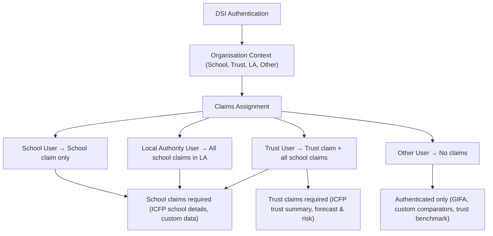

# Authentication & Authorisation

The **Financial Benchmarking and Insights Tool (FBIT)** provides schools, trusts, local authorities, and other approved organisations with benchmarking and financial insights.

Authentication is handled by **DfE Sign-in (DSI)**, and authorisation within the service is implemented using a **claims-based model**.

This document explains how authentication and authorisation are structured and how access is granted across different organisation types.

## Authentication

* FBIT uses DfE Sign-in (DSI) for user authentication.
* When a user logs in via DSI, the service receives:

  * The organisation the user is acting on behalf of.
  * Confirmation that the user is an approved member of that organisation.

Authentication ensures:

* The user is verified by DSI.
* The correct organisation context is established for their session.

## Authorisation

Authorisation is claims-based. A claim represents a user’s permission to access specific organisation.

**Claim Types:**

There are two claim types in the service:

1. School claims – grants access to individual school.
2. Trust claims – grants access to individual trust.

**Supported Organisation Types:**

The service supports four organisation types:

* School
* Trust
* Local authority
* Other

**Claim Assignment Rules:**

* School user: receives a claim for that specific school only.
* Trust user: receives a trust claim for the trust, and school claims for all schools within that trust.
* Local authority user: receives school claims for all schools within that local authority.
* Other: no claims are assigned.

## Feature Access Model

**Features requiring only authentication (no claims)**:

* Gross Internal Floor Area (GIFA) data
* Trust-to-trust benchmarking
* User-defined/custom comparator sets

**Features requiring school claims:**

* ICFP (School details)
* Custom data

**Features requiring trust claims:**

* ICFP (Trust summary)
* Forecast and risk

<!-- Leave the rest of this page blank -->
\newpage
