# Web Assets

Static assets within the website are managed in two ways:

1. Compiled and bundled within the app service within `wwwroot`
2. Resolved from the `webassets` storage account

## `wwwroot` derived assets

ℹ️ **Examples**: favicons, progressive enhancements, stylesheets, fonts

These assets are generated by running the script `npm run build` from `/web/src/Web.App` which in turn runs the Gulp task `build-fe`. The output directory structure is as follows:

```txt
.
└── webassets
    ├── apple-touch-icons.png   # including variants
    ├── favicon.ico
    ├── assets
    │   ├── fonts               # govuk fonts
    │   ├── images              # govuk and FBIT images
    │   └── rebrand             # govuk rebrand files
    ├── css                     # compiled sass files
    └── js                      # compiled ts and govuk-frontend files
```

Requests to these assets is relative to the root of the website. e.g. `https://XXX.a02.azurefd.net/favicon.ico`.

## Blob storage derived assets

ℹ️ **Examples**: dynamically managed images, static data files

Some web assets that are present on the paths below are resolved to blob storage based on Azure Front Door configuration instead of being served by the app service.

| Path      | Purpose             |
|-----------|---------------------|
| `/files`  | Transparency files  |
| `/images` | News article images |

The process by which requests to these paths are routed to blob storage is:

```mermaid
flowchart TD
    accTitle: Resolving web assets from blob storage

    request[Incoming Front Door Request]
    pattern{Front Door routing}
    origin_files(Files Front Door origin 1️⃣)
    origin_images(Images Front Door origin 1️⃣)
    origin_app_service(Web app service origin)
    storage_files(Files blob storage container)
    storage_images(Images blob storage container)
    app_service[App service managed response]
    blob{Path resolves to file in blob storage?}
    success_response["File response (200) 3️⃣"]
    error_response["Error response (400/404) 4️⃣"]

    request --> pattern 
    pattern -- Path matches /files/* --> origin_files -- Origin authentication 2️⃣ --> storage_files --> blob
    pattern -- Path matches /images/* --> origin_images -- Origin authentication 2️⃣ --> storage_images --> blob
    pattern -- Any other path --> origin_app_service --> app_service
    blob -- Yes --> success_response
    blob -- No --> error_response
```



1️⃣ Separate origins configured to enable different storage accounts/containers to be configured in the future

2️⃣ Front Door system assigned managed identity granted `Storage Blob Data Reader` role on storage account

3️⃣ Successful result is also cached at the edge by Front Door

4️⃣ Errors are returned directly from the storage account (no friendly `404` page, for example)

### Response codes

| Path                      | Response                                                                                 |
|---------------------------|------------------------------------------------------------------------------------------|
| `/files/spreadsheet.xlsx` | `200` if `spreadsheet.xlsx` exists in `files` container, otherwise<br>`404 BlobNotFound` |
| `/files`                  | `404 Not Found` from web app because pattern not matched                                 |
| `/files/`                 | `400 InvalidUri` because container listing is disabled                                   |

### Storage account authentication

As described above, Front Door is authenticated with the storage account via origin authentication using the system assigned managed identity. This means that SAS keys may be disabled on the storage account and no additional networking configuration (such as private link) is required.

When files are required to be managed within the storage account, it is acceptable to temporarily enable SAS keys in order for the container to be read/writable. This may be achieved by selecting *Settings > Configuration > Allow storage account key access* and then waiting a few minutes (as well as potentially logging out/in again) before trying again. Once finished, SAS keys may be disabled again. This manual process is required due to CIP restrictions on Microsoft Entra ACLs.

### Route and origin management

To add additional routing and origins, extend the `custom-origins` `local` in [front-door.tf](../../web/terraform/front-door.tf). This is defined as:

| Property        | Purpose                                                              | Example                                        |
|-----------------|----------------------------------------------------------------------|------------------------------------------------|
| `route-pattern` | Front Door route pattern to match                                    | `/files/*`                                     |
| `base-url`      | Relative path that matches above when rendering pages in the web app | `/files`                                       |
| `container`     | Blob storage container name                                          | `files`                                        |
| `origin-host`   | Storage account host name                                            | `<storage account name>.blob.core.windows.net` |
| `origin-path`   | Relative path to storage container from the origin root              | `/files`                                       |

### Troubleshooting deployments

The deployment of the Azure Front Door changes above using Terraform is sometimes a little flaky. Below are some errors that may arise and how to resolve them.

#### `terraform plan` fails with `The argument "principal_id" is required, but no definition was found`

This is due to Terraform attempting to manage role assignment before the service principal has been created. To resolve, request Contributor access via PIM as required and then manually enable the system assigned managed identity on Front Door in Azure Portal. Alternatively, run the following [Azure CLI](https://learn.microsoft.com/en-us/cli/azure/) command:

```sh
az resource update --ids "/subscriptions/<SUBSCRIPTION ID>/resourceGroups/<ENVIRONMENT PREFIX>-ebis-web/providers/Microsoft.Cdn/profiles/<ENVIRONMENT PREFIX>-education-benchmarking-fd-profile" --set identity.type="SystemAssigned"
```

Re-running the failed task allows `terraform plan` to succeed.

> 💡 **Note**: The [`az afd profile identity assign`](https://learn.microsoft.com/en-us/cli/azure/afd/profile/identity) command would be preferable to the above, but this is [reported](https://github.com/Azure/azure-cli/issues/25343) to be an unreliable option

#### `terraform apply` fails with `Please make sure that the originGroup is created successfully and at least one enabled origin is created under the origin group.`

This is due to a race condition when the Front Door origin changes are being applied. Re-running the failed task after a short while allows `terraform apply` to succeed.

<!-- Leave the rest of this page blank -->
\newpage
