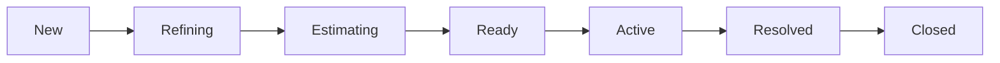

# Azure DevOps Workflow Guide

This document describes the **workflow states** used in our Azure DevOps process. Please follow these definitions to ensure smooth collaboration between developers, BAs, Tech Leads, and Product Owners.

>**Note:** There will be exceptions to the flow when necessary, but this represents the **standard process**.

## Workflow States

**New:**

- A new ticket in the backlog.
- Initial status for all work items.
- No active progress has started.
- **Action:** Should be flagged to **Tech Lead**, **BA**, or **Product Owner** for triage.

**Refining:**

- Ticket is being shaped and clarified.
- This may include:
  - R&D process (research, UX design, content review, etc.)
  - Process mapping
  - BA analysis or clarifications
- **Goal:** Ensure the story is well-defined, feasible, and aligned with product needs.

**Estimating:**

- Ticket is ready for **sizing/estimation** by the team.
- Has gone through refinement and R&D/discovery as needed.
- **Output:** Story points / estimates are assigned.

**Ready:**

- Ticket is fully refined **and** estimated.
- No blockers for development.
- **Action:** Developers can pick up this ticket when starting new work.

**Active:**

- Ticket is currently being **developed**.
- The developer should:
  - Keep status updated.
  - Link relevant PRs and commits.
  - Communicate blockers in stand-ups.

**Resolved:**

- Development work is **complete**, but not yet deployed to production.
- Code is typically merged into the main branch (or release branch).
- Waiting on testing, release, or deployment pipeline.

**Closed:**

- Ticket is **fully complete**.
- Work is deployed to **production**.
- No further action required.

## Workflow Diagram

<!-- Leave the rest of this page blank -->
\newpage
