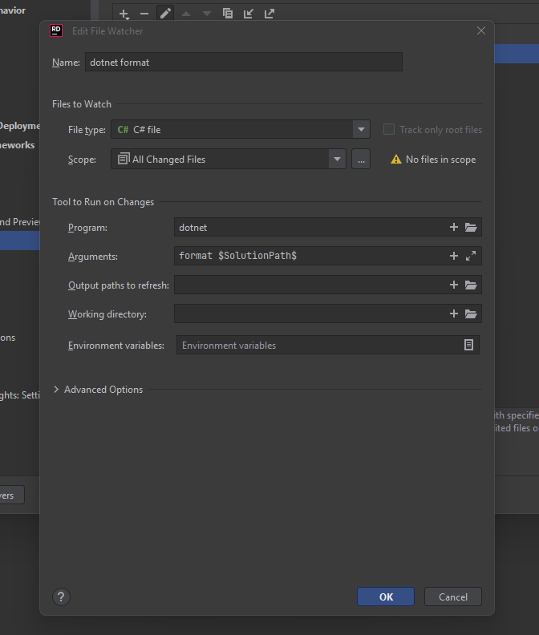
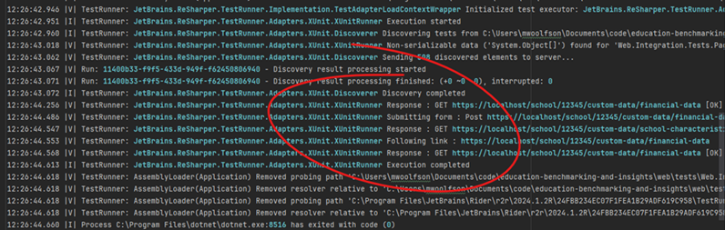
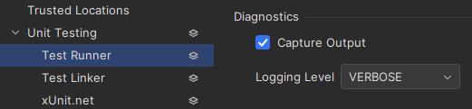

# Rider Configuration

JetBrains Rider is .net IDE of choice of the team, this section covers help settings and configuration for the IDE.

## `dotnet format`

`dotnet format` is a code formatter for dotnet that applies style preferences to a project or solution. Preferences will be read from an .editorconfig file, if present, otherwise a default set of preferences will be used.  

Add a file watcher to automatically format code changes:

- Open Settings -> Tools -> File Watchers
- Press The “Plus Sign” to Add a Custom watcher
- Set the name to “dotnet format”
  - FileType: `C#`
  - Scope: `All changed files`
  - Program: `dotnet`
  - Arguments: `format $SolutionPath$`
  - All other values were left default

## Unit Test Output

xUnit does not always output to the expected window in Rider. When `IMessageSink` is used, output is sent to the Launch Log, which is accessible from:

> Unit Tests Window > ⚙️ Session Options > Diagnostics > Show Last Launch Log

To ensure Rider writes to this log, the following setting should also be configured:

> Menu > File > Settings > Build, Execution, Deployment > Unit Testing > Test Runner > Diagnostics
>
> - Capture Output: `true`
> - Logging Level: `Verbose`

