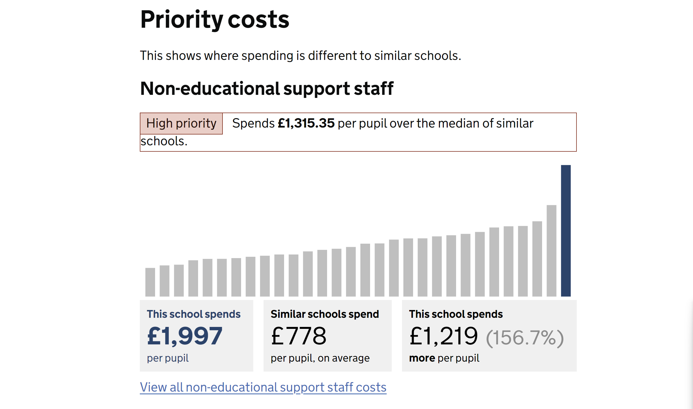
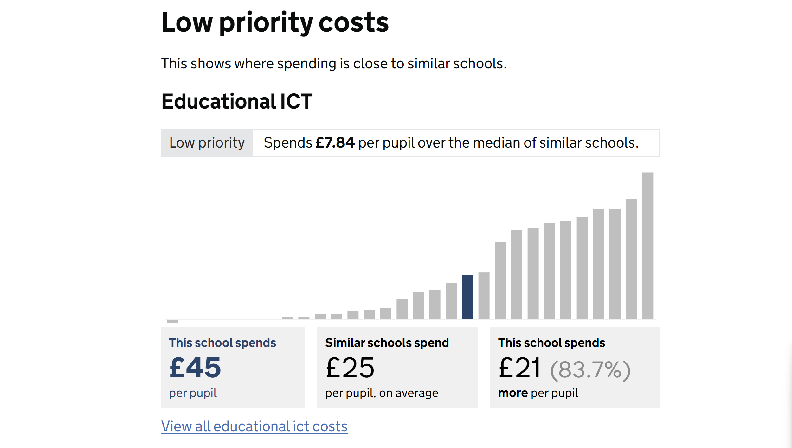

# Features - 0002 -  Spending and costs

## Introduction

This document provides detailed information for developers about the implementation, usage, and integration of the Spending and costs feature within the system.

## Overview

This feature allows a user to compare the spending of their selected school to similar schools.

Information is provided to the user on how the comparator set of schools is selected.

A comparison is displayed and rated for the following categories

- Administrative supplies
- Catering staff and services
- Educational ICT
- Educational supplies
- Non-educational support staff
- Other
- Premises and services
- Teaching and teaching support staff
- Utilities

The data is displayed as a horizontal bar chart for each cost category which are grouped as Priority costs and Low priority costs. This is based on the calculated rating for each category. High and medium as priority costs and low as low priority costs.





When schools within the comparator set are missing data this is flagged with a warning. See the documentation for incomplete data for more [information.](./incomplete-data.md)

## Goals

### Primary Goal

This feature allows users to compare their selected school to similar schools to help identify priority areas so that they can be investigated further.

## Prerequisites/Dependencies

This feature has monorepo dependencies on:

- Web app
- Establishment API
- Insight API
- Benchmark API
- Front-end components

## Usage

The page is orchestrated by the controller and its associated view model and view.

- [Controller](../../../web/src/Web.App/Controllers/SchoolSpendingController.cs)
- [View Model](../../../web/src/Web.App/ViewModels/SchoolSpendingViewModel.cs)
- [View](../../../web/src/Web.App/Views/SchoolSpending/Index.cshtml)

The following API calls are made [see API Reference](#api-reference):

- API call to Establishment: Retrieves details of the selected school.
- API call to Insight: Fetches the ratings information.
- API call for Comparator Set to Benchmark: Fetches the comparator set.
- API call for Expenditure: Retrieves expenditure data for each school in the comparator set.

CategoryBuilder is utilized to obtain the categories and their respective rating information for the school against the comparator set.

- [CategoryBuilder](../../../web/src/Web.App/Domain/CostCategories.cs)

if any school is missing data for the financial year this is flagged. See [incomplete data.](./incomplete-data.md)

The data is visualised as a horizontal bar chart using the comparison chart summary component from front-end components.

- [comparison chart summary](../../../front-end-components/src/composed/comparison-chart-summary/composed.tsx)

## API Reference

API call to Establishment: Retrieves details of the selected school.

Endpoint: `/api/school/{urn}`

Response:

```json
{
  "urn": "string",
  "name": "string",
  "financeType": "string",
  "overallPhase": "string",
  "ofstedRating": "string",
  "kind": "string",
  "laEstab": "string",
  "street": "string",
  "locality": "string",
  "address3": "string",
  "town": "string",
  "county": "string",
  "postcode": "string",
  "companyNumber": "string",
  "trustOrCompanyName": "string",
  "telephone": "string",
  "address": "string",
  "website": "string",
  "localAuthorityName": "string",
  "hasSixthForm": true
}
```

API call to Insight: Fetches the ratings information.

Endpoint: `/api/ratings/{urns}`

Response:

```json
[
  {
    "urn": "string",
    "costCategoryId": 0,
    "costCategory": "string",
    "costGroup": "string",
    "value": 0,
    "median": 0,
    "decile": 0,
    "status": "string",
    "statusOrder": 0
  }
]
```

API call for Comparator Set to Benchmark: Fetches the comparator set.

Endpoint: `/api/comparator-set/{urn}`

```json
{
  "defaultPupil": [
    "string"
  ],
  "defaultArea": [
    "string"
  ]
}
```

API call for Expenditure: Retrieves expenditure data for each school in the comparator set.

Endpoint: `api/schools/expenditure`

```json
[
  {
    "urn": "string",
    "name": "string",
    "schoolType": "string",
    "localAuthority": "string",
    "totalExpenditure": 0,
    "numberOfPupils": 0,
    "totalIncome": 0,
    "totalTeachingSupportStaffCosts": 0,
    "teachingStaffCosts": 0,
    "supplyTeachingStaffCosts": 0,
    "educationalConsultancyCosts": 0,
    "educationSupportStaffCosts": 0,
    "agencySupplyTeachingStaffCosts": 0,
    "netCateringCosts": 0,
    "cateringStaffCosts": 0,
    "cateringSuppliesCosts": 0,
    "incomeCatering": 0,
    "administrativeSuppliesCosts": 0,
    "learningResourcesIctCosts": 0,
    "totalEducationalSuppliesCosts": 0,
    "examinationFeesCosts": 0,
    "breakdownEducationalSuppliesCosts": 0,
    "learningResourcesNonIctCosts": 0,
    "totalNonEducationalSupportStaffCosts": 0,
    "administrativeClericalStaffCosts": 0,
    "auditorsCosts": 0,
    "otherStaffCosts": 0,
    "professionalServicesNonCurriculumCosts": 0,
    "totalPremisesStaffServiceCosts": 0,
    "cleaningCaretakingCosts": 0,
    "maintenancePremisesCosts": 0,
    "otherOccupationCosts": 0,
    "premisesStaffCosts": 0,
    "totalOtherCosts": 0,
    "otherInsurancePremiumsCosts": 0,
    "directRevenueFinancingCosts": 0,
    "groundsMaintenanceCosts": 0,
    "indirectEmployeeExpenses": 0,
    "interestChargesLoanBank": 0,
    "privateFinanceInitiativeCharges": 0,
    "rentRatesCosts": 0,
    "specialFacilitiesCosts": 0,
    "staffDevelopmentTrainingCosts": 0,
    "staffRelatedInsuranceCosts": 0,
    "supplyTeacherInsurableCosts": 0,
    "communityFocusedSchoolStaff": 0,
    "communityFocusedSchoolCosts": 0,
    "totalUtilitiesCosts": 0,
    "energyCosts": 0,
    "waterSewerageCosts": 0,
    "floorArea": 0,
    "hasIncompleteData": true
  }
]
```

## Known Issues

- Without JavaScript this enabled the spending and costs page will not display any charts. This is not unique to this feature but happens throughout the service.
- Does not display expenditure as % of total which is something SFB currently shows. `totalExpenditure` is available from the API response so this could be added to the feature.
- Rating bands do not take into account ofsted rating or whether the comparator set contains >=10 "close range schools".
