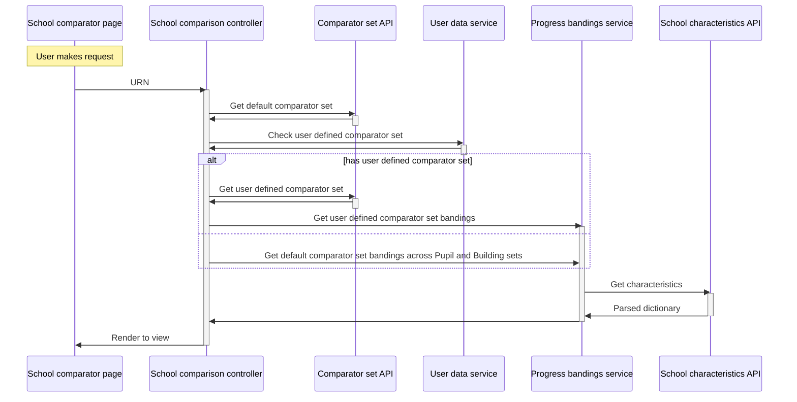
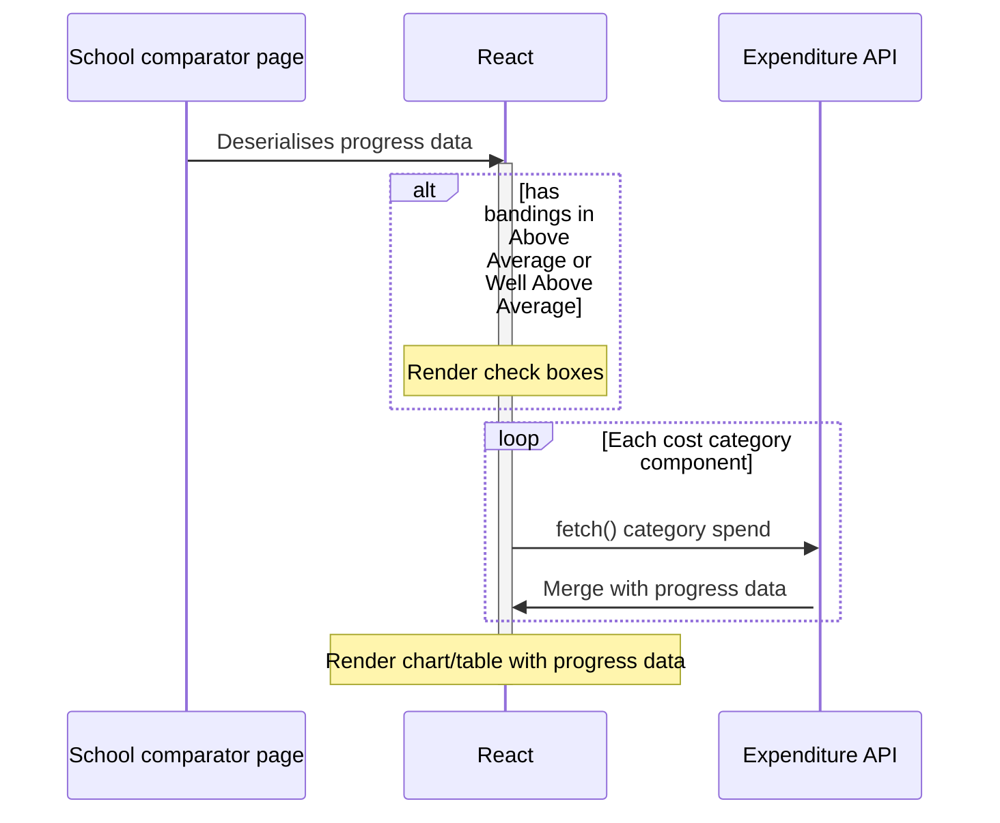

# Developer Feature Documentation: Progress 8 Data

## Introduction

This document provides detailed information for developers about the implementation, usage, and integration of the Progress 8 Data feature within the system.

## Overview

As per [#283987](https://dfe-ssp.visualstudio.com/s198-DfE-Benchmarking-service/_workitems/edit/283987), the requirement to surface Progress 8 data for KS4 schools involves updates to the client-rendered charts, tables and tooltips. This is to honour the use case:

> As a School Business Professional
>
> I want to view Progress 8 data for KS4 schools on the school Benchmark spending page
>
> so that I can identify the schools in my comparator set achieving good educational outcomes

## Goals

### Primary Goal

Retrieve progress data alongside existing financial data to display in client side charts via:

- Check boxes to toggle visibility of 'Above average' and 'Well above average' values
- Chart bar colour updates when any comparators matching toggled check box(es) are rendered
- Addition of legend (key) when any comparators matching toggled check box(es) are rendered
- Modifications to tooltip when any comparators matching toggled check box(es) are rendered
- Additional table column when any comparators matching toggled check box(es) are rendered

Progress data should be displayed for:

- Default comparator sets (Pupil and Building)
- User defined comparator set (if logged in and configured)
- Custom data derived comparator set (if logged in and configured)

### Secondary Goals

Progress data requested once per group of comparator sets (data also required by server rendered views) so as to reduce API call overhead.

Other pages that require progress data (e.g. School home page) should be able to do so without much additional development overhead.

## Prerequisites/Dependencies

The Progress 8 bandings are persisted in the `NonFinancial` table, as managed by the data pipeline.

## Usage

The Insight API School(s) Characteristics endpoints include the new `KS4ProgressBanding` property alongside other non-financial data. This is called from a controller via the new `ProgressService` and a mapping between URN and banding for each school in the set built and rendered to a `data-` attribute, ready to be resolved by the client component. It is also available elsewhere in the relevant view model for consumption by server rendered views (for introductory text).

The client rendered charts for each cost category makes its expenditure `fetch()` and upon success, the progress data is merged, keyed off the URN. The chart bars, tooltips, legend and table changes may then be resolved as if the progress data was always alongside the expenditure data. When the user changes dimension, the new expenditure data is merged again with the progress data. When the view is changed to 'table' or the toggle checkboxes are selected no side effects of additional API calls are made.

### Flow diagram (server)

### Flow diagram (client)

## Deployment

Enabled via the `KS4ProgressBanding` feature flag.

<!-- Leave the rest of this page blank -->
\newpage
