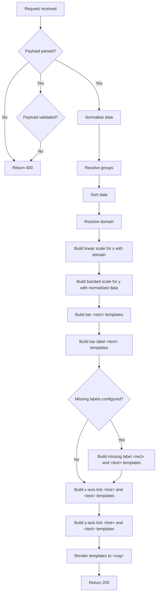

# Developer Feature Documentation: Chart Rendering API

## Introduction

This document provides detailed information for developers about the implementation, usage, and integration of the Chart Rendering API feature within the system.

See also:

- [Guide: Chart Development Workflow](../guides/chart-development-workflow/1_Chart-Development-Workflow.md)
- [Feature: Progressive Enhancements](../features/8_Progressive_Enhancements.md)
- [ADR006: Rendering of Charts](../architecture/decisions/0006-chart-rendering.md)
- [ADR007: Deployment Options for SVG Service for Rendering Charts](../architecture/decisions/0007-deployment-options-rendering-charts-service.md)
- [ADR009: JavaScript Library Selection for ASP.NET Core](../architecture/decisions/0009-js-library.md)
- [ADR015: Chart Rendering API Performance and Scalability Improvements](../architecture/decisions/0015-chart-svg-generation.md)

## Overview

As discussed across other documentation above, the need across the service to server side render charts led to the creation of a Node.JS function app with this single responsibility. This API is data agnostic - requests should include both the dataset and associated configuration. One endpoint should exist per chart type.

## Goals

### Primary Goal

The chart rendering API should support the following chart types, with one endpoint for each:

- Vertical bar chart
- Horizontal bar chart

### Secondary Goals

Support future extensibility through backwards-compatible configuration.

## Prerequisites/Dependencies

- [Node 22](https://nodejs.org/en/download) and/or switch to that version using [nvm](https://github.com/nvm-sh/nvm)
- [Azure Functions Core Tools](https://learn.microsoft.com/en-us/azure/azure-functions/functions-run-local)
- [.NET 8](https://dotnet.microsoft.com/en-us/download/dotnet/8.0) for end-to-end API tests

### External Dependencies

- Various npm packages, notably:
  - [D3](https://d3js.org/) for chart rendering
  - [Jest](https://jestjs.io/) for unit tests

### Internal Dependencies

- Access to Azure DevOps for validating pipelines
- Access to Azure portal for validating infrastructure

## API Reference

### `POST api/horizontalBarChart`

#### Input

The payload expected by this endpoint is either a single or multiple `HorizontalBarChartDefinition` types:

| Required Property | Type     | Definition                                                              |
|-------------------|----------|-------------------------------------------------------------------------|
| `data`            | object[] | Array of items to render                                                |
| `keyField`        | string   | Key identifier. Must resolve to a property on object types in `data`.   |
| `valueField`      | string   | Value identifier. Must resolve to a property on object types in `data`. |

> ℹ️ If multiple definitions are supplied, the `id` property below is mandatory for each so as to not fail validation.

| Optional Property       | Type                    | Default                | Definition                                                                                 |
|-------------------------|-------------------------|------------------------|--------------------------------------------------------------------------------------------|
| `barHeight`             | number                  | `25`                   | Height of horizontal bars                                                                  |
| `domainMax`             | number                  | Maximum resolved value | Maximum value for the chart domain. Value may be normalised in case out-of-range.          |
| `domainMin`             | number                  | 0                      | Minimum value for the chart domain. Value may be normalised in case out-of-range.          |
| `groupedKeys`           | object                  |                        | Dictionary of group name to array of key values within that group to apply known styles to |
| `highlightKey`          | string                  |                        | Key of an item in `data` to assign highlight styles to                                     |
| `id`                    | string                  | New UUID v4            | Unique identifier of the chart data/configuration combination                              |
| `labelField`            | string                  |                        | Keyed off object types in `data`                                                           |
| `labelFormat`           | string                  |                        | Format string to use for labels on y-axis, where `%1` is the key and `%2` is the label     |
| `linkFormat`            | string                  |                        | Format string to use for rendering y-axis labels as links, where `%1` is the key           |
| `missingDataLabel`      | string                  |                        | Label to render in the case of a data point containing null or undefined value             |
| `missingDataLabelWidth` | number                  |                        | Width in pixels of the above label (for positioning, due to unpredictable typeface)        |
| `paddingInner`          | number                  | `0.2`                  | The ratio of the range for blank space between bands                                       |
| `paddingOuter`          | number                  | `0.1`                  | The ratio of the range for blank space before the first and after the last band            |
| `sort`                  | `asc` or `desc`         |                        | Sort `data` by resolved values after normalisation                                         |
| `valueType`             | `Percent` or `Currency` |                        | Describes how values on the chart should be interpreted and formatted                      |
| `width`                 | number                  | `928`                  | Width of chart surface                                                                     |
| `xAxisLabel`            | string                  |                        | Label to render on the x-axis                                                              |

#### Output

| Status code | Condition                                                                                | Response type      | Response body definition                                                                                                         |
|-------------|------------------------------------------------------------------------------------------|--------------------|----------------------------------------------------------------------------------------------------------------------------------|
| `200`       | Single definition in payload with `data` only                                            | `application/json` | JSON in the format: `{ "id": "new uuidv4", "html": "<svg />" }`                                                                  |
| `200`       | Single definition in payload with `data` only and `x-accept` header of `"image/svg+xml"` | `image/svg+xml`    | `<svg />`                                                                                                                        |
| `200`       | Single definition in payload with `data` and `id`                                        | `application/json` | JSON in the format: `{ "id": "id from payload", "html": "<svg />" }`                                                             |
| `200`       | Array of definitions in payload with `data` and `id`                                     | `application/json` | JSON in the format: `[{ "id": "id from payload", "html": "<svg />" }, { "id": "next id from payload", "html": "<svg />" }, ...]` |
| `400`       | Invalid payload                                                                          | `application/json` | JSON in the format: `{ error: "Message"; errors: ["Details"] }`                                                                  |
| `500`       | Unhandled processing error                                                               | `application/json` | JSON in the format: `{ error: "Message" }`                                                                                       |

#### Process

The 'build template' steps below refer to standard JavaScript string templates. As part of the performance investigation and move away from the virtual DOM it was seen to be far more performant to build each `<svg>` in this way from the basic building blocks, e.g.:

- `<rect>` for a bar, with `<text>` for its label
- `<g>` with `<line>` and `<text>` for a plain axis tick
- `<g>` with `<line>`, `<text>`, `<a>` and `<tspan>` for an axis tick rendered as a link
- `<g>` with `<path>` and `<text>` for an axis line and label

The initial work with the virtual DOM helped to identify how each chart element's `x`/`y`/`dy`/`width`/`height`/`d` attribute(s) should be resolved (based off `x` and `y` scales), as did use of the [D3 gallery](https://observablehq.com/@d3/gallery).

### `POST api/verticalBarChart`

### `GET api/health`

Returns `200`, for consumption by upstream availability checks.

### `GET api/openapi.json`

Gets [OpenAPI](https://www.openapis.org/) spec for consumption by Swagger UI.

### `GET api/swagger/{*swaggerAsset}`

Resolves [Swagger UI](https://swagger.io/tools/swagger-ui/) assets.

### `POST api/horizontalBarChart/dom` (local development)

> ⚠️ This endpoint is excluded from production builds via [TSConfig](https://www.typescriptlang.org/tsconfig/).

During initial rapid development of this chart type, D3 was used to render directly to a virtual DOM using [xmldom](https://github.com/xmldom/xmldom). Performance of using a virtual DOM was not suitable for production use even with explicit worker management (see ADRs above) but the endpoint remains for local development.

See also:

- [Performance test plan 0007](../quality-assurance/performance-test-plans/0007_API-Web-ssr-charts-load-test-plan.md)
- [Performance test plan 0010](../quality-assurance/performance-test-plans/0010_Web-Bencmark-IT-Spending-load-test-plan.md)

### `POST api/verticalBarChart/dom` (local development)

> ⚠️ This endpoint is excluded from production builds via [TSConfig](https://www.typescriptlang.org/tsconfig/).

See above.

## Deployment

[Describe the deployment process for releasing the feature to production or staging environments.]

## Known Issues

### Horizontal bar charts

1. No support for negative values

## Future features

### Multi-series horizontal bar chart

### Line chart

<!-- Leave the rest of this page blank -->
\newpage
