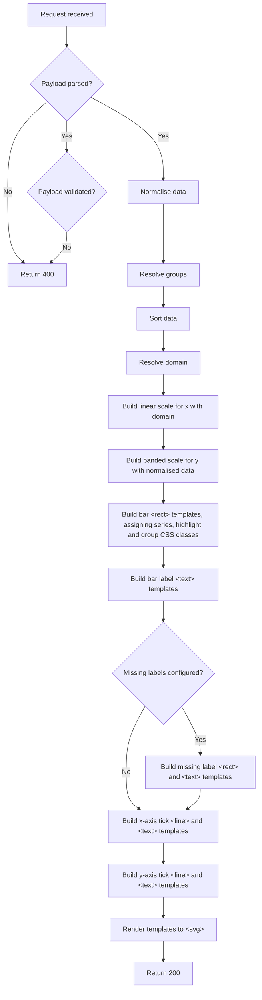
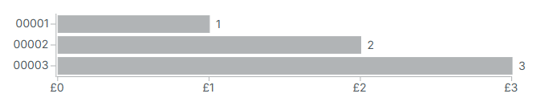
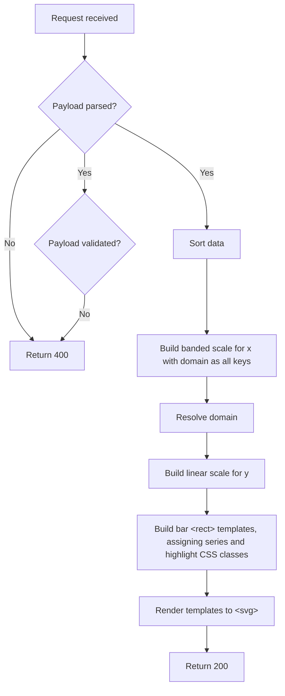

# Developer Feature Documentation: Chart Rendering API

## Introduction

This document provides detailed information for developers about the implementation, usage, and integration of the Chart Rendering API feature within the system.

See also:

- [Guide: Chart Development Workflow](../guides/chart-development-workflow/1_Chart-Development-Workflow.md)
- [Feature: Progressive Enhancements](../features/8_Progressive_Enhancements.md)
- [ADR006: Rendering of Charts](../architecture/decisions/0006-chart-rendering.md)
- [ADR007: Deployment Options for SVG Service for Rendering Charts](../architecture/decisions/0007-deployment-options-rendering-charts-service.md)
- [ADR009: JavaScript Library Selection for ASP.NET Core](../architecture/decisions/0009-js-library.md)
- [ADR015: Chart Rendering API Performance and Scalability Improvements](../architecture/decisions/0015-chart-svg-generation.md)

## Overview

As discussed across other documentation above, the need across the service to server side render charts led to the creation of a Node.JS function app with this single responsibility. This API is data agnostic - requests should include both the dataset and associated configuration. One endpoint should exist per chart type.

## Goals

### Primary Goal

The chart rendering API should return a visual representation of input data and configuration for the following chart types:

- Vertical bar chart
- Horizontal bar chart

The response should include an SVG containing the various correctly dimensioned and positioned elements only, with minimal responsibility over styles. Instead, well-known CSS classes should be set allowing the consumer to resolve to the required styles in the client browser. This helps to reduce the amount of logic in each chart builder as well as bandwidth required for each response.

The endpoints should support single or batched chart requests, and in the case of the latter, resultant SVG should be cross referenced to its original requesting identifier.

### Secondary Goals

Support future extensibility through backwards-compatible configuration.

## Prerequisites/Dependencies

- [Node 22](https://nodejs.org/en/download) and/or switch to that version using [nvm](https://github.com/nvm-sh/nvm)
- [Azure Functions Core Tools](https://learn.microsoft.com/en-us/azure/azure-functions/functions-run-local)
- [.NET 8](https://dotnet.microsoft.com/en-us/download/dotnet/8.0) for end-to-end API tests

### External Dependencies

- Various npm packages, notably:
  - [D3](https://d3js.org/) for chart rendering
  - [Jest](https://jestjs.io/) for unit tests
- App Insights for (optional) dependency tracking

### Internal Dependencies

- Access to Azure DevOps for validating pipelines
- Access to Azure portal for validating infrastructure

## API Reference

### `POST api/horizontalBarChart`

#### Input

The payload expected by this endpoint is either a single or multiple `HorizontalBarChartDefinition` types:

| Required Property | Type                    | Definition                                                                      |
|-------------------|-------------------------|---------------------------------------------------------------------------------|
| `data`            | object[]                            | Array of items to render                                                        |
| `keyField`        | string                              | Key identifier. Must resolve to a property on object types in `data`.           |
| `valueField`      | string or string[]                  | Value identifier(s). Each must resolve to a property on object types in `data`. |
| `valueType`       | `percent`, `currency`, or `numeric` | Describes how values on the chart should be interpreted and formatted           |

> ℹ️ If multiple definitions are supplied, the `id` property below is mandatory for each so as to not fail validation.

> ℹ️ Where an array of strings is passed in `valueField`, each value will be represented as a "stack" on the chart

| Optional Property       | Type            | Default                | Definition                                                                                 |
|-------------------------|-----------------|------------------------|--------------------------------------------------------------------------------------------|
| `barHeight`             | number          | `25`                   | Height of horizontal bars                                                                  |
| `domainMax`             | number          | Maximum resolved value | Maximum value for the chart domain. Value may be normalised in case out-of-range.          |
| `domainMin`             | number          | `0`                    | Minimum value for the chart domain. Value may be normalised in case out-of-range.          |
| `groupedKeys`           | object          |                        | Dictionary of group name to array of key values within that group to apply known styles to |
| `highlightKey`          | string          |                        | Key of an item in `data` to assign highlight styles to                                     |
| `id`                    | string          | New UUID v4            | Unique identifier of the chart data/configuration combination                              |
| `labelField`            | string          |                        | Keyed off object types in `data`                                                           |
| `labelFormat`           | string          |                        | Format string to use for labels on y-axis, where `%1` is the key and `%2` is the label     |
| `legendLabels`          | string[]        |                        | Array of strings to display in the legend of a stacked bar chart.  Array order must match the entries in the `valueField` array
| `linkFormat`            | string          |                        | Format string to use for rendering y-axis labels as links, where `%1` is the key           |
| `missingDataLabel`      | string          |                        | Label to render in the case of a data point containing null or undefined value             |
| `missingDataLabelWidth` | number          |                        | Width in pixels of the above label (for positioning, due to unpredictable typeface)        |
| `paddingInner`          | number          | `0.2`                  | The ratio of the range for blank space between bands                                       |
| `paddingOuter`          | number          | `0.1`                  | The ratio of the range for blank space before the first and after the last band            |
| `sort`                  | `asc` or `desc` |                        | Sort `data` by resolved values after normalisation                                         |
| `width`                 | number          | `928`                  | Width of chart surface                                                                     |
| `xAxisLabel`            | string          |                        | Label to render on the x-axis                                                              |

#### Output

| Status code | Condition                                                                              | Response type      | Response body definition                                                                                                         |
|-------------|----------------------------------------------------------------------------------------|--------------------|----------------------------------------------------------------------------------------------------------------------------------|
| `200`       | Single definition in payload with `data` only                                          | `application/json` | JSON in the format: `{ "id": "new uuidv4", "html": "<svg />" }`                                                                  |
| `200`       | Single definition in payload with `data` only and `x-accept` header of `image/svg+xml` | `image/svg+xml`    | `<svg />`                                                                                                                        |
| `200`       | Single definition in payload with `data` and `id`                                      | `application/json` | JSON in the format: `{ "id": "id from payload", "html": "<svg />" }`                                                             |
| `200`       | Array of definitions in payload with `data` and `id`                                   | `application/json` | JSON in the format: `[{ "id": "id from payload", "html": "<svg />" }, { "id": "next id from payload", "html": "<svg />" }, ...]` |
| `400`       | Invalid payload                                                                        | `application/json` | JSON in the format: `{ error: "Message"; errors: ["Details"] }`                                                                  |
| `500`       | Unhandled processing error                                                             | `application/json` | JSON in the format: `{ error: "Message" }`                                                                                       |

#### Process

The 'build template' steps below refer to standard JavaScript string templates. As part of the performance investigation and move away from the virtual DOM it was seen to be far more performant to build each `<svg>` in this way from the basic building blocks, e.g.:

- `<rect>` for a bar, with `<text>` for its label
- `<g>` with `<line>` and `<text>` for a plain axis tick
- `<g>` with `<line>`, `<text>`, `<a>` and `<tspan>` for an axis tick rendered as a link
- `<g>` with `<path>` and `<text>` for an axis line and label

The initial work with the virtual DOM helped to identify how each chart element's `x`/`y`/`dy`/`width`/`height`/`d` attribute(s) should be resolved (based off `x` and `y` scales), as did use of the [D3 gallery](https://observablehq.com/@d3/gallery).



#### Minimal example

##### Request

```sh
curl -X 'POST' \
  'http://localhost:7076/api/horizontalBarChart' \
  -H 'accept: application/json' \
  -H 'Content-Type: application/json' \
  -d '{
  "id": "id",
  "keyField": "key",
  "valueField": "value",
  "valueType": "currency",
  "data": [
    {
      "key": "00001",
      "value": "1"
    },
    {
      "key": "00002",
      "value": "2"
    },
    {
      "key": "00003",
      "value": "3"
    }
  ]
}'
```

##### Response body

```json
{
  "id": "id",
  "html": "<svg width=\"928\" height=\"118\" viewBox=\"0,0,928,118\" data-chart-id=\"id\" xmlns=\"http://www.w3.org/2000/svg\"><g><rect x=\"317.3333333333333\" y=\"22.6\" width=\"188.5555555555556\" height=\"20.8\" data-key=\"00001\" class=\"chart-cell chart-cell__series-0\"/><rect x=\"317.3333333333333\" y=\"48.6\" width=\"377.11111111111114\" height=\"20.8\" data-key=\"00002\" class=\"chart-cell chart-cell__series-0\"/><rect x=\"317.3333333333333\" y=\"74.6\" width=\"565.6666666666667\" height=\"20.8\" data-key=\"00003\" class=\"chart-cell chart-cell__series-0\"/></g><g><text x=\"513.8888888888889\" y=\"33\" dy=\"0.35em\" class=\"chart-label chart-label__series-0\">1</text><text x=\"702.4444444444445\" y=\"59\" dy=\"0.35em\" class=\"chart-label chart-label__series-0\">2</text><text x=\"891\" y=\"85\" dy=\"0.35em\" class=\"chart-label chart-label__series-0\">3</text></g><g class=\"chart-axis chart-axis__x\" transform=\"translate(-2,98)\"><path class=\"domain\" stroke=\"currentColor\" d=\"M317.8333333333333,1V0.5H883.5V1\"/><g class=\"chart-tick\" transform=\"translate(317.8333333333333,0)\"><line y2=\"6\" x1=\"1\" x2=\"1\"/><text y=\"9\" dy=\"0.71em\" x1=\"1\" x2=\"1\">£0</text></g><g class=\"chart-tick\" transform=\"translate(506.3888888888889,0)\"><line y2=\"6\" x1=\"1\" x2=\"1\"/><text y=\"9\" dy=\"0.71em\" x1=\"1\" x2=\"1\">£1</text></g><g class=\"chart-tick\" transform=\"translate(694.9444444444445,0)\"><line y2=\"6\" x1=\"1\" x2=\"1\"/><text y=\"9\" dy=\"0.71em\" x1=\"1\" x2=\"1\">£2</text></g><g class=\"chart-tick\" transform=\"translate(883.5,0)\"><line y2=\"6\" x1=\"1\" x2=\"1\"/><text y=\"9\" dy=\"0.71em\" x1=\"1\" x2=\"1\">£3</text></g></g><g class=\"chart-axis chart-axis__y\" transform=\"translate(314.3333333333333,0)\"><path class=\"domain\" stroke=\"currentColor\" d=\"M0,20.5H0.5V98.5H0\" transform=\"translate(0,0)\"/><g class=\"chart-tick\" transform=\"translate(0,33)\"><line x2=\"-6\"/><text x=\"-9\" dy=\"0.32em\">00001</text></g><g class=\"chart-tick\" transform=\"translate(0,59)\"><line x2=\"-6\"/><text x=\"-9\" dy=\"0.32em\">00002</text></g><g class=\"chart-tick\" transform=\"translate(0,85)\"><line x2=\"-6\"/><text x=\"-9\" dy=\"0.32em\">00003</text></g></g></svg>"
}
```

##### Response body as raw SVG


##### Response body as styled SVG (from browser style sheet)



### `POST api/verticalBarChart`

#### Input

The payload expected by this endpoint is either a single or multiple `VerticalBarChartDefinition` types:

| Required Property | Type     | Definition                                                              |
|-------------------|----------|-------------------------------------------------------------------------|
| `data`            | object[] | Array of items to render                                                |
| `keyField`        | string   | Key identifier. Must resolve to a property on object types in `data`.   |
| `valueField`      | string   | Value identifier. Must resolve to a property on object types in `data`. |

> ℹ️ If multiple definitions are supplied, the `id` property below is mandatory for each so as to not fail validation.

| Optional Property | Type            | Default                | Definition                                                                        |
|-------------------|-----------------|------------------------|-----------------------------------------------------------------------------------|
| `domainMax`       | number          | Maximum resolved value | Maximum value for the chart domain. Value may be normalised in case out-of-range. |
| `domainMin`       | number          | `0`                    | Minimum value for the chart domain. Value may be normalised in case out-of-range. |
| `height`          | number          | `500`                  | Height of chart surface                                                           |
| `highlightKey`    | string          |                        | Key of an item in `data` to assign highlight styles to                            |
| `id`              | string          | New UUID v4            | Unique identifier of the chart data/configuration combination                     |
| `sort`            | `asc` or `desc` |                        | Sort `data` by resolved values after normalisation                                |
| `width`           | number          | `928`                  | Width of chart surface                                                            |

#### Output

| Status code | Condition                                                                              | Response type      | Response body definition                                                                                                         |
|-------------|----------------------------------------------------------------------------------------|--------------------|----------------------------------------------------------------------------------------------------------------------------------|
| `200`       | Single definition in payload with `data` only                                          | `application/json` | JSON in the format: `{ "id": "new uuidv4", "html": "<svg />" }`                                                                  |
| `200`       | Single definition in payload with `data` only and `x-accept` header of `image/svg+xml` | `image/svg+xml`    | `<svg />`                                                                                                                        |
| `200`       | Single definition in payload with `data` and `id`                                      | `application/json` | JSON in the format: `{ "id": "id from payload", "html": "<svg />" }`                                                             |
| `200`       | Array of definitions in payload with `data` and `id`                                   | `application/json` | JSON in the format: `[{ "id": "id from payload", "html": "<svg />" }, { "id": "next id from payload", "html": "<svg />" }, ...]` |
| `400`       | Invalid payload                                                                        | `application/json` | JSON in the format: `{ error: "Message"; errors: ["Details"] }`                                                                  |
| `500`       | Unhandled processing error                                                             | `application/json` | JSON in the format: `{ error: "Message" }`                                                                                       |

#### Process

The 'build template' steps below refer to standard JavaScript string templates as above.



#### Minimal example

##### Request

```sh
curl -X 'POST' \
  'http://localhost:7076/api/verticalBarChart' \
  -H 'accept: application/json' \
  -H 'Content-Type: application/json' \
  -d '{
  "id": "id",
  "keyField": "key",
  "valueField": "value",
  "data": [
    {
      "key": "00001",
      "value": "1"
    },
    {
      "key": "00002",
      "value": "2"
    },
    {
      "key": "00003",
      "value": "3"
    }
  ]
}'
```

##### Response body

```json
{
  "id": "id",
  "html": "<svg width=\"928\" height=\"500\" viewBox=\"0,0,928,500\" data-chart-id=\"id\" xmlns=\"http://www.w3.org/2000/svg\"><g><rect x=\"60.625\" y=\"340.00000000000006\" height=\"159.99999999999994\" width=\"230.5\" data-bar-index=\"0\" class=\"chart-cell chart-cell__series-0\"/><rect x=\"348.75\" y=\"180.00000000000003\" height=\"320\" width=\"230.5\" data-bar-index=\"1\" class=\"chart-cell chart-cell__series-0\"/><rect x=\"636.875\" y=\"20\" height=\"480\" width=\"230.5\" data-bar-index=\"2\" class=\"chart-cell chart-cell__series-0\"/></g></svg>"
}
```

##### Response body as raw SVG


##### Response body as styled SVG (from browser style sheet)


### `GET api/health`

Returns `200`, for consumption by upstream availability checks.

### `GET api/openapi.json`

Gets [OpenAPI](https://www.openapis.org/) spec for consumption by Swagger UI.

### `GET api/swagger/{*swaggerAsset}`

Resolves [Swagger UI](https://swagger.io/tools/swagger-ui/) assets to host `http://localhost:7076/api/swagger/` locally.

### `POST api/horizontalBarChart/dom` (local development)

> ⚠️ This endpoint is excluded from production builds via [TSConfig](https://www.typescriptlang.org/tsconfig/).

During initial rapid development of this chart type, D3 was used to render directly to a virtual DOM using [d3-selection](https://d3js.org/d3-selection) and [xmldom](https://github.com/xmldom/xmldom). Performance of using a virtual DOM was not suitable for production use even with explicit worker management (see ADRs above) but the endpoint remains for local development.

See also:

- [Performance test plan 0007](../quality-assurance/performance-test-plans/0007_API-Web-ssr-charts-load-test-plan.md)
- [Performance test plan 0010](../quality-assurance/performance-test-plans/0010_Web-Bencmark-IT-Spending-load-test-plan.md)

### `POST api/verticalBarChart/dom` (local development)

> ⚠️ This endpoint is excluded from production builds via [TSConfig](https://www.typescriptlang.org/tsconfig/).

See above.

## Deployment

The Chart Rendering function app is deployed and managed along with the other function apps in the Platform solution within the monorepo. The Terraform is slightly different due to this being a Node rather than .NET function app, but this is all managed within the `functions` TF module:

1. `azurerm_linux_function_app` resource type used instead of `azurerm_windows_function_app` along with `22` for the `node_version`
1. Above resource's identity assigned to dependent service access policies instead of the `windows` equivalent
1. Optional (elastic/standard) worker count variables supported for fine-tuning configuration
1. Separate SKU variable (from `windows` equivalent) to support alternative app service plans per environment

### API Tests

API tests against the Chart Rendering endpoints takes place within pipeline runs against `main`, as per the other function apps. Assertions are done against expected JSON or SVG responses rather than explicit deeper inspection. There are no additional dependencies (such as seeded test data).

## Known Issues

1. Results are not cached. So far this has not raised any performance concerns.

### Horizontal bar chart

1. Negative values filtered out from chart with CSS class alone applied to identify as such.

### Vertical bar chart

1. Vertical bars only are the only rendered elements at this time as relative entries alone required by consumer.
1. Negative values may cause unexpected behaviour due to lack of data normalisation.

## Horizontal stacked bar charts

When support for stacked bar charts was added, it was decided that all horizontal bar charts would be stacked charts, with existing charts simply rendering with a single data stack, and being visually identical to a non-stacked chart.

### Chart legend

The legend on a stacked horizontal bar chart is built using the `legendLabels` request property. The `valueField` property must be an array of strings, each string being a property on objects in `data`.  `legendLabels` should contain the names of these properties, eg.:

```
{
  ...

  "valueField": [
    "headTeachers",
    "deputyHeadTeachers",
    "assistantHeadTeachers",
    "leadershipNonTeachers"
  ],
  "legendLabels": [
    "Head teachers",
    "Deputy head teachers",
    "Assistant head teachers",
    "Leadership non-teachers"
  ]

  ...
}
```

## Future Features

### Multi-series horizontal bar chart

The horizontal bar charts only support a single series, by design. To support multiple series the input configuration will need to be modified. In `front-end-components` a separate chart type has been defined for this purpose, which should be avoided unless absolutely necessary for the production-ready version. Prototyping using the existing `d3-selection`/virtual DOM endpoint would be acceptable in order to identify what changes would need to be merged into the 'string template' version.

Looking at [various](https://observablehq.com/@slowkow/horizontal-grouped-bar-chart) [examples](https://gist.github.com/erikvullings/51cc5332439939f1f292) there appear to be many ways of solving this problem. To provide backwards compatibility with single-series charts the best solution would probably be to:

1. Include multiple series (including padding) in surface height calculation.
1. Modify the `<rect>` string templates for bars to loop through all keys defined in the multi series configuration. Calculate `y` to be relative to the key index (achieved with a separate scale band for `y` using the series keys for the domain), to allow offset from the parent `<g>` (see below).

  ```js
  // e.g., from example above
  const y0 = d3.scaleBand()
    .domain(data.map(d => d[groupKey]))
    .rangeRound([margin.top, height - margin.bottom])
    .paddingInner(0.1);
  const y1 = d3.scaleBand()
    .domain(keys)
    .rangeRound([y0.bandwidth(), 0])
    .padding(0.1)
  ```

1. Assign series index or other identifier to `<rect>` as well as class (currently hard-coded to `chart-cell__series-0`).
1. Modify the `<text>` string templates for labels similar to above.
1. Add wrapper `<g>` around each of the above with a `transform` to offset the `y` attribute to be the number of items in the series multiplied by the bar height (plus some padding).

  ```js
  // e.g., from example above
  .join("g")
    .attr("transform", d => `translate(0,${y0(d[groupKey])})`)
  ```

#### SVG snippet

```xml
<!-- current -->
<svg width="928" height="118" viewBox="0,0,928,118" data-chart-id="id" xmlns="http://www.w3.org/2000/svg">
    <g>
        <rect x="317.3333333333333" y="22.6" width="188.5555555555556" height="20.8" data-key="00001" class="chart-cell chart-cell__series-0"/>
        <rect x="317.3333333333333" y="48.6" width="377.11111111111114" height="20.8" data-key="00002" class="chart-cell chart-cell__series-0"/>
        <rect x="317.3333333333333" y="74.6" width="565.6666666666667" height="20.8" data-key="00003" class="chart-cell chart-cell__series-0"/>
    </g>
    <g>
        <text x="513.8888888888889" y="33" dy="0.35em" class="chart-label chart-label__series-0">1</text>
        <text x="702.4444444444445" y="59" dy="0.35em" class="chart-label chart-label__series-0">2</text>
        <text x="891" y="85" dy="0.35em" class="chart-label chart-label__series-0">3</text>
    </g>
</svg>
```


```xml
<!-- proposed single series -->
<svg width="928" height="118" viewBox="0,0,928,118" data-chart-id="id" xmlns="http://www.w3.org/2000/svg">
    <g>
        <g transform="translate(0,22.6)">
            <rect x="317.3333333333333" y="1" width="188.5555555555556" height="20.8" data-key="00001" class="chart-cell chart-cell__series-0"/>
            <text x="513.8888888888889" y="11" dy="0.35em" class="chart-label chart-label__series-0">1</text>
        </g>
        <g transform="translate(0,48.6)">
            <rect x="317.3333333333333" y="1" width="377.11111111111114" height="20.8" data-key="00002" class="chart-cell chart-cell__series-0"/>
            <text x="702.4444444444445" y="11" dy="0.35em" class="chart-label chart-label__series-0">2</text>
        </g>
        <g transform="translate(0,74.6)">
            <rect x="317.3333333333333" y="1" width="565.6666666666667" height="20.8" data-key="00003" class="chart-cell chart-cell__series-0"/>
            <text x="891" y="11" dy="0.35em" class="chart-label chart-label__series-0">3</text>
        </g>
    </g>
</svg>
```


```xml
<!-- proposed multi series -->
<svg width="928" height="170" viewBox="0,0,928,170" data-chart-id="id" xmlns="http://www.w3.org/2000/svg">
    <g>
        <g transform="translate(0,22.6)">
            <rect x="317.3333333333333" y="1" width="188.5555555555556" height="20.8" data-key="00001" class="chart-cell chart-cell__series-0"/>
            <text x="513.8888888888889" y="11" dy="0.35em" class="chart-label chart-label__series-0">1</text>
            <rect x="317.3333333333333" y="24" width="565.6666666666667" height="20.8" data-key="00003" class="chart-cell chart-cell__series-1"/>
            <text x="891" y="34" dy="0.35em" class="chart-label chart-label__series-1">3</text>
        </g>
        <g transform="translate(0,72.6)">
            <rect x="317.3333333333333" y="1" width="377.11111111111114" height="20.8" data-key="00002" class="chart-cell chart-cell__series-0"/>
            <text x="702.4444444444445" y="11" dy="0.35em" class="chart-label chart-label__series-0">2</text>
            <rect x="317.3333333333333" y="24" width="188.5555555555556" height="20.8" data-key="00001" class="chart-cell chart-cell__series-1"/>
            <text x="513.8888888888889" y="34" dy="0.35em" class="chart-label chart-label__series-1">1</text>
        </g>
        <g transform="translate(0,122.6)">
            <rect x="317.3333333333333" y="1" width="565.6666666666667" height="20.8" data-key="00003" class="chart-cell chart-cell__series-0"/>
            <text x="891" y="11" dy="0.35em" class="chart-label chart-label__series-0">3</text>
            <rect x="317.3333333333333" y="24" width="377.11111111111114" height="20.8" data-key="00002" class="chart-cell chart-cell__series-1"/>
            <text x="702.4444444444445" y="34" dy="0.35em" class="chart-label chart-label__series-1">2</text>
        </g>
    </g>
</svg>
```


#### Other things to note

1. If developing first in the `d3-selection`/virtual DOM endpoint then it may be worth retrospectively updating that with the latest changes from the 'string template' version. A brand new endpoint could also be used, possibly based off one of the identified similar examples.
1. Domain calculations for `x` will need to take multiple series into account so as to not inadvertently truncate any bars.
1. Styles may need to be defined in consuming service for newly rendered CSS classes.
1. Although the above proposal should work for 'single series' charts the SVG output will be different and so API tests will initially fail.

### Line chart

This chart type does not yet exist in the Chart Rendering API. When implementing, the following features must be configurable:

1. Single/multi series
1. X-axis label (values/visibility)
1. X-axis tick formatter
1. Legend (values/visibility/position)
1. Value type
1. Value dots (visibility)
1. Value labels (visibility)

The following features must always be supported:

1. Y-axis ticks
1. X-axis ticks
1. Horizontal grid lines
1. Domain management (will be different from that used for bar charts; see [#233948](https://dfe-ssp.visualstudio.com/s198-DfE-Benchmarking-service/_workitems/edit/233948) and associated existing implementation)

The current implementation in `front-end-components` includes all of the above features.

#### Examples

As per other guidance above, best practice would be to first implement this new chart type based on existing examples using D3 and the virtual DOM. Once this has been completed and the expected SVG outputted the rewrite to use string templates may proceed. Below are some examples to use as a starting point:

1. [Line chart, multiple series](https://observablehq.com/@d3/multi-line-chart/2)
1. [Line chart](https://observablehq.com/@d3/line-chart/2)
1. [Line chart gallery](https://d3-graph-gallery.com/line.html)

#### Styles

As per the other endpoints, inline styles via SVG attributes should be kept to a minimum and instead class names should be used. To help support line formatting, for example, the following is rendered in the existing client side line charts for a dashed line:

```xml
<g class="recharts-layer recharts-line chart-line chart-line-series-1">
    <path stroke-width="3" class="recharts-curve recharts-line-curve" stroke-dasharray="20 7" stroke="#3182bd"
        fill="none" width="860" height="300" d="M130,181.192L282,193.423L434,56.346L586,86.577L738,187.538L890,337.538">
    </path>
</g>
```

For the proposed server rendered version this should be something like:

```xml
<g class="chart-line chart-line-series-1">
    <path class="line-curve" fill="none" width="860" height="300"
        d="M130,181.192L282,193.423L434,56.346L586,86.577L738,187.538L890,337.538"></path>
</g>
```

with CSS managing the styles:

```css
.chart-line.chart-line-series-1 > .line-curve {
    stroke-dasharray: 20px 7px;
    stroke-width: 5px;
    stroke: #3182bd;
}
```

This CSS definition could also then be re-used in the legend for consistency.

#### Progressive enhancement

The existing client side line charts optionally support tooltips when the mouse enters a value dot. As per the [Progressive Enhancements](../features/8_Progressive_Enhancements.md) feature, this should be added in once the server rendered chart has been implemented.

<!-- Leave the rest of this page blank -->
\newpage
