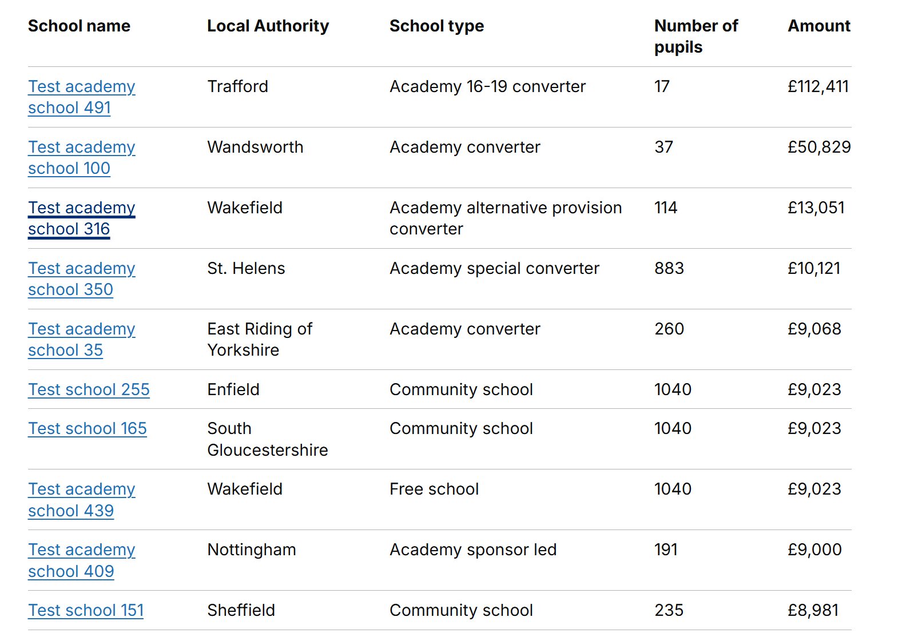
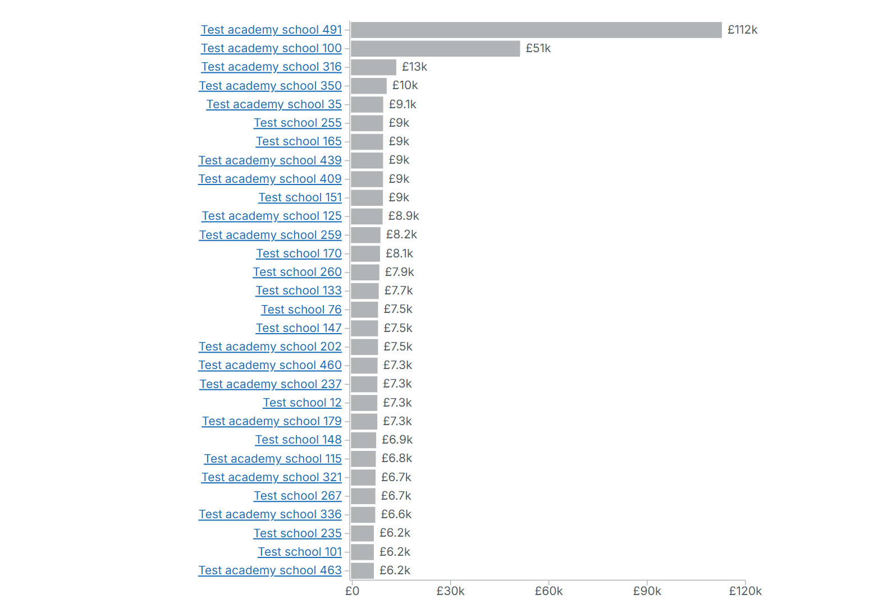
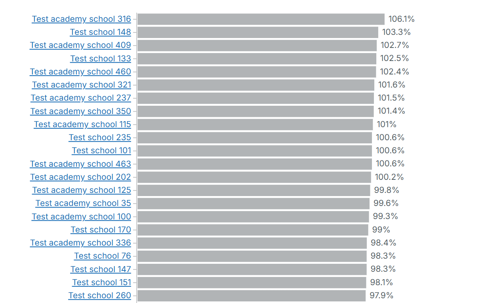
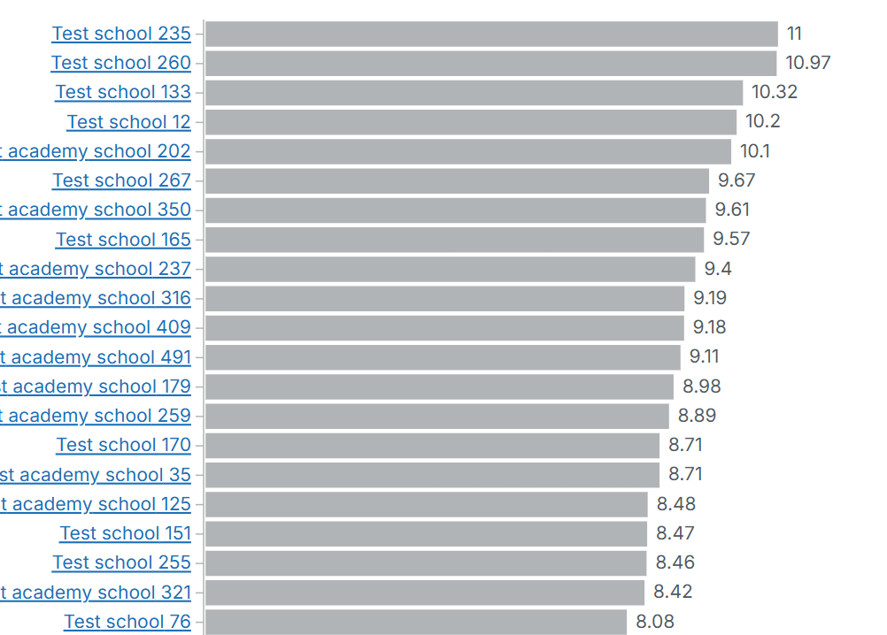
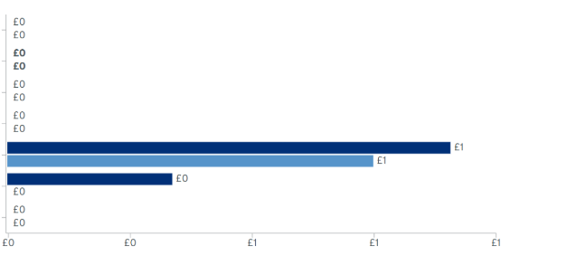

# Developer Feature Documentation: Number Rounding for Charts and Tables

## Introduction

This document describes the rounding logic used across tables, charts, and tooltips within the service. The goal is to ensure numerical values are displayed consistently and clearly while maintaining accuracy where appropriate.

## Overview

Rounding rules differ depending on:

- Whether the value contains decimals
- Whether the value is **currency**, **percentage**, or a **ratio**
- Whether the value is displayed in a **table**, a **chart**, or a **tooltip**
- Whether the value is **above or below 1000** (currency only)
- Whether the value is a **ratio**, which is rounded to **2 decimal places**
- Whether the value is an **average**, which is rounded to **1 decimal place** in tooltips
- Whether the value is **total pupils**, which is rounded to **1 decimal place** in tooltips

These rules must be applied in the correct order to ensure consistent behaviour.

## Rounding Rules

### Rounding to the Nearest Pound (Currency Only)

Any currency value containing decimals is rounded to the nearest whole pound before any further formatting.

This applies to **both table and chart views**, and also to **currency values in tooltips**.

### Chart‑Specific Rounding for Currency Values ≥ 1000

After rounding to the nearest pound:

- If the value is **1000 to < 1 million**, charts convert it to a **“k” format**, rounded to **one decimal place**.
- If the value is **1 million or greater**, charts convert it to an **“m” format**, rounded to **one decimal place**.
- If the value is **less than 1000**, charts display the exact rounded value.

The chart format rules are based on [SI prefixes](https://en.wikipedia.org/wiki/Metric_prefix#List_of_SI_prefixes)

These same formatting rules apply to **currency values in tooltips on the historic page**.

### Percentage Rounding

Percentage values follow a separate rule:

- Percentages are **always rounded to 1 decimal place**.
- This applies to **tables**, **charts**, and **tooltips**.
- No “k” or “m” formatting is ever applied to percentages.
- The rounded value is displayed exactly as rounded (e.g., 12.345% → 12.3%).

### Ratio Rounding

Ratios follow their own rule:

- Ratios are **always rounded to 2 decimal places**.
- This applies to **tables**, **charts**, and **tooltips**.
- No “k” or “m” formatting is ever applied to ratios.
- The rounded value is displayed exactly as rounded (e.g., 0.12345 → 0.12).

## Tooltip Formatting Rules

Tooltips follow specific formatting rules depending on the type of value.

### Currency in Tooltips

- Currency values follow **the same formatting rules as charts**:
  - Rounded to nearest pound
  - < 1000 → shown as rounded value
  - ≥ 1000 → “k” format (1 dp)
  - ≥ 1,000,000 → “m” format (1 dp)

### Averages in Tooltips

- Averages are **always rounded to 1 decimal place**.

### Ratios in Tooltips

- Ratios are **always rounded to 2 decimal places**.

### Total Pupils in Tooltips

- Total pupil counts shown in tooltips are **rounded to 1 decimal place**.

## Summary of Behaviour

### Table View

- Currency → rounded to nearest pound
- Percentages → rounded to 1 decimal place
- Ratios → rounded to 2 decimal places
- No k/m formatting

### Chart View

- Currency → rounded to nearest pound, then if:
  - < 1000 → shown as rounded value
  - ≥ 1000 and < 1,000,000 → “k” format
  - ≥ 1,000,000 → “m” format
- Percentages → rounded to 1 decimal place
- Ratios → rounded to 2 decimal places
- Only currency uses SI‑prefix formatting

### Tooltip View

- Currency → same formatting as charts
- Averages → rounded to 1 decimal place
- Ratios → rounded to 2 decimal places
- Total pupils → rounded to 1 decimal place

## Screenshots

### Currency Rounding (Nearest Pound)

### Currency Rounding in Charts (k Format)

### Percentage Rounding (1 Decimal Place)

### Ratio Rounding (2 Decimal Places)

## Future Enhancements

### Visual Misalignment for Very Small Currency Values (e.g., 0 → 0.45)

When decimals are rounded:

- 0.45 becomes **0** for display
- But the chart bar height still reflects the original value (0.45)

This can cause misleading visuals:

- School A: £0
- School B: £0.45

Both may display as 0, but the bar for £0.45 will appear longer.

This creates a mismatch between:

- **Displayed label**
- **Visual bar length**

Potential improvements include:

- Aligning table content with chart formatting to show the same values in both formats
- Using the rounded value (not the raw value) for chart scaling
- Introducing a minimum visible bar height for non‑zero values
- Displaying very small values as “<£1” instead of rounding to 0 or 1
- Enhancing tooltips to show the exact underlying value
- Applying similar visual‑consistency rules to percentage and ratio bars if needed

<!-- Leave the rest of this page blank -->
\newpage
