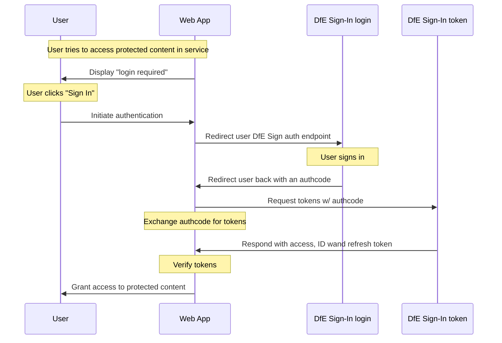

# Integration with DfE Sign In (DSI)

## The authorization flow (‘code’ response type)

## Setting up our service configuration in DSI

1. Receive manage access to DfE manage console.
2. Register our service as a ‘relying party’.
3. We then must provide (details of each below):
   - services home URL
   - post password-reset URL
   - client ID
   - redirect URL
   - logout direct URL
   - response type (‘code’ seems to suit our use case and is flow captured in diagram above)
   - refresh token
   - client secret
   - token endpoint authentication method
4. Once set up we can then use DSI’s API to interact with it: [DfE Public API](https://github.com/DFE-Digital/login.dfe.public-api) (details below)
5. Any edits to our services configuration can be done via the manage console.

### Home URL

The home URL is the home page of the service you want to configure. It is usually the service landing page from DfE Sign-in. For example: [Apply for Teacher Training](https://www.apply-for-teacher-training.service.gov.uk/provider)

### Post password-reset URL

The post password-reset URL is the page that you want to redirect users to after they have reset their password. It is usually the DfE Sign-in home page. For example: [DfE Sign-in](https://services.signin.education.gov.uk)

If you do not provide a post password-reset URL, the DfE Sign-in system will automatically use one of the redirect URLs provided.

### Client ID

The client ID is a unique identifier of the service you want to configure. It is created manually by the DfE Sign-in team and must be:
- Unique
- Letters only
- A minimum of 8 characters

The client ID should not be easy for third parties to guess as it can lead to phishing attacks. You cannot change this value when configuring a service. The value of the client ID must be passed as part of the authentication request.

### Redirect URL

The redirect URL is where you want to redirect users to after they have authenticated. DfE Sign-in will send the authentication response to this URL.

You can add multiple redirect URLs. For security reasons, it is important to add at least 1. URLs must be valid, trusted, and start with https. URLs must not include:
- Query string, for example, `https://myservice.com/auth/cb?user=xyz`
- Local host, for example, `https://localhost`
- Wildcards, for example, `https://*.myservice.com`

Users will only be redirected back to a URL if it exists in this whitelist. It is important to keep redirect URLs up to date and remove any URLs that are no longer relevant. You can remove a redirect URL on the ‘Edit service configuration’ page by clicking ‘Remove’ next to the URL field.

### Logout redirect URL

The logout redirect URL is the page that you want to redirect users to after they log out of the service. It is usually the service landing page from DfE Sign-in. For example, [Apply for Teacher Training](https://www.apply-for-teacher-training.service.gov.uk/provider)

You can add multiple redirect URLs. For security reasons, it is important to add at least 1. URLs must be valid, trusted, and start with https. URLs must not include:
- Query string, for example, `https://myservice.com/auth/cb?clientid=xyz`
- Local host, for example, `https://localhost`
- Wildcards, for example, `https://*.myservice.com`

Users will only be redirected back to a URL if it exists in this whitelist. If you do not provide a logout redirect URL, users will be redirected to the DfE Sign-in page.

### Response types

A response type is a value that determines the authentication flow. It is sent as part of an authentication request. We should go with ‘code’, which is the authorization flow visible in the above diagram.

### Refresh token

The `refresh_token` is a grant type. Grant types are the way that a service can get OAuth access tokens.

A `refresh_token` is used to exchange a refresh token for an access token when the access token has expired. This means you’ll be able to get a new access token without interaction with the user.

When configuring a service and the system has chosen either authorization flow or hybrid flow, you can choose to select `refresh_token`. This is optional.

### Client secret

The client secret is a value that acts as a password for the service. DfE manage console automatically creates the client secret when configuring a service. It:
- is usually 25 characters long
- can be changed

The client secret should be secure and not easy for third parJes to guess. It is a security pracJce to change the client secret regularly.
 
You can view or change the client secret on the ‘Edit service configuraJon’ page by clicking ‘Show’ or ‘Regenerate’ next to the client secret field.
The client secret is needed when your service authenJcates itself to the DfE Sign-in token endpoint. Therefore, it is only required when you have selected response type code which automatically choses authorizaJon flow as your flow.

### Token endpoint authentication method

A token endpoint is where applications make a request to get OAuth access tokens.

A token endpoint authentication method is the way your service authenticates to the DfE Sign-in token endpoint.

When configuring a service, there are 3 token endpoint authentication methods:

- client_secret_basic
- client_secret_post
- none

You must select 1 method that applies to your service when configuring a service.

### API

The DfE Sign-in public API is for external consumers to interact with DfE Sign-in. It is specific to DfE Sign-in, not OAuth.

For any requests on DfE manage console, you will need to provide a JSON Web Token. The token must be signed using the HS256 algorithm with your API secret

### API secret

The API secret is a value that acts as a password for accessing the DfE Sign-in public API.
DfE manage console automatically creates the API secret when configuring a service. It:

- is usually 25 characters long
- can be changed

The client secret should be secure and not easy for third parJes to guess.

You can view or change the API secret on the ‘Edit service configuraJon’ page by clicking ‘Show’ or ‘Regenerate’ next to the API secret field.

## DSI Configuration

Configuring DSI requires the following steps:

1. **Account Requirement:**
   - You need a DSI pre-production or production account.
   - Submit an access request to the Financial Benchmarking and Insights Tool management portal. Separate requests may be necessary for pre-production and production environments.

2. **Required Roles:**
   - Service Configuration
   - Service Access Management
   - Service Support
   - Service Banner

3. **Accessing the Manage Portal:**
   Once permissions are granted, you will find the DfE Sign-in Manage service in your DfE Sign-in my services portal. Alternatively, you can access the manage portals directly:
   - [Pre-production Manage Portal](https://pp-manage.signin.education.gov.uk/)
   - [Production Manage Portal](https://manage.signin.education.gov.uk/)

4. **Configuring the Service:**
   Use the Manage portal with the appropriate access to configure the service.

   - **Adding Redirect URLs:**
     You can add multiple redirect URLs if needed, as the pre-production account can link to multiple environments. Navigate to Configuration -> Redirect URL -> click "Add URL" to enter a new URL. Ensure the URL is entered correctly for it to function properly.

   - **Adding Logout Redirect URLs:**
     Similarly, multiple logout redirect URLs can be added. Navigate to Configuration -> Redirect URL -> click "Add URL" to enter a new URL. Ensure the URL is entered accurately for it to work correctly.

5. **Saving Changes:**
   Once configurations are complete, save the changes to finalise setup.

This process ensures your DSI configuration is correctly set up and ready for use.

