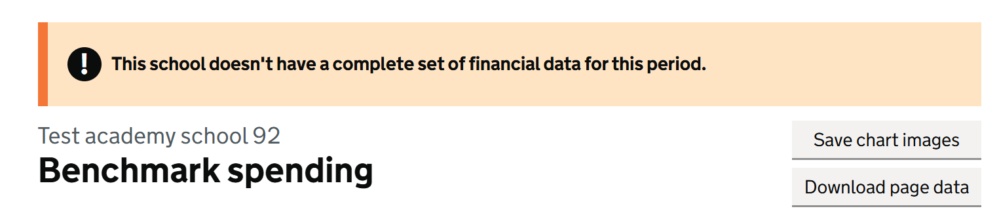
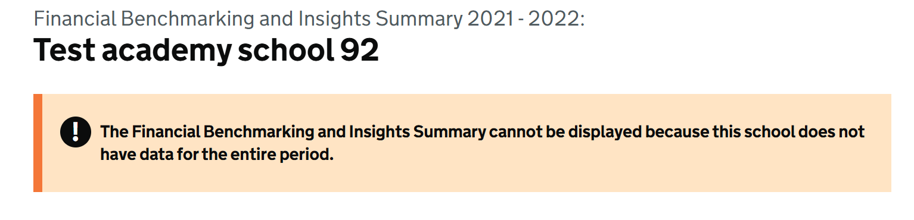
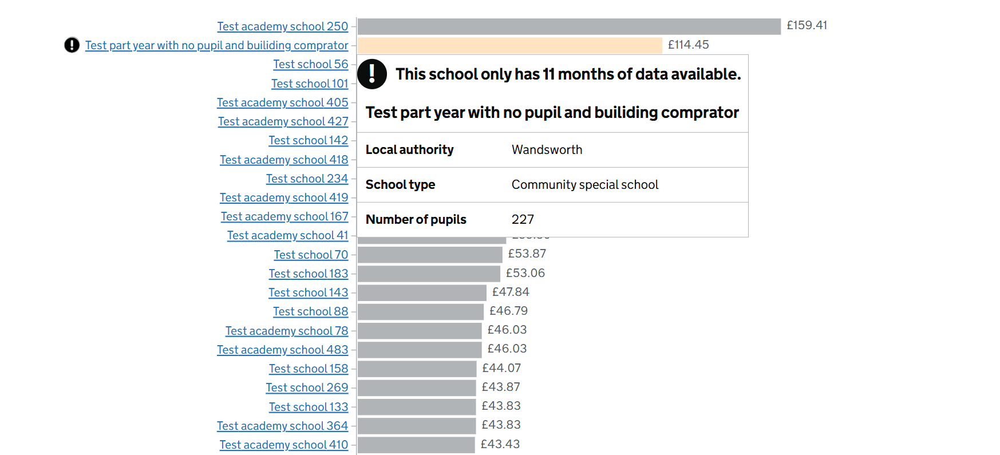

# Incomplete Data

## Introduction

This document provides detailed information for developers about the implementation and usage of the Incomplete Data feature within the system.

## Overview

The <b>Incomplete Data</b> feature provides a clear visual indicator when users are viewing financial data that may be incomplete. This ensures transparency and helps users make well-informed decisions based on the available information.

As part of financial submissions from schools, the field `Periods covered by return` indicates the number of months reported. An establishment reporting fewer than 12 months is considered to have <b>part-year</b> status.

For such schools, a warning banner is prominently displayed on relevant pages.





Additionally, when these schools appear within comparator sets in benchmarking charts, a warning icon is displayed alongside the corresponding y-axis label (i.e. school name). A tooltip provides further context to users:



### Primary Goal

The primary goal is to alert users when data is incomplete so they can interpret comparisons and insights with appropriate caution.

## Usage

`PeriodCoveredByReturn` is stored as a `SMALLINT` column in the `Financial` SQL table.

This value can be retrieved via an API call to [Insight](../../platform/src/apis/EducationBenchmarking.Platform.Api.Insight/) as shown below:

```ExpenditureSchoolResponse```

```json
{
  "urn": "string",
  "schoolName": "string",
  "schoolType": "string",
  "laName": "string",
  "periodCoveredByReturn": 0,
  "totalPupils": 0,
  "totalInternalFloorArea": 0,
  "totalExpenditure": 0,
  "totalTeachingSupportStaffCosts": 0,
  "teachingStaffCosts": 0,
  "supplyTeachingStaffCosts": 0,
  "educationalConsultancyCosts": 0,
  "educationSupportStaffCosts": 0,
  "agencySupplyTeachingStaffCosts": 0,
  "totalNonEducationalSupportStaffCosts": 0,
  "administrativeClericalStaffCosts": 0,
  "auditorsCosts": 0,
  "otherStaffCosts": 0,
  "professionalServicesNonCurriculumCosts": 0,
  "totalEducationalSuppliesCosts": 0,
  "examinationFeesCosts": 0,
  "learningResourcesNonIctCosts": 0,
  "learningResourcesIctCosts": 0,
  "totalPremisesStaffServiceCosts": 0,
  "cleaningCaretakingCosts": 0,
  "maintenancePremisesCosts": 0,
  "otherOccupationCosts": 0,
  "premisesStaffCosts": 0,
  "totalUtilitiesCosts": 0,
  "energyCosts": 0,
  "waterSewerageCosts": 0,
  "administrativeSuppliesNonEducationalCosts": 0,
  "totalGrossCateringCosts": 0,
  "totalNetCateringCosts": 0,
  "cateringStaffCosts": 0,
  "cateringSuppliesCosts": 0,
  "totalOtherCosts": 0,
  "directRevenueFinancingCosts": 0,
  "groundsMaintenanceCosts": 0,
  "indirectEmployeeExpenses": 0,
  "interestChargesLoanBank": 0,
  "otherInsurancePremiumsCosts": 0,
  "privateFinanceInitiativeCharges": 0,
  "rentRatesCosts": 0,
  "specialFacilitiesCosts": 0,
  "staffDevelopmentTrainingCosts": 0,
  "staffRelatedInsuranceCosts": 0,
  "supplyTeacherInsurableCosts": 0,
  "communityFocusedSchoolStaff": 0,
  "communityFocusedSchoolCosts": 0
}
```

`IncomeSchoolResponse`

```json
{
  "urn": "string",
  "schoolName": "string",
  "schoolType": "string",
  "laName": "string",
  "periodCoveredByReturn": 0,
  "totalIncome": 0,
  "totalGrantFunding": 0,
  "totalSelfGeneratedFunding": 0,
  "directRevenueFinancing": 0,
  "directGrants": 0,
  "prePost16Funding": 0,
  "otherDfeGrants": 0,
  "otherIncomeGrants": 0,
  "governmentSource": 0,
  "communityGrants": 0,
  "academies": 0,
  "incomeFacilitiesServices": 0,
  "incomeCatering": 0,
  "donationsVoluntaryFunds": 0,
  "receiptsSupplyTeacherInsuranceClaims": 0,
  "investmentIncome": 0,
  "otherSelfGeneratedIncome": 0
}
```

### Incomplete data warning banner

The value of `PeriodCoveredByReturn` is passed to the view model, where a shared partial view is responsible for rendering the banner.

- [SchoolExpenditure](../../web/src/Web.App/Domain/Insight/Expenditure.cs#L54)
- [Incomplete data partial](../../web/src/Web.App/Views/Shared/_IncompleteFinances.cshtml)

```C#
@if (Model is { PeriodCoveredByReturn: < 12 })
{
    @await Html.PartialAsync("_IncompleteFinances")
}
```

For an example in context, refer to the `SchoolComparison` feature.

- [Controller](../../web/src/Web.App/Controllers/SchoolComparisonController.cs)
- [View Model](../../web/src/Web.App/ViewModels/SchoolComparisonViewModel.cs)
- [View](../../web/src/Web.App/Views/SchoolComparison/Index.cshtml)

### Part-year warning Financial Benchmarking Insights Summary

Within the <b>Financial Benchmarking Insights Summary</b> feature, schools identified as having part-year status are also flagged. In such cases, users are shown a dedicated warning view.

This is implemented by returning a custom `ViewResult` accompanied by an HTTP status code `Status404NotFound`, to clearly indicate that a full insights summary is unavailable due to insufficient data.

The controller retrieves the `PeriodCoveredByReturn` value from the `SchoolBalance` object. If this value is not equal to 12, it determines whether the return is explicitly part-year (i.e. a valid value less than 12) or whether the data is missing (i.e. `null`). The controller then invokes the Unavailable method to display a view explaining that insights are not available due to incomplete data.

- [SchoolBalance](../../web/src/Web.App/Domain/Insight/Balance.cs#L13)
- [Controller](../../web/src/Web.App/Controllers/SchoolFinancialBenchmarkingInsightsSummaryController.cs)

### Part-year warning on charts

The same `PeriodCoveredByReturn` value is used within `front-end-components` to to identify schools with part-year submissions.

This affects both the y-axis label and tooltip content in benchmarking charts:

- [SchoolExpenditure](../../front-end-components/src/services/types.tsx)
- [Exclamation](../../front-end-components/src/components/charts/establishment-tick/component.tsx)
- [PartYearDataWarning](../../front-end-components/src/components/charts/part-year-data-warning/component.tsx)

When part-year data is detected, an exclamation mark is shown, and the tooltip provides further explanation of the time period covered.

\newpage
