# Find Organisation

## Introduction

This document provides detailed information for developers about the implementation, usage, and integration of the Find Organisation feature within the system.

## Overview

The Find Organisation feature serves as the starting point for a user's journey through the application. It enables users to locate a School, Trust, or Local Authority, which then becomes the context for all subsequent operations.


After selecting an organisation type and clicking 'Continue' users are directed to the corresponding search page.


As users begin typing, a debounced API call is triggered to fetch and display the top ten matching results in a dropdown list.


If a suggestion is selected and the 'Search' button is clicked, the user is taken to the relevant home page to continue their journey.

If 'Search' is clicked without entering any text, a validation error is shown with instructions to proceed.


If a search term is entered but no suggestion is selected, clicking 'Search' triggers an API call that returns results matching the entered term, sorted by relevance.

These results can be sorted alphabetically and filtered by 'Education Phase' using the 'Filter and sort' section. Clicking 'Apply' applies the filters; clicking 'Clear filters' resets them.


If JavaScript is disabled in the user's browser, suggestions will not appear while typing. However, users can still perform searches and view results as described above.

## Goals

### Primary Goal

Enable users to establish the organisational context that scopes all subsequent actions within the platform.

## Prerequisites/Dependencies

This feature has monorepo dependencies on:

- Web
- Establishment API

### External Dependencies

- Azure AI search
  - `school-index` index
  - `trust-index` index
  - `local-authority-index` index

## API Reference

### Suggester

```mermaid
flowchart TD
  accDescr: suggester API flow - happy path
  
  A([✏️ Enter search criteria]) --> B[GET\n /api/suggest?type=school&search=XXX ]
    B --> C[Proxy to Establishment API]
    C --> D["POST\n /api/schools/suggest{ 'searchText': 'XXX', 'size': 10, 'suggesterName': 'school-suggester' }"]
    D --> E["SchoolSearchService.SuggestAsync()"]
    E --> F["Azure AI Search\n(via Suggest API)"]
    F --> G["SchoolSummary[]"]
    G --> H([📃 Result selected])
    H --> I([✅ Form submitted])
    I --> J[Redirect to school page]
```



On the Web side, `GET /api/suggest` proxies to the Establishment API based on the `type` in the query string:

| Type| Method | URL| Body |
|-------|--------|----------------|-----------------------------------------|
| `school` | `POST` | `/api/schools/suggest` | `{ "searchText": 'XXX', "size": 10, "suggesterName": "school-suggester" }` |
| `trust` | `POST` | `/api/trusts/suggest` | `{ "searchText": 'XXX', "size": 10, "suggesterName": "trust-suggester" }` |
| `local-authority` | `POST` | `/api/trusts/suggest` | `{ "searchText": 'XXX', "size": 10, "suggesterName": "local-authorities-suggester" }` |

In the Establishment API, a `SearchService` for each of the above types executes `SearchClient.SuggestAsync<T>()` with a set of response field names relevant to each search type to return from the index, and search result highlight configuration.

| Type | Model |
|----------|-----------------------|
| `school` | [`SchoolSummary`](../../platform/src/apis/Platform.Api.Establishment/Features/Schools/Models/SchoolSummary.cs) |
| `trust` | [`TrustSummary`](../../platform/src/apis/Platform.Api.Establishment/Features/Trusts/Models/TrustSummary.cs) |
| `local-authority` | [`LocalAuthoritySummary`](../../platform/src/apis/Platform.Api.Establishment/Features/LocalAuthorities/Models/LocalAuthoritySummary.cs) |

The response payload from the above is in the following format, where `*` has been specified in the search highlight configuration:

```json
{
  "results": [
    {
      "text": "*Test* academy school 92",
      "document": {
        "urn": "777054",
        "schoolName": "Test academy school 92",
        "addressStreet": "address 281",
        "addressLocality": "Brixton",
        "addressLine3": "",
        "addressTown": "London",
        "addressCounty": "",
        "addressPostcode": "ABC403"
      }
    },
    ...
  ]
}
```

### Search


In the Establishment API, each type uses a corresponding `SearchService` to call `SearchClient.SearchAsync<T>()`, returning relevant fields from the index.

| Type | Model |
|----------|-----------------------|
| `school` | [`SchoolSummary`](../../platform/src/apis/Platform.Api.Establishment/Features/Schools/Models/SchoolSummary.cs) |
| `trust` | [`TrustSummary`](../../platform/src/apis/Platform.Api.Establishment/Features/Trusts/Models/TrustSummary.cs) |
| `local-authority` | [`LocalAuthoritySummary`](../../platform/src/apis/Platform.Api.Establishment/Features/LocalAuthorities/Models/LocalAuthoritySummary.cs) |

The response payload from the above is in the following format:

```json
{
  "totalResults": 763,
  "page": 1,
  "pageSize": 15,
  "pageCount": 51,
  "results": [
    {
      "urn": "777054",
      "schoolName": "Test academy school 92",
      "addressStreet": "address 281",
      "addressLocality": "Brixton",
      "addressLine3": "",
      "addressTown": "London",
      "addressCounty": "",
      "addressPostcode": "ABC403",
      "overallPhase": "Secondary",
      "periodCoveredByReturn": 3,
      "totalPupils": 216
    },
    ...
  ]
}
```

## Usage

Each page is orchestrated by its controller, view model, and Razor view:

| Feature               | Controller                                                                 | View Model                                                                 | View                                                                 |
|-----------------------|----------------------------------------------------------------------------|-----------------------------------------------------------------------------|----------------------------------------------------------------------|
| FindOrganisation      | [FindOrganisationController.cs](../../web/src/Web.App/Controllers/FindOrganisationController.cs)      | [FindOrganisationViewModel.cs](../../web/src/Web.App/ViewModels/FindOrganisationViewModel.cs)      | [Index.cshtml](../../web/src/Web.App/Views/FindOrganisation/Index.cshtml)      |
| SchoolSearch          | [SchoolSearchController.cs](../../web/src/Web.App/Controllers/SchoolSearchController.cs)              | [SchoolSearchViewModel.cs](../../web/src/Web.App/ViewModels/Search/SchoolSearchViewModel.cs)              | [Index.cshtml](../../web/src/Web.App/Views/SchoolSearch/Index.cshtml)          |
| TrustSearch           | [TrustSearchController.cs](../../web/src/Web.App/Controllers/TrustSearchController.cs)                | [TrustSearchViewModel.cs](../../web/src/Web.App/ViewModels/Search/TrustSearchViewModel.cs)                | [Index.cshtml](../../web/src/Web.App/Views/TrustSearch/Index.cshtml)           |
| LocalAuthoritySearch  | [LocalAuthoritySearchController.cs](../../web/src/Web.App/Controllers/LocalAuthoritySearchController.cs) | [LocalAuthoritySearchViewModel.cs](../../web/src/Web.App/ViewModels/Search/LocalAuthoritySearchViewModel.cs) | [Index.cshtml](../../web/src/Web.App/Views/LocalAuthoritySearch/Index.cshtml)  |

The suggester is implemented as a [progressive enhancement](./8_Progressive_Enhancements.md) to improve the experience when JavaScript is available.

- [Suggester Component](../../web/src/Web.App/AssetSrc/ts/components/suggester/Suggester.ts)

## Configuration

In Establishment API:

| Setting | Example value |
|---------------|----------------|
| `Search:Name` | `s198d01-ebis-search` |
| `Search:Key` | `api-key` |

## Deployment

AI Search deployment is managed via [Terraform](../../platform/terraform/search.tf) and the Platform build/release pipeline in Azure DevOps.

## Known Issues

Currently no known issues. This section is reserved for future updates.

<!-- Leave the rest of this page blank -->
\newpage
