# Find Organisation

## Introduction

This document provides detailed information for developers about the implementation, usage, and integration of the Find Organisation feature within the system.

## Overview

This feature acts as the entry point for the entire user journey within the application. It allows the School or Trust to be sought that works as the context for all subsequent operations.


As the user types, a debounced API call is performed that performs a search and displays the top ten matches in a drop-down list.


Once an item has been chosen and 'Continue' clicked, the School or Trust landing page is displayed and the user may continue on their journey.

If 'Continue' is pressed before either a School or Trust has been selected from the list then a validation error is displayed.

## Goals

### Primary Goal

This feature allows the user to select the context of their entire journey within the platform.

## Prerequisites/Dependencies

This feature has monorepo dependencies on:

- Web
- Establishment API
- Front-end components

### External Dependencies

- Azure AI search
  - `school-index` index
  - `trust-index` index
- Cosmos
  - `GIAS` collection

## API Reference

```mermaid
flowchart TD
  accTitle: Happy path
  
  A([✏️ Enter search criteria]) --> B[GET\n/api/suggest?type=school&search=XXX ]
    B --> C[Proxy to Establishment API]
    C --> D["POST\n/api/schools/suggest\n{ 'searchText': 'XXX', 'size': 10, 'suggesterName': 'school-suggester' }"]
    D --> E["SchoolSearchService.SuggestAsync()"]
    E --> F["Azure AI Search\n(via Suggest API)"]
    F --> G["SchoolResponseModel[]"]
    G --> H([📃 Result selected])
    H --> I([✅ Form submitted])
    I --> J[Redirect to school page]
```



On the Web side, `GET /api/suggest` proxies to the Establishment API based on the `type` in the query string:

| Type| Method | URL| Body |
|-------|--------|----------------|-----------------------------------------|
| `school` | `POST` | `/api/schools/suggest` | `{ "searchText": 'XXX', "size": 10, "suggesterName": "school-suggester" }` |
| `trust` | `POST` | `/api/trusts/suggest` | `{ "searchText": 'XXX', "size": 10, "suggesterName": "trust-suggester" }` |

In the Establishment API, a `SearchService` for each of the above types executes `SearchClient.SuggestAsync<T>()` with a set of response field names relevant to each search type to return from the index, and search result highlight configuration.

| Type | Model | Fields |
|----------|-----------------------|------------|
| `school` | `SchoolResponseModel` | `Urn`, `Name`, `Town`, `Postcode` |
| `trust` | `TrustResponseModel` | `CompanyNumber`, `Name` |

The response payload from the above is in the following format, where `*` has been specified in the search highlight configuration:

```json
[
  {
    "text": "*Gorse* Ride Infants' School (Wokingham, RG40 4EH)",
    "document": {
      "urn": "109924",
      "name": "Gorse Ride Infants' School",
      "town": "Wokingham",
      "postcode": "RG40 4EH",
      "hasSixthForm": false,
      "isPrimary": false,
      "isPartOfTrust": false
    }
  },
  ...
]
```

## Usage

Consumption of the feature is managed via the [`<FindOrganisation />` view](/front-end-components/src/views/find-organisation/view.tsx) in Front-end components, which is rendered to the browser as a pure client side component via the [`FindOrganisationController`](/web/src/Web.App/Controllers/FindOrganisationController.cs) and associated View.

The `<SchoolInput />` and `<TrustInput />` components manage the input field state, key press events and API `fetch` effects. Search results are bound to a list, and when an item is clicked upon, or navigated to with arrow keys and enter pressed, the selected item identifier is set in a hidden `<input />` field. The `<form />` is submitted on the Continue `<button />` press, which `POST`s back to the Controller for model validation and, if all is well, redirection to the appropriate establishment home page.

### Accessible Autocomplete

The [alphagov/accessible-autocomplete](https://github.com/alphagov/accessible-autocomplete) package was chosen for use here due to its (partial) support by the GDS team and the high level of accessibility support. It is also distributed with React integration, has (third party) typings available, and has a high number of downloads/dependents/forks/stars compared. Alternatives were to maintain a custom component to manage the accessibility needs, or other GDS branded options such as `Autocomplete` from [@x-govuk/govuk-prototype-components](https://x-govuk.github.io/govuk-prototype-components/autocomplete/), which is used in the Prototype kit.

## Configuration

In Establishment API:

| Setting | Example value |
|---------------|----------------|
| `Search:Name` | `s198d01-ebis-search` |
| `Search:Key` | `api-key` |

## Deployment

AI Search deployment is managed via [Terraform](../../platform/terraform/search.tf) and the Platform build/release pipeline in Azure DevOps.

## Known Issues

### School does not appear in the top ten results

There is no option to 'view more results' if the given search term returns more than ten results. This is detrimental to the user experience compared to the capabilities within SFB.

### School name, URN or address not known, but other criteria is known

There is no option to search or filter by additional criteria beyond name, URN and address. This is detrimental to the user experience compared to the capabilities within SFB.

### User does not have JavaScript enabled in their browser

If the user does not have JavaScript enabled in their web browser they will see an empty page. There is no progressive enhancement, but this is not unique to this feature, rather all client script across the whole platform.


This is also a problem in SFB and VMFI, but first occurs later on in the user journey.
