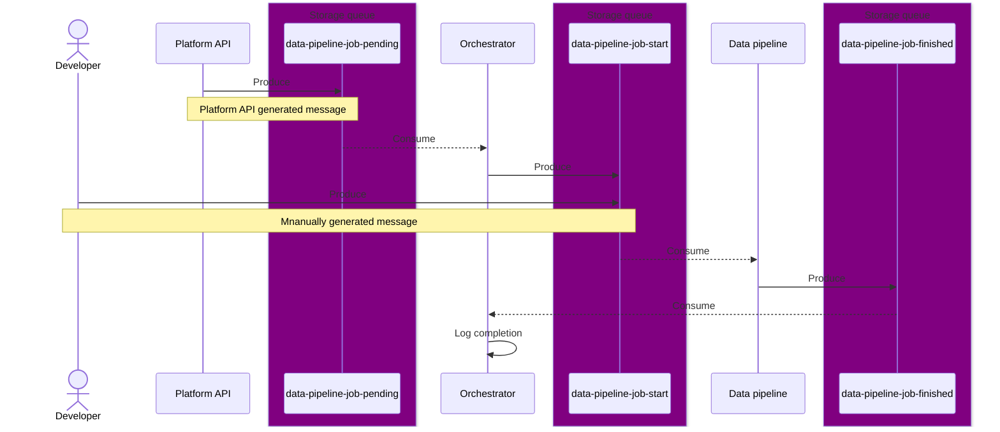

# Developer Feature Documentation: [Feature Name]

## Introduction
This document provides detailed information for developers about the implementation, usage, and integration of the [Feature Name] feature within the system.

## Overview
[Provide a brief overview of the feature, including its purpose, functionality, and significance within the system.]

## Usage
[Explain how developers can use the feature, including any APIs, libraries, or components that they need to interact with.]

[Identify the key components or modules that comprise the feature and describe their responsibilities.]

## Configuration
[Document any configuration settings or parameters that developers can customize to tailor the behavior of the feature.]

## Known Issues
[List any known issues or limitations of the feature, along with any workarounds or plans for resolution.]****
