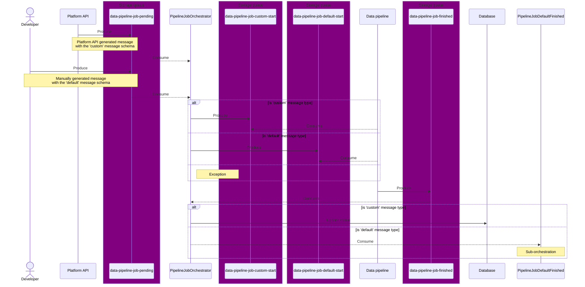
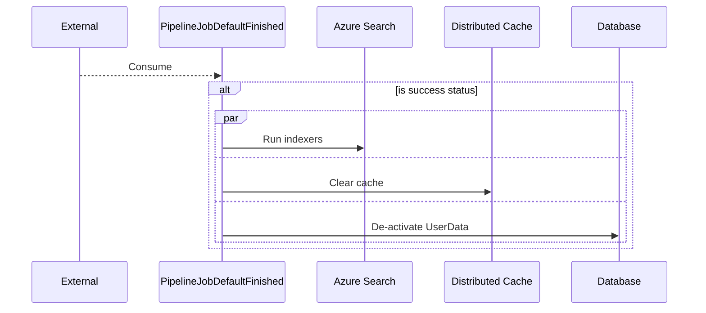

# Developer Feature Documentation: Pipeline Orchestrator

## Introduction

This document provides detailed information for developers about the implementation, usage and integration of the Pipeline Orchestrator feature within the system.

## Overview

//TODO

## Orchestrations

### PipelineJobOrchestrator

### PipelineJobDefaultFinished

## Configuration

//TODO

## Known Issues

//TODO

<!-- Leave the rest of this page blank -->
\newpage
