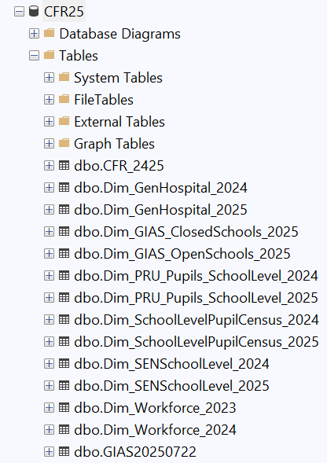
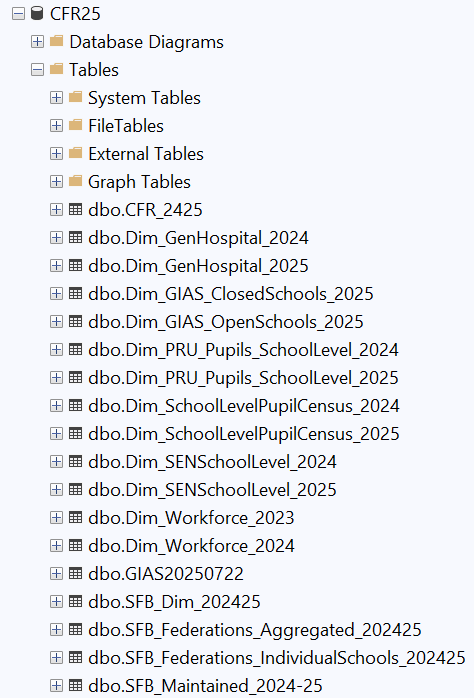

# CFR File Generation

## Run SQL Queries

1. Meticulously edit all five (5) sql scripts copied over from last academic reporting year's folder as mentioned under Prerequisite subsection in this documentation [Overview](documentation\financial-data-drop\cfr\1_Overview .md) page. Edits must reflect

    - All table reference in the SQL scripts must be in accordance to the current reporting academic year, for instance `[CFR25].[dbo].[Dim_GIAS_ClosedSchools_2025]` be edited to `[CFR26].[dbo].[Dim_GIAS_ClosedSchools_2026]` when generating 2025-2026 CFR downstream dataset.
    - All slowly changing dimension tables reference must be in accordance to the previous reporting academic year, for instance `[dbo].[Dim_Workforce_2024]` be edited to `[dbo].[Dim_Workforce_2024]` when generating 2025-2026 CFR downstream dataset.

2. Confirm a total of fourteen (14) tables in `CFR_yy` local database. The below image corresponds to Fact and Dimension tables used for the CFR downstream dataset generation for  2024-2025 reporting academic year

    

3. Run `My_Step1.sql` to output both [dbo].[SFB_Federations_Aggregated_20YYyy] and [dbo].[SFB_Federations_IndividualSchools_20YYyy] tables.

4. Run `My_Step2.sql` to output [dbo].[SFB_Dim_20YYyy] table

5. Run `My_Step3.sql` to output [dbo].[SFB_Maintained_20YY-yy] table

    The below image corresponds to all tables relating to the CFR downstream dataset generation for 2024-2025 reporting academic year

    

6. Run `My_Step4.sql` and save the result of the query as `maintained_schools_master_list.csv`

7. Run `My_Step4.sql` and save the result of the query as `maintained_schools_transparency.csv`

## Save CFR Downstream Dataset

1. Upload `maintained_schools_master_list.csv` to dev environment Azure blob storage [default folder](https://educationgovuk.sharepoint.com/:w:/r/sites/DfEFinancialBenchmarking/Shared%20Documents/Runbooks/DfE%20Benchmarking%20Service%20Azure%20Directory.docx?d=w6bf9bad25b9c4ea8b5e9b35cee3f664a&csf=1&web=1&e=vtehLJ) that corresponds to the end of the reporting academic year. For instance, `2025` when working on generating 2024-2025 CFR downstream dataset

2. Backup local database and save remotely

3. Upload `maintained_schools_transparency.csv` to [Sharepoint Location](https://educationgovuk.sharepoint.com/sites/DfEFinancialBenchmarking/Shared%20Documents/Forms/AllItems.aspx?id=%2Fsites%2FDfEFinancialBenchmarking%2FShared%20Documents%2FFBIT%20Source%20Data%2FTransparency%20files&viewid=7afed90f%2D9f2f%2D431a%2D93ce%2D48075c0e93d8)

<!-- Leave the rest of this page blank -->
\newpage
