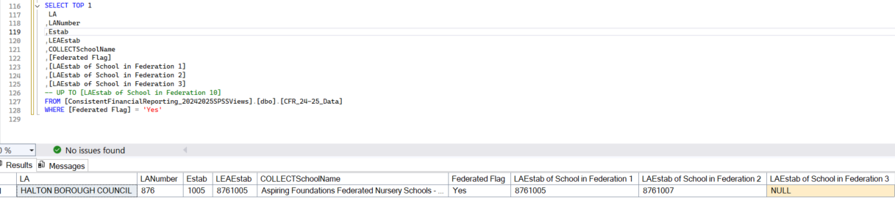

# Data Sourcing and Validation for Consistent Financial Reporting (CFR) Data

This documentation details the necessary steps to process the Consistent Financial Reporting (CFR) data extract. The core of this process involves rigorous data validation and cleansing to ensure the accuracy and integrity of the final output.

## CFR Quality Assurance Check

The main checks on CFR data relate to the fields for federated schools. A federation of schools is a structure where two or more maintained schools join under a single governing body, while retaining their individual identities. Section 24 of the Education Act 2002 allows for a local authority (LA) to allocate a single budget share to a governing body where there are two or more schools federated.

Federated schools receiving a single budget share should report collectively in their CFR return. There should therefore be only one CFR return made for federated schools. The “lead school” in the federation should make the return while including the LA Establishment (`LAEstab`) numbers of other schools within its federation. There should be no individual return from schools within a federation other than the lead school. In practice however, some schools submit returns both through a federation and on their own, resulting in duplicate submissions which need to be resolved as part of preprocessing.



The image above shows an example of a federated school with the lead school alone actioning the financial return. There is validation in the data collection to identify federation reporting issues but it is possible that some errors remain. The mis-recording of federated schools can cause issues such as duplication and incorrect totals.

### CFR Data Source

Server Name = [iSore SQL Server](https://educationgovuk.sharepoint.com/:w:/r/sites/DfEFinancialBenchmarking/_layouts/15/Doc.aspx?sourcedoc=%7BA47507F6-2C23-487A-98EC-0B6C75A7471A%7D&file=CFR%20source%20data%20access%20request.docx&action=default&mobileredirect=true)

Database Name = `ConsistentFinancialReporting_20YY20YYSPSSViews` where 20YY20YY represents the reporting academic year, for instance, `ConsistentFinancialReporting_20242025SPSSViews` for `2024-2025` academic year.

View Name = `CFR_yy-yy_Data` where yy-yy represent reporting academic year, for instance `CFR_24-25_Data` for `2024-2025` academic year.

### The following instructions describe CFR QA checks

1. Connect to the CFR data source listed above as well as the newly created local database as mentioned under Prerequisite subsection in this documentation [Overview](../cfr/1_Overview%20.md) page.

2. Using a database GUI Tool, ingest all `CFR_yy-yy_Data` records from CFR data source within iStore SQL Server into a destination table to be named `CFR_yyyy` within the newly created local database, where yyyy represents the reporting academic year. For instance `CFR_2425` for 2024-2025 reporting year

    - Exclude Personally Identifiable Information (PII) fields when exporting `CFR_yy-yy_Data` records from CFR data source to new destination table. The specific PII fields to be excluded are `Contact`, `Email` and `Phone`.

3. Run the below SQL query to validate non-federated schools financial return. The absence of record / no result suggest that there is no incorrect non-federated school entry in CFR data collection. Edit both local database and table names to reflect the reporting academic year.

    ```sql
    SELECT *
    FROM  [CFR25].[dbo].[CFR_2425]
    WHERE ([Federated Flag] IS NULL OR [Federated Flag] = 'No')
    AND   ([LAEstab of School in Federation 1] IS NOT NULL
        OR [LAEstab of School in Federation 2] IS NOT NULL
        OR [LAEstab of School in Federation 3] IS NOT NULL
        OR [LAEstab of School in Federation 4] IS NOT NULL
        OR [LAEstab of School in Federation 5] IS NOT NULL
        OR [LAEstab of School in Federation 6] IS NOT NULL
        OR [LAEstab of School in Federation 7] IS NOT NULL
        OR [LAEstab of School in Federation 8] IS NOT NULL
        OR [LAEstab of School in Federation 9] IS NOT NULL
        OR [LAEstab of School in Federation 10] IS NOT NULL)
    ```

4. Run the below SQL query to validate that only the “lead school” within a federation have CFR return. The absence of record / no result suggest that there is no incorrect federated school entry in CFR data collection. Edit both local database and table names to reflect the reporting academic year.

    ```sql
    SELECT b.*
    FROM (
        SELECT [LAEstab of School in Federation 1] AS LAEstab1_to_10 FROM [CFR25].[dbo].[CFR_2425]
        UNION
        SELECT [LAEstab of School in Federation 2] FROM [CFR25].[dbo].[CFR_2425]
        UNION
        SELECT [LAEstab of School in Federation 3] FROM [CFR25].[dbo].[CFR_2425]
        UNION
        SELECT [LAEstab of School in Federation 4] FROM [CFR25].[dbo].[CFR_2425]
        UNION
        SELECT [LAEstab of School in Federation 5] FROM [CFR25].[dbo].[CFR_2425]
        UNION
        SELECT [LAEstab of School in Federation 6] FROM [CFR25].[dbo].[CFR_2425]
        UNION
        SELECT [LAEstab of School in Federation 7] FROM [CFR25].[dbo].[CFR_2425]
        UNION
        SELECT [LAEstab of School in Federation 8] FROM [CFR25].[dbo].[CFR_2425]
        UNION
        SELECT [LAEstab of School in Federation 9] FROM [CFR25].[dbo].[CFR_2425]
        UNION
        SELECT [LAEstab of School in Federation 10] FROM [CFR25].[dbo].[CFR_2425]) a
    LEFT JOIN (
        SELECT * FROM [CFR25].[dbo].[CFR_2425])b
    ON a.LAEstab1_to_10 = b.LEAEstab
    WHERE b.LEAEstab IS NOT NULL
    ```

5. Run the below SQL query to validate that all schools where the Federated Flag is “yes” (lead school) have at least one school listed in “LAEstab of School in Federation 1” to 10 (non-lead schools). The absence of record / no result suggest that there is no incorrect federated school entry in CFR data collection. Edit both local database and table names to reflect the reporting academic year.

    ```sql
    SELECT *
    FROM  [CFR25].[dbo].[CFR_2425]
    WHERE [Federated Flag] = 'Yes'
    AND   [LAEstab of School in Federation 1] IS NULL
    AND   [LAEstab of School in Federation 2] IS NULL
    AND   [LAEstab of School in Federation 3] IS NULL
    AND   [LAEstab of School in Federation 4] IS NULL
    AND   [LAEstab of School in Federation 5] IS NULL
    AND   [LAEstab of School in Federation 6] IS NULL
    AND   [LAEstab of School in Federation 7] IS NULL
    AND   [LAEstab of School in Federation 8] IS NULL
    AND   [LAEstab of School in Federation 9] IS NULL
    AND   [LAEstab of School in Federation 10] IS NULL
    ```

6. Run the below SQL query to confirm NULLs in the data. `NULL` values can throw out the total calculations, all NULL return should be replaced with zero in the creation of the final dataset. Edit both local database and table names to reflect the reporting academic year.

    ```sql
    SELECT * FROM [CFR25].[dbo].[CFR_2425]
    WHERE [OB01] IS NULL OR [OB02] IS NULL OR [OB03] IS NULL OR [I01] IS NULL OR [I02] IS NULL
    OR [I03] IS NULL OR [I04] IS NULL OR [I05] IS NULL OR [I06] IS NULL OR [I07] IS NULL
    OR [I08a] IS NULL OR [I08b] IS NULL OR [I09] IS NULL OR [I10] IS NULL OR [I11] IS NULL
    OR [I12] IS NULL OR [I13] IS NULL OR [I15] IS NULL OR [I16] IS NULL OR [I17] IS NULL
    OR [I18c] IS NULL OR [I18d] IS NULL OR [E01] IS NULL OR [E02] IS NULL OR [E03] IS NULL
    OR [E04] IS NULL OR [E05] IS NULL OR [E06] IS NULL OR [E07] IS NULL OR [E08] IS NULL
    OR [E09] IS NULL OR [E10] IS NULL OR [E11] IS NULL OR [E12] IS NULL OR [E13] IS NULL
    OR [E14] IS NULL OR [E15] IS NULL OR [E16] IS NULL OR [E17] IS NULL OR [E18] IS NULL
    OR [E19] IS NULL OR [E20A] IS NULL OR [E20B] IS NULL OR [E20C] IS NULL OR [E20D] IS NULL
    OR [E20E] IS NULL OR [E20F] IS NULL OR [E20G] IS NULL OR [E21] IS NULL OR [E22] IS NULL
    OR [E23] IS NULL OR [E24] IS NULL OR [E25] IS NULL OR [E26] IS NULL OR [E27] IS NULL
    OR [E28a] IS NULL OR [E28b] IS NULL OR [E29] IS NULL OR [E30] IS NULL OR [E31] IS NULL
    OR [E32] IS NULL OR [CI01] IS NULL OR [CI03] IS NULL OR [CI04] IS NULL OR [DeMinimis] IS NULL
    OR [CE01] IS NULL OR [CE02] IS NULL OR [CE03] IS NULL OR [CE04A] IS NULL OR [CE04B] IS NULL
    OR [CE04C]IS NULL OR [CE04D] IS NULL OR [CE04E] IS NULL OR [B01] IS NULL OR [B02] IS NULL
    OR [B03] IS NULL OR [B05] IS NULL OR [B06] IS NULL OR [B07] IS NULL
    ```

### Handling CFR data errors

1. Run the below SQL query to replace all `NULL` values with zero (0) in the specified fields. Edit both local database and table names to reflect the reporting academic year.

    ```sql
    UPDATE [CFR25].[dbo].[CFR_2425] SET [OB01]=0 WHERE [OB01] IS NULL
    UPDATE [CFR25].[dbo].[CFR_2425] SET [OB02]=0 WHERE [OB02] IS NULL
    UPDATE [CFR25].[dbo].[CFR_2425] SET [OB03]=0 WHERE [OB03] IS NULL
    UPDATE [CFR25].[dbo].[CFR_2425] SET [I01]=0 WHERE [I01] IS NULL
    UPDATE [CFR25].[dbo].[CFR_2425] SET [I02]=0 WHERE [I02] IS NULL
    UPDATE [CFR25].[dbo].[CFR_2425] SET [I03]=0 WHERE [I03] IS NULL
    UPDATE [CFR25].[dbo].[CFR_2425] SET [I04]=0 WHERE [I04] IS NULL
    UPDATE [CFR25].[dbo].[CFR_2425] SET [I05]=0 WHERE [I05] IS NULL
    UPDATE [CFR25].[dbo].[CFR_2425] SET [I06]=0 WHERE [I06] IS NULL
    UPDATE [CFR25].[dbo].[CFR_2425] SET [I07]=0 WHERE [I07] IS NULL
    UPDATE [CFR25].[dbo].[CFR_2425] SET [I08a]=0 WHERE [I08a] IS NULL
    UPDATE [CFR25].[dbo].[CFR_2425] SET [I08b]=0 WHERE [I08b] IS NULL
    UPDATE [CFR25].[dbo].[CFR_2425] SET [I09]=0 WHERE [I09] IS NULL
    UPDATE [CFR25].[dbo].[CFR_2425] SET [I10]=0 WHERE [I10] IS NULL
    UPDATE [CFR25].[dbo].[CFR_2425] SET [I11]=0 WHERE [I11] IS NULL
    UPDATE [CFR25].[dbo].[CFR_2425] SET [I12]=0 WHERE [I12] IS NULL
    UPDATE [CFR25].[dbo].[CFR_2425] SET [I13]=0 WHERE [I13] IS NULL
    UPDATE [CFR25].[dbo].[CFR_2425] SET [I15]=0 WHERE [I15] IS NULL
    UPDATE [CFR25].[dbo].[CFR_2425] SET [I16]=0 WHERE [I16] IS NULL
    UPDATE [CFR25].[dbo].[CFR_2425] SET [I17]=0 WHERE [I17] IS NULL
    UPDATE [CFR25].[dbo].[CFR_2425] SET [I18c]=0 WHERE [I18c] IS NULL
    UPDATE [CFR25].[dbo].[CFR_2425] SET [I18d]=0 WHERE [I18d] IS NULL
    UPDATE [CFR25].[dbo].[CFR_2425] SET [E01]=0 WHERE [E01] IS NULL
    UPDATE [CFR25].[dbo].[CFR_2425] SET [E02]=0 WHERE [E02] IS NULL
    UPDATE [CFR25].[dbo].[CFR_2425] SET [E03]=0 WHERE [E03] IS NULL
    UPDATE [CFR25].[dbo].[CFR_2425] SET [E04]=0 WHERE [E04] IS NULL
    UPDATE [CFR25].[dbo].[CFR_2425] SET [E05]=0 WHERE [E05] IS NULL
    UPDATE [CFR25].[dbo].[CFR_2425] SET [E06]=0 WHERE [E06] IS NULL
    UPDATE [CFR25].[dbo].[CFR_2425] SET [E07]=0 WHERE [E07] IS NULL
    UPDATE [CFR25].[dbo].[CFR_2425] SET [E08]=0 WHERE [E08] IS NULL
    UPDATE [CFR25].[dbo].[CFR_2425] SET [E09]=0 WHERE [E09] IS NULL
    UPDATE [CFR25].[dbo].[CFR_2425] SET [E10]=0 WHERE [E10] IS NULL
    UPDATE [CFR25].[dbo].[CFR_2425] SET [E11]=0 WHERE [E11] IS NULL
    UPDATE [CFR25].[dbo].[CFR_2425] SET [E12]=0 WHERE [E12] IS NULL
    UPDATE [CFR25].[dbo].[CFR_2425] SET [E13]=0 WHERE [E13] IS NULL
    UPDATE [CFR25].[dbo].[CFR_2425] SET [E14]=0 WHERE [E14] IS NULL
    UPDATE [CFR25].[dbo].[CFR_2425] SET [E15]=0 WHERE [E15] IS NULL
    UPDATE [CFR25].[dbo].[CFR_2425] SET [E16]=0 WHERE [E16] IS NULL
    UPDATE [CFR25].[dbo].[CFR_2425] SET [E17]=0 WHERE [E17] IS NULL
    UPDATE [CFR25].[dbo].[CFR_2425] SET [E18]=0 WHERE [E18] IS NULL
    UPDATE [CFR25].[dbo].[CFR_2425] SET [E19]=0 WHERE [E19] IS NULL
    UPDATE [CFR25].[dbo].[CFR_2425] SET [E20A]=0 WHERE [E20A] IS NULL
    UPDATE [CFR25].[dbo].[CFR_2425] SET [E20B]=0 WHERE [E20B] IS NULL
    UPDATE [CFR25].[dbo].[CFR_2425] SET [E20C]=0 WHERE [E20C] IS NULL
    UPDATE [CFR25].[dbo].[CFR_2425] SET [E20D]=0 WHERE [E20D] IS NULL
    UPDATE [CFR25].[dbo].[CFR_2425] SET [E20E]=0 WHERE [E20E] IS NULL
    UPDATE [CFR25].[dbo].[CFR_2425] SET [E20F]=0 WHERE [E20F] IS NULL
    UPDATE [CFR25].[dbo].[CFR_2425] SET [E20G]=0 WHERE [E20G] IS NULL
    UPDATE [CFR25].[dbo].[CFR_2425] SET [E21]=0 WHERE [E21] IS NULL
    UPDATE [CFR25].[dbo].[CFR_2425] SET [E22]=0 WHERE [E22] IS NULL
    UPDATE [CFR25].[dbo].[CFR_2425] SET [E23]=0 WHERE [E23] IS NULL
    UPDATE [CFR25].[dbo].[CFR_2425] SET [E24]=0 WHERE [E24] IS NULL
    UPDATE [CFR25].[dbo].[CFR_2425] SET [E25]=0 WHERE [E25] IS NULL
    UPDATE [CFR25].[dbo].[CFR_2425] SET [E26]=0 WHERE [E26] IS NULL
    UPDATE [CFR25].[dbo].[CFR_2425] SET [E27]=0 WHERE [E27] IS NULL
    UPDATE [CFR25].[dbo].[CFR_2425] SET [E28a]=0 WHERE [E28a] IS NULL
    UPDATE [CFR25].[dbo].[CFR_2425] SET [E28b]=0 WHERE [E28b] IS NULL
    UPDATE [CFR25].[dbo].[CFR_2425] SET [E29]=0 WHERE [E29] IS NULL
    UPDATE [CFR25].[dbo].[CFR_2425] SET [E30]=0 WHERE [E30] IS NULL
    UPDATE [CFR25].[dbo].[CFR_2425] SET [E31]=0 WHERE [E31] IS NULL
    UPDATE [CFR25].[dbo].[CFR_2425] SET [E32]=0 WHERE [E32] IS NULL
    UPDATE [CFR25].[dbo].[CFR_2425] SET [CI01]=0 WHERE [CI01] IS NULL
    UPDATE [CFR25].[dbo].[CFR_2425] SET [CI03]=0 WHERE [CI03] IS NULL
    UPDATE [CFR25].[dbo].[CFR_2425] SET [CI04]=0 WHERE [CI04] IS NULL
    UPDATE [CFR25].[dbo].[CFR_2425] SET [DeMinimis]=0 WHERE [DeMinimis] IS NULL
    UPDATE [CFR25].[dbo].[CFR_2425] SET [CE01]=0 WHERE [CE01] IS NULL
    UPDATE [CFR25].[dbo].[CFR_2425] SET [CE02]=0 WHERE [CE02] IS NULL
    UPDATE [CFR25].[dbo].[CFR_2425] SET [CE03]=0 WHERE [CE03] IS NULL
    UPDATE [CFR25].[dbo].[CFR_2425] SET [CE04A]=0 WHERE [CE04A] IS NULL
    UPDATE [CFR25].[dbo].[CFR_2425] SET [CE04B]=0 WHERE [CE04B] IS NULL
    UPDATE [CFR25].[dbo].[CFR_2425] SET [CE04C]=0 WHERE [CE04C] IS NULL
    UPDATE [CFR25].[dbo].[CFR_2425] SET [CE04D]=0 WHERE [CE04D] IS NULL
    UPDATE [CFR25].[dbo].[CFR_2425] SET [CE04E]=0 WHERE [CE04E] IS NULL
    UPDATE [CFR25].[dbo].[CFR_2425] SET [B01]=0 WHERE [B01] IS NULL
    UPDATE [CFR25].[dbo].[CFR_2425] SET [B02]=0 WHERE [B02] IS NULL
    UPDATE [CFR25].[dbo].[CFR_2425] SET [B03]=0 WHERE [B03] IS NULL
    UPDATE [CFR25].[dbo].[CFR_2425] SET [B05]=0 WHERE [B05] IS NULL
    UPDATE [CFR25].[dbo].[CFR_2425] SET [B06]=0 WHERE [B06] IS NULL
    UPDATE [CFR25].[dbo].[CFR_2425] SET [B07]=0 WHERE [B07] IS NULL
    ```

2. Upon identifying any issues during steps 3, 4, or 5 of the CFR QA checks, an Excel report must be generated. This report will detail the affected schools, including the values for the LEAEstab, Federated Flag, and LAEstab of School in Federation fields. The document should then be communicated to the relevant stakeholders (product owners).

3. Excel report be named `Federation Funnies` and uploaded to the newly created `yy-yy` folder within [CFR Data Procurement Process Sharepoint location](https://educationgovuk.sharepoint.com/sites/DfEFinancialBenchmarking/Shared%20Documents/Forms/AllItems.aspx?id=%2Fsites%2FDfEFinancialBenchmarking%2FShared%20Documents%2FCFR%20Data%20Procurement%20Process&viewid=7afed90f%2D9f2f%2D431a%2D93ce%2D48075c0e93d8&csf=1&web=1&e=boXhxD&CID=0fb7a62d%2De68f%2D4f86%2Dac15%2D27e9c4f7b4a6&FolderCTID=0x012000B007B75DE8F91C4B82D20FE8B354FCBD) as mentioned under Prerequisite subsection in this documentation [Overview](../cfr/1_Overview%20.md) page. See sample for 2024-2025 academic year [here](https://educationgovuk.sharepoint.com/:x:/r/sites/DfEFinancialBenchmarking/Shared%20Documents/CFR%20Data%20Procurement%20Process/24-25/Federation%20Funnies%20-%20250730.xlsx?d=w77a953618eef4ce5a6c6cdc37e6fc14e&csf=1&web=1&e=cXUQtM)

    > **Note**
    >
    > Our established process has been to manually correct school data submission errors, as this is more efficient than reopening the portal for resubmission. Following these corrections, product owner would make arrangements to notify the affected schools' Local Authorities with instructions on how to report their financial records correctly in the future.

4. Manually correct school data submission errors (records included in the Federation Funnies report) by making any amendments to the CFR data having consulted with product owner and sought further information from the schools and LAs. This step may not be necessary - it depends on your preliminary CFR data checks. Manual correction may include updating `CFR_yyyy` table within local database based on specific conditions, for instance,

    ```sql
    UPDATE [CFR2y].[dbo].[CFR_2y2y]
    SET [Federated Flag] = 'No' 
    WHERE [LEAEstab] IN (8761005, 8761007);
    ```

### CFR Fields Data Type

| Column Name                       | Data type |
|-----------------------------------|-----------|
|ReturnStatus                       |nvarchar   |
|HighErrors                         |float      |
|LowErrors                          |float      |
|OKErrors                           |float      |
|DataVersion                        |nvarchar   |
|LA                                 |nvarchar   |
|LANumber                           |float      |
|Estab                              |float      |
|LEAEstab                           |float      |
|COLLECTSchoolName                  |nvarchar   |
|XMLSchoolName                      |nvarchar   |
|FinYear                            |float      |
|OB01                               |float      |
|OB02                               |float      |
|OB03                               |float      |
|I01                                |float      |
|I02                                |float      |
|I03                                |float      |
|I04                                |float      |
|I05                                |float      |
|I06                                |float      |
|I07                                |float      |
|I08a                               |float      |
|I08b                               |float      |
|I09                                |float      |
|I10                                |float      |
|I11                                |float      |
|I12                                |float      |
|I13                                |float      |
|I15                                |float      |
|I16                                |float      |
|I17                                |float      |
|I18c                               |float      |
|I18d                               |float      |
|E01                                |float      |
|E02                                |float      |
|E03                                |float      |
|E04                                |float      |
|E05                                |float      |
|E06                                |float      |
|E07                                |float      |
|E08                                |float      |
|E09                                |float      |
|E10                                |float      |
|E11                                |float      |
|E12                                |float      |
|E13                                |float      |
|E14                                |float      |
|E15                                |float      |
|E16                                |float      |
|E17                                |float      |
|E18                                |float      |
|E19                                |float      |
|E20A                               |float      |
|E20B                               |float      |
|E20C                               |float      |
|E20D                               |float      |
|E20E                               |float      |
|E20F                               |float      |
|E20G                               |float      |
|E21                                |float      |
|E22                                |float      |
|E23                                |float      |
|E24                                |float      |
|E25                                |float      |
|E26                                |float      |
|E27                                |float      |
|E28a                               |float      |
|E28b                               |float      |
|E29                                |float      |
|E30                                |float      |
|E31                                |float      |
|E32                                |float      |
|CI01                               |float      |
|CI03                               |float      |
|CI04                               |float      |
|DeMinimis                          |float      |
|CE01                               |float      |
|CE02                               |float      |
|CE03                               |float      |
|CE04A                              |float      |
|CE04B                              |float      |
|CE04C                              |float      |
|CE04D                              |float      |
|CE04E                              |float      |
|B01                                |float      |
|B02                                |float      |
|B03                                |float      |
|B05                                |float      |
|B06                                |float      |
|B07                                |float      |
|Federated Flag                     |nvarchar   |
|LAEstab of School in Federation 1  |nvarchar   |
|LAEstab of School in Federation 2  |nvarchar   |
|LAEstab of School in Federation 3  |nvarchar   |
|LAEstab of School in Federation 4  |nvarchar   |
|LAEstab of School in Federation 5  |nvarchar   |
|LAEstab of School in Federation 6  |nvarchar   |
|LAEstab of School in Federation 7  |nvarchar   |
|LAEstab of School in Federation 8  |nvarchar   |
|LAEstab of School in Federation 9  |nvarchar   |
|LAEstab of School in Federation 10 |nvarchar   |
|Phase                              |nvarchar   |
|FinancialYear                      |float      |
|InputSystem                        |nvarchar   |
|DataPreparation                    |nvarchar   |
|FullYear                           |nvarchar   |
|CashOrAccruals                     |nvarchar   |
|F109                               |nvarchar   |
|F110                               |nvarchar   |

<!-- Leave the rest of this page blank -->
\newpage
