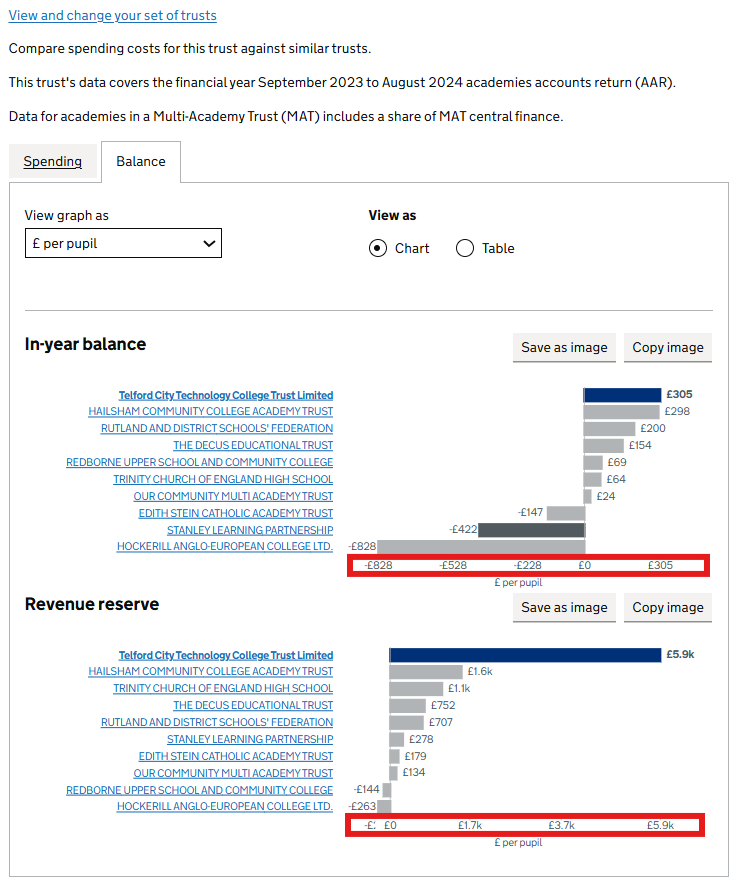
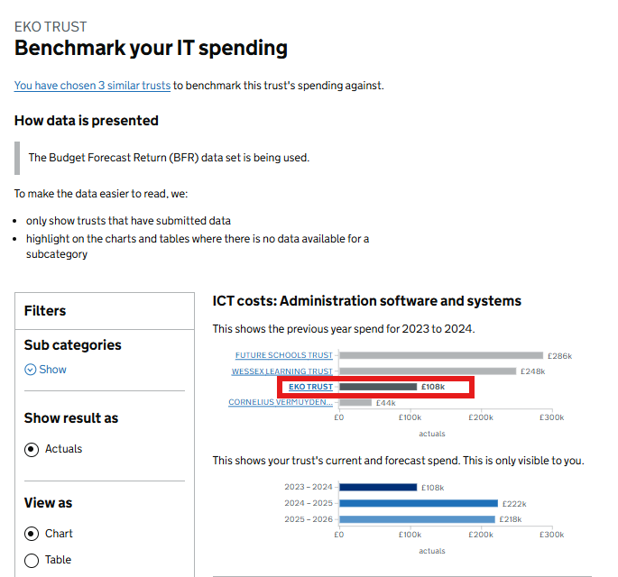

# FBIT Chart Rationale Description

This page documents known charting inconsistencies within the FBIT service, specifically regarding axis labels, text alignment, colour usage, fonts, and image placement.

The goal is to create a record of the underlying rationale for deviating from our core design standards, whether due to specific use-case requirements, strategic decisions, or implementation constraints. This reference is a living document linked to the [chart-development-workflow](/documentation/guides/chart-development-workflow/1_Chart-Development-Workflow.md) guide. To ensure accountability and set consistency goal, where possible, technical and design debt identified here should be formally tagged in the risk log with corresponding tickets created in the backlog for continuous improvement.

## Something

### X-Axis Scale Inconsistency

1. Trust to trust benchmarking: Balance Visualization & Axis Logic

    

This chart development has been adapted to accommodate the bi-directional nature of the trust's financial data (both deficit and surplus balance states). The X-axis in this view employs adaptive scaling to align tick marks directly with specific data values and the zero-baseline. This approach prioritises the visibility of exact currency milestones over the set standard of variable interval spacing, also, the rendering of negative values is context-dependent, dynamically adjusting the axis origin to maximise data density and reduce visual clutter in surplus only scenarios.

### Blue Highlight Inconsistency

1. Benchmark IT Spending: Previous year spend

    

While standard designs rely on blue highlights for benchmarking consistency, the Trust IT Benchmarking required a new approach to handle the dense, multi-trust view and strict data sensitivity. The colour palette was expanded to comply with data governance (current and future data are protected under strict governance rules) and for this reason, the neutral grey highlight is used specifically to illustrate the previous year spend. This visually separates the open and shareable historical data from the protected spend that is visible only to the specific trust. The result is a clear signal of data status that keeps visual noise low across these complex comparisons.

### Missing Hover Behaviour

1. LA
    - no hover cause nothing to show

### Entity Case & Fonts Inconsistency

School, Trust, and Local Authority entities are displayed in their raw state as provided by the upstream data therefore causing inconsistent casing and irregular font weights to be observed within the FBIT service. These styles are preserved to match the system of record and no cleansing logic is applied to avoid the risk of breaking specific acronyms or nomenclature.

### Truncated Y-Axis Label

To maximise the screen real estate available for data visualization, the Y-axis is restricted to a fixed-width container. The effect of this width restriction is that label text is right-aligned to ensure immediate proximity to the corresponding data bars, minimizing eye-scanning distance. For entities with lengthy descriptions, strict horizontal clipping is applied at the container edge therefore creates a 'hard cut' effect where words may be truncated mid-character. This method is utilised to maintain a rigid vertical rhythm and prevent variable row heights from distorting the chart’s scale.

### Unit Value

- less than 1000 should not have a unit
- 1 vs 2 vs o decimal point
