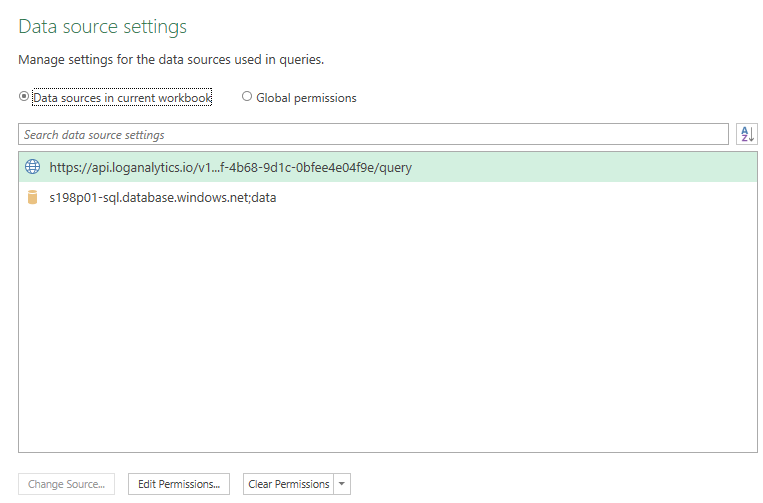
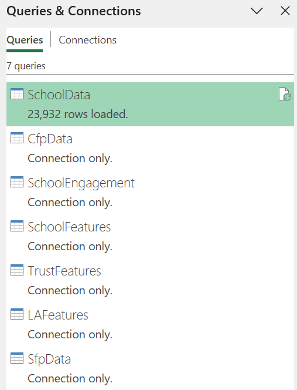
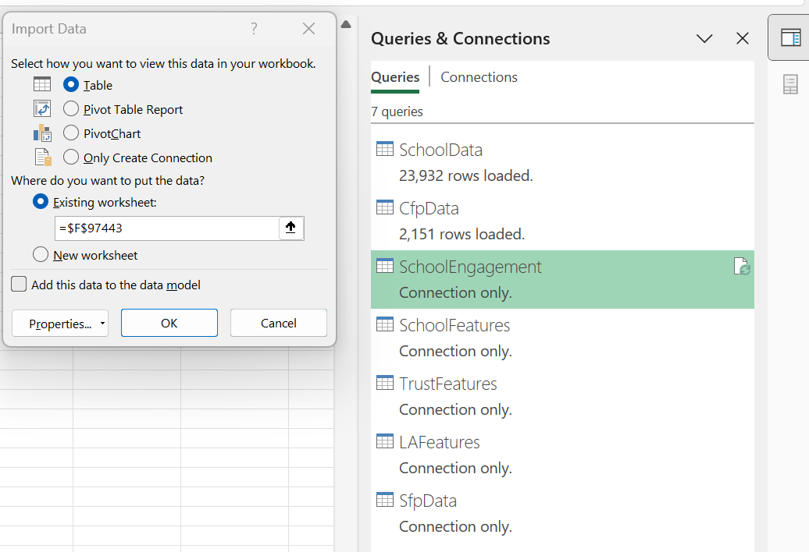
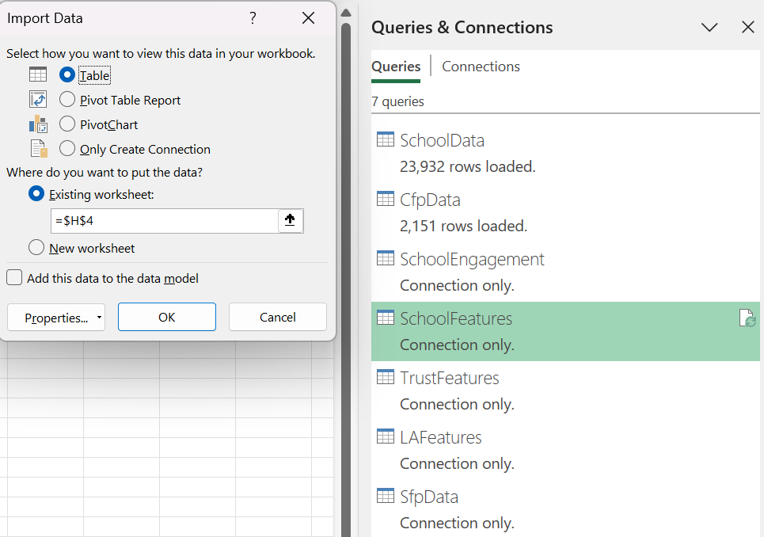

# Monthly Analytics Reporting

## Overview

There is capability to report user interactions based on visited school pages within the FBIT service by harnessing transactional data from Azure monitor logs (via a log analytics workspace) and relational store in Azure SQL database. An automated ETL process implemented in Excel's Get & Transform (Power Query) facilitates the production of a monthly summary report for intended stakeholder(s).

### Stakeholder(s)

- Product Owner - Schools Financial Benchmarking

### Get started

1. Locate the [FBIT Report TEMPLATE](https://educationgovuk.sharepoint.com/:x:/r/sites/DfEFinancialBenchmarking/Shared%20Documents/FBIT%20Product/Analytics/FBIT%20Report%20-%20TEMPLATE.xlsx?d=w52e2c483bb034e69a5cb70a0996f9ac3&csf=1&web=1&e=5A6PSg) file found in this [DfE Sharepoint Location](https://educationgovuk.sharepoint.com/:f:/r/sites/DfEFinancialBenchmarking/Shared%20Documents/FBIT%20Product/Analytics).
2. Open the report with the `Open in app` option and not the browser option.
3. In the `Data` Ribbon of excel, locate `Get Data` button, click on the drop down to select `Data Source Settings`.
4. As seen below, select `Edit Permissions` and provide credentials for access to data source.

    - _Use `organization account` for log analytics and `database` for Azure SQL connection_

    

5. Upon successful credential log-in, still on the `Data` ribbon, locate and select the `Queries & Connections` button.
6. Confirm the seven queries in the `Queries & Connections` view by the right hand side of excel work book.

    _The image below signifies successful access to the data sources_

   
7. On the Data ribbon, locate and select the `Refresh All` button to refresh all seven queries.
8. Confirm refresh by hovering on each query to see `Last refreshed` timestamp, ignore `Load status` and `Data Sources` values as it has no correlation with the data refresh status.

### Prepare Report

#### Total Schools

The workbook's `SchoolData` sheet is updated and loaded (overwrite) after a successful refresh. The `school` table in the `data` SQL database is updated after a new academic/financial year, it is typical to have the same records of school data loaded through out an academic/financial year.

#### CFP Completion

The workbook's `CfpData` sheet is updated and loaded (overwrite) after a successful refresh.

#### School Engagement

1. In the `SpendingPrioritiesRequestData` sheet of the workbook, navigate to the end of the existing `SpendingPrioritiesRequestData` table and select an empty cell preferably in column F.
2. Load the `SchoolEngagement` query to the existing worksheet.

    - _To achieve this step, right click on the `SchoolEngagement` query under the `Queries & Connections` view,_
    - _Select `Load to`,_
    - _In the Import Data pop-up view, select the options as shown in the below image and click on the `OK` button to initiate load_

   

3. Copy the loaded data excluding headers and paste value at the end of existing table to append data.
4. Delete the loaded data after append.

#### Pivot Tables

1. In the `PivotTables` sheet of the workbook, refresh all four pivot tables.
2. In the `Summary` sheet of the workbook, insert a row above `Total Unique Schools` of the School Engagement summary.
3. Copy the values from `PivotTables` sheet into the relevant section in `Summary`

   > **NOTE:**
   >
   > For School Engagement summary, `FBIT Total Schools (all time)` and `Percentage of FBIT engaged` are calculated rows, do not overwrite but update formula if required.
   >
   > For CFP completion summary, `Total plans created` and `# Schools with plans` are calculated rows, do not overwrite but update formula if required.

#### School Features, Trust Features, LA Features and SfpData

1. In the `Summary` sheet of the workbook, select preferably cell `H4`.
2. Load the `SchoolFeatures` query to the existing worksheet.

    - _To achieve this step, right click on the `SchoolFeatures` query under the `Queries & Connections` view,_
    - _Select `Load to`,_
    - _In the Import Data pop-up view, select the options as shown in the below image and click on the `OK` button to initiate load_

   

3. Repeat steps 16 and 17 to load `TrustFeatures`, `LAFeatures` and `SfpData` respectively.
4. Copy the loaded data excluding headers and paste values to overwrite the respective existing summary report.
5. Upon overwrite completion, delete the loaded data (columns H to J)
6. Save the Excel workbook.
7. Make a copy of the saved file and save to the same [DfE Sharepoint Location](https://educationgovuk.sharepoint.com/:f:/r/sites/DfEFinancialBenchmarking/Shared%20Documents/FBIT%20Product/Analytics).

    - _Rename file to match `FBIT Report - yyyy-mm`, for instance, if reporting for the month of June in the year 2025, file name should be `FBIT Report - 2025-05`_

8. Inform / share report with stakeholder(s).

### Report Queries

#### School Engagement

On `p01` Log Analytics workspace, run the following KQL query to cover whole of the last month. The maximum number of rows being shown needs to be updated in the query results in order for them to not be truncated.

```kql
let time_start = startofmonth(datetime(now), -1); 
let time_end = endofmonth(datetime(now), -1);
GetEstablishmentRequests
| where 
    Establishment == "school" 
| where 
    ResultCode == 200
| where 
    Feature == "spending-priorities"
| where
    TimeGenerated between (time_start .. time_end)
| order by 
    TimeGenerated asc
| project 
    Urn = Identifier,
    ExcelDate = format_datetime(TimeGenerated, 'dd/MM/yyyy HH:mm:ss')
```

> **NOTE:** Although the query above could be modified to capture the whole of the past year, this is not advised due to potentially exceeding the row limit if executing from within Log Analytics in Azure Portal.

#### Total Schools

On `p01` database run the following SQL query:

```sql
SELECT
    [URN],
    [OverallPhase],
    [FinanceType]
FROM [dbo].[School]
ORDER BY [URN]
```

#### School features

On `p01` Log Analytics workspace, run the following KQL query to cover whole of the year up to the end of the last month:

```kql
let time_start = startofmonth(datetime(now), -12); 
let time_end = endofmonth(datetime(now), -1);
GetEstablishmentRequests
| where 
    Establishment == "school" 
| where 
    ResultCode == 200
| where
    TimeGenerated between (time_start .. time_end)
| project 
    TimeGenerated, 
    Feature, 
    Identifier
| summarize 
    Visits=count(), UniqueVisits=count_distinct(Identifier)
    by Feature
| sort by 
    Visits desc
```

#### Trust features

On `p01` Log Analytics workspace, run the following KQL query to cover whole of the year up to the end of the last month:

```kql
let time_start = startofmonth(datetime(now), -12); 
let time_end = endofmonth(datetime(now), -1);
GetEstablishmentRequests
| where 
    Establishment == "trust" 
| where 
    ResultCode == 200
| where
    TimeGenerated between (time_start .. time_end)
| project 
    TimeGenerated, 
    Feature, 
    Identifier
| summarize 
    Visits=count(), UniqueVisits=count_distinct(Identifier)
    by Feature
| sort by 
    Visits desc
```

#### Local Authority features

On `p01` Log Analytics workspace, run the following KQL query to cover whole of the year up to the end of the last month:

```kql
let time_start = startofmonth(datetime(now), -12); 
let time_end = endofmonth(datetime(now), -1);
GetEstablishmentRequests
| where 
    Establishment == "local-authority" 
| where 
    ResultCode == 200
| where
    TimeGenerated between (time_start .. time_end)
| project 
    TimeGenerated, 
    Feature, 
    Identifier
| summarize 
    Visits=count(), UniqueVisits=count_distinct(Identifier)
    by Feature
| sort by 
    Visits desc
```

#### CFP Completion

On `p01` SQL database, obtain the CFP records for the whole year up to the end of the last month:

```sql
SELECT
    [URN],
    [Year],
    [IsComplete]
FROM [dbo].[FinancialPlan]
WHERE   [UpdatedAt] > CAST(DATEADD(MONTH, -12, DATEADD(day, 1 - DAY(GETDATE()), GETDATE())) AS DATE)
    AND [UpdatedAt] < DATEADD(MONTH, DATEDIFF(MONTH, 0, GETDATE()), 0)
ORDER BY [URN], [Year]
```

#### SFB Decommissioning

On `p01` Log Analytics workspace, run the following KQL query to cover whole of the year up to the end of the last month:

```kql
let time_start = startofmonth(datetime(now), -12); 
let time_end = endofmonth(datetime(now), -1);
GetSfbReferrerRequests
| where
    TimeGenerated between (time_start .. time_end)
| project 
    TimeGenerated,
    IsDeepLink
| summarize 
    Visits=count()
    by IsDeepLink, Month = format_datetime(startofmonth(TimeGenerated),'yyyy/MM')
```

_**TIPS!!**_

_To integrate, update or change log analytics query in Excel see [External Reference](https://learn.microsoft.com/en-us/azure/azure-monitor/logs/log-excel)_

_To integrate, update or change SQL query in Excel see [External Reference](https://learn.microsoft.com/en-us/power-query/power-query-ui)_
<!-- Leave the rest of this page blank -->
\newpage
