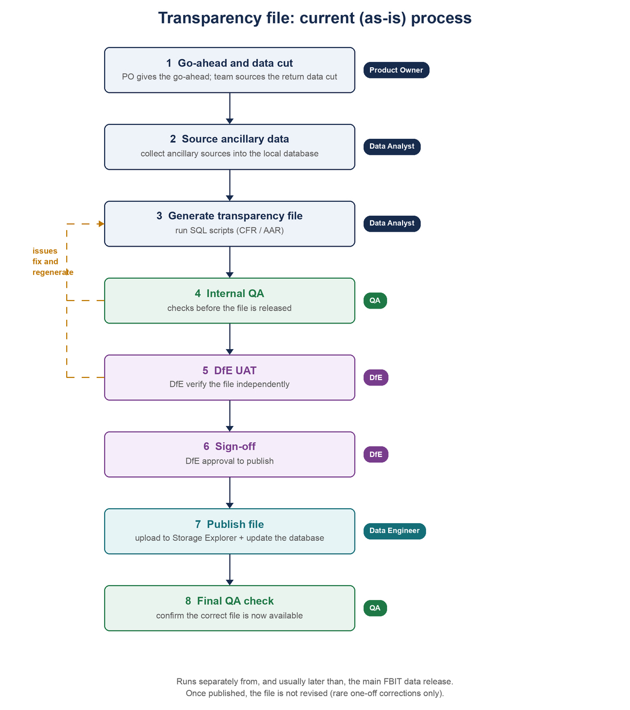

# Transparency File: Current (As-Is) Process

## Purpose

This document records the current, end-to-end process for producing and publishing the FBIT transparency files before the pipeline started to produce the files.

## What the transparency file is

The transparency file is a published Excel workbook that exposes the financial data behind FBIT in a downloadable form. There is one for CFR (maintained schools) and one for AAR (academies and trusts). Publishing it is a legal requirement, and it is used mainly by DfE analysts.

It contains:

* raw data points from the financial returns,
* ancillary (contextual) data about each school,
* some FBIT roll-ups, and
* ancillary data that is not included in FBIT.

Assembling the file involves federation and DNS (Did Not Submit) handling, ancillary joins, and roll-ups.

Each file is released alongside its financial data, but as a separate artefact from the main FBIT service, and each includes an index tab that records the file version and a summary of what has changed. Where columns overlap with FBIT, the figures should reconcile with the service.

## Roles

| Role          | Responsibility                                                                                  |
|:--------------|:------------------------------------------------------------------------------------------------|
| Product Owner | Gives the go-ahead to start once the submission deadline has passed.                            |
| Data Analyst  | Sources the return and ancillary data, and produces the transparency file from the SQL scripts. |
| QA            | Runs internal checks before release and the final check after publish.                          |
| DfE           | Carries out UAT and provides sign-off.                                                          |
| Data Engineer | Publishes the approved file: uploads it to storage and updates the database.                    |

## The process

### 1. Go-ahead and data cut

CFR and AAR each have a submission deadline. Once the deadline has passed, the Product Owner gives the go-ahead to start. The Product Owner does not provide the data itself: the team sources the cut of the financial return data (CFR or AAR) from source. That cut is the basis for the release.

### 2. Source the ancillary data

All ancillary data sources (for example GIAS, Census, SEN, PRU, and hospital schools) are sourced and collected into the local database. These provide the contextual data about each school that aligns with the CFR or AAR return, and must be in place before the SQL scripts are run to generate the file.

### 3. Generate the transparency file

The CFR and AAR transparency files are produced by running their respective SQL scripts against the return and ancillary data. The output is the transparency workbook for that release.

### 4. Internal QA

The file is checked internally before it is released. Checks include reconciling the file totals against FBIT, confirming federation and DNS (Did Not Submit) handling so schools are not double-counted, and completeness checks against the previous year. If issues are found, the file is corrected, regenerated, and re-checked.

### 5. DfE UAT

The file is passed to DfE, who verify it independently as part of user acceptance testing. Any issues raised are fed back, fixed, and the file is regenerated and re-checked.

### 6. Sign-off

Once DfE are satisfied, they sign off the file. This approval authorises publication.

### 7. Publish the file

After sign-off, the Data Engineer uploads the approved file to storage (via Storage Explorer) and updates the database so the new version is listed as available on the service.

### 8. Final QA check

QA then does a final check to confirm the correct file is now available on the service.

## Key characteristics

* **Separate and usually later:** the transparency file is released separately from, and often after, the main data release, so the service and its transparency file are not always in step.
* **Produced and checked independently:** the file does not go through the lower environments. It is produced and verified independently, and is only updated in pre-production and production.
* **Human-gated:** publication requires internal QA, DfE UAT, and DfE sign-off before the file goes live.
* **Frozen once published:** once approved and published, the file is not revised, even if the FBIT data is later corrected. A published file has been changed only once, as a one-off manual correction to keep it aligned with the released data.

## References

* [CFR file generation guide](../cfr-file-generation/1_Overview.md) and [SFB File Generation](../cfr-file-generation/9_SFB-FileGeneration.md): the CFR SQL generation steps.
* [Data release guide: CFR](../data-release-guide/03_CFR.md) and [AAR](../data-release-guide/02_AAR.md): where the transparency file sits in each release.
* [Data release test plans](../../quality-assurance/data-release-test-plans/): the release-specific QA checks.

<!-- Leave the rest of this page blank -->
\newpage
